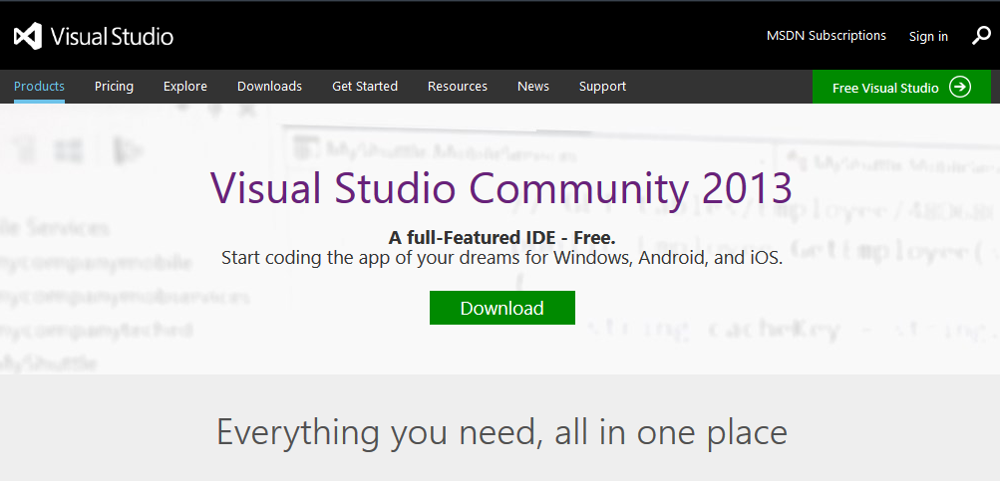
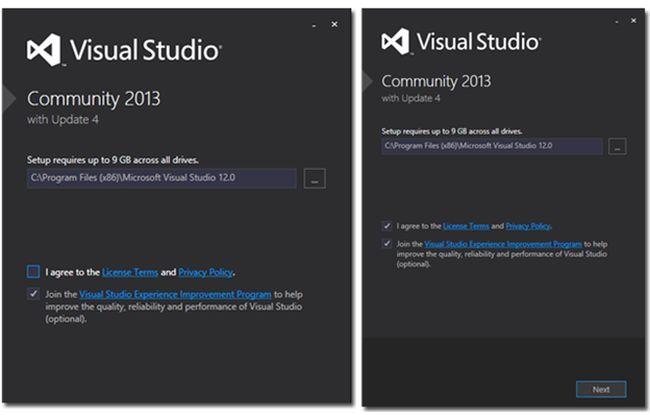
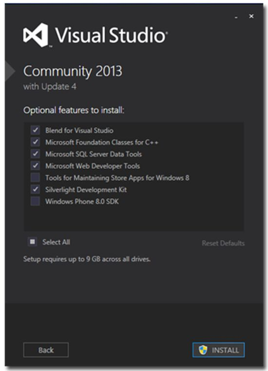
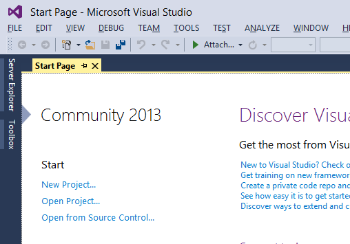

# Preparando o Visual Studio

## Obtendo o Visual Studio

O **Visual Studio** é uma poderosa ferramenta de desenvolvimento, fácil de usar e simples de aprender. Atualmente, sua última versão estável é a **2017 Update 4**.

O Visual Studio também apresenta “tipos” de distribuições, conforme abaixo:

- Professional: versão intermediária do Visual Studio. Já conta com uma gama boa de plug-ins e funcionalidades que auxiliam no desenvolvimento de software. É indicado geralmente para equipes de desenvolvimento pequenas e médias;
- Premium: versão que conta com as funcionalidades da versão Professional mais recursos relacionados à arquitetura de software;
- Ultimate: versão que conta com todos os recursos das versões anteriores, além de outros recursos de rastreamento de código e ferramentas adicionais;
- Test Pro: equivalente à versão Professional, porém, com foco para profissionais da área de teste;
- Community: a edição gratuita do Visual Studio. Apesar de ser gratuita, a versão Community oferece suporte para desenvolvimento em todas as plataformas que o .NET suporta, como desenvolvimento Desktop, Web e Mobile, bem como dá suporte à plug-ins e extensões. Mesmo sendo gratuita, é possível utilizar o Visual Studio Community para desenvolvimento comercial, desde que este desenvolvimento seja de maneira individual. Caso seja necessário trabalhar em times, será necessário adquirir uma licença do Visual Studio Professional ou superior.

Você pode baixar o Visual Studio 2013 Community em http://www.visualstudio.com/en-us/products/visual-studio-community-vs.aspx:

Clique no botão **Download**. Logo após, você terá acesso ao **instalador online** do Visual Studio Community.

Opcionalmente, você pode utilizar o **Visual Studio 2015**, se quiser verificar quais são as novidades para a próxima versão do Visual Studio. Esta versão atende aos requisitos para este curso. Porém, lembre-se: é uma versão preview, ou seja, não é estável e não deve ser utilizada “em produção”. Se quiser obter o Visual Studio 2015, clique neste link (http://go.microsoft.com/?linkid=9863611&amp;clcid=0x409) para o instalador online, ou neste (http://go.microsoft.com/?linkid=9863612&amp;clcid=0x409) para o instalador off-line (ISO). Você precisará fazer login com uma conta Microsoft.

Tanto as versões do Visual Studio 2013 Community quanto o Visual Studio 2015 Preview têm a mesma interface de instalação. Ao abrir o instalador, você verá uma tela similar à abaixo. Marque a caixa “I agree to the Licence Terms and Privacy Policy” e logo após clique no botão “Next”:

Logo após, deve ser exibida uma tela onde você pode escolher quais componentes do Visual Studio serão instalados, conforme imagem abaixo:

Para este curso, as opções que são marcadas por padrão são suficientes. Se quiser, pode selecionar componentes adicionais, como o SDK para desenvolvimento para Windows Phone. É importante que a opção “Web Developer Tools” esteja marcada se pretende à frente fazer os cursos de ASP.NET MVC.

Logo após, clique no botão “Install” e aguarde o término desta. Não se preocupe: o Visual Studio levará algum tempo para terminar a instalação, dependendo das opções selecionadas.

---

## Sobre o Visual Studio

O Visual Studio 2012 é uma IDE (**Integrated Development Environment**), um ambiente integrado de desenvolvimento; ou seja, uma ferramenta de desenvolvimento de aplicações para a plataforma .NET. Com uma interface amigável e integrada com os ambientes e de fácil entendimento, proporciona aos desenvolvedores a criação de aplicações sofisticadas com todos os recursos existentes, sem ter que ficar criando parte de código em um aplicativo e o restante no outro. É possível, com o Visual Studio, gerenciar recursos da máquina local e de um possível servidor, criar aplicações para Windows, web e dispositivos móveis e até jogos para consoles, como o XBox.

A sua página inicial é:

Ela pode variar de acordo com a versão instalada. Nela temos a primeira página exibida, a **Start Page**, onde podem ser abertos rapidamente os últimos projetos através da caixa **Recent**. Temos atalhos para criar e abrir um Projeto, através da caixa **Start**. E temos as últimas notícias do MSDN na tela central.

Também podemos criar um novo projeto no menu **File**, clicando na opção **Project** de **New**, ou seja, na opção **File** > **New** > **Project**; ou através do atalho **Ctrl+Shift+N**.

Nesses casos, a caixa de diálogo **New Project** aparece. Ela permite criar um novo projeto usando vários templates, como um **Windows Forms Application**, **Class Library**, **Console Application** e vários outros, que variam de acordo com os recursos instalados no Visual Studio.

---

## Visual Studio 2015 RC

Alguns recursos que serão apresentados neste curso infelizmente não estão disponíveis na versão Community do Visual Studio, sendo possível utilizá-los somente em edições pagas como a Premium, Ultimate ou Enterprise. Para que consigamos verificar também estes recursos no decorrer do curso, você pode optar por instalar a versão RC do Visual Studio Enterprise 2015. Essa versão pode ser baixada em https://www.visualstudio.com/en-us/downloads/visual-studio-2015-downloads-vs.aspx Edições trial do Visual Studio Ultimate também contemplam esta funcionalidade e podem ser utilizadas sem maiores problemas.