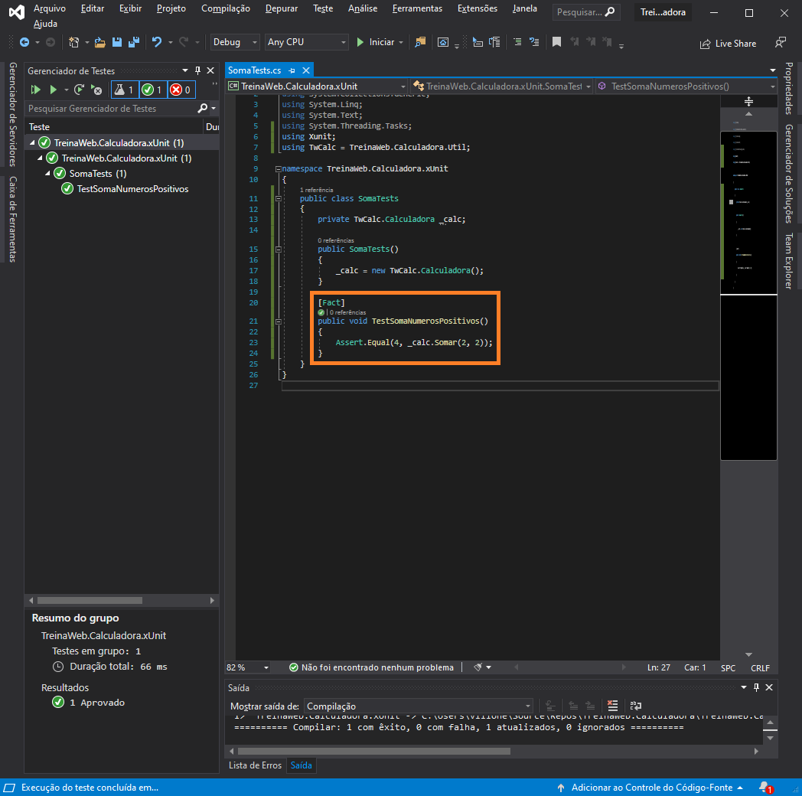
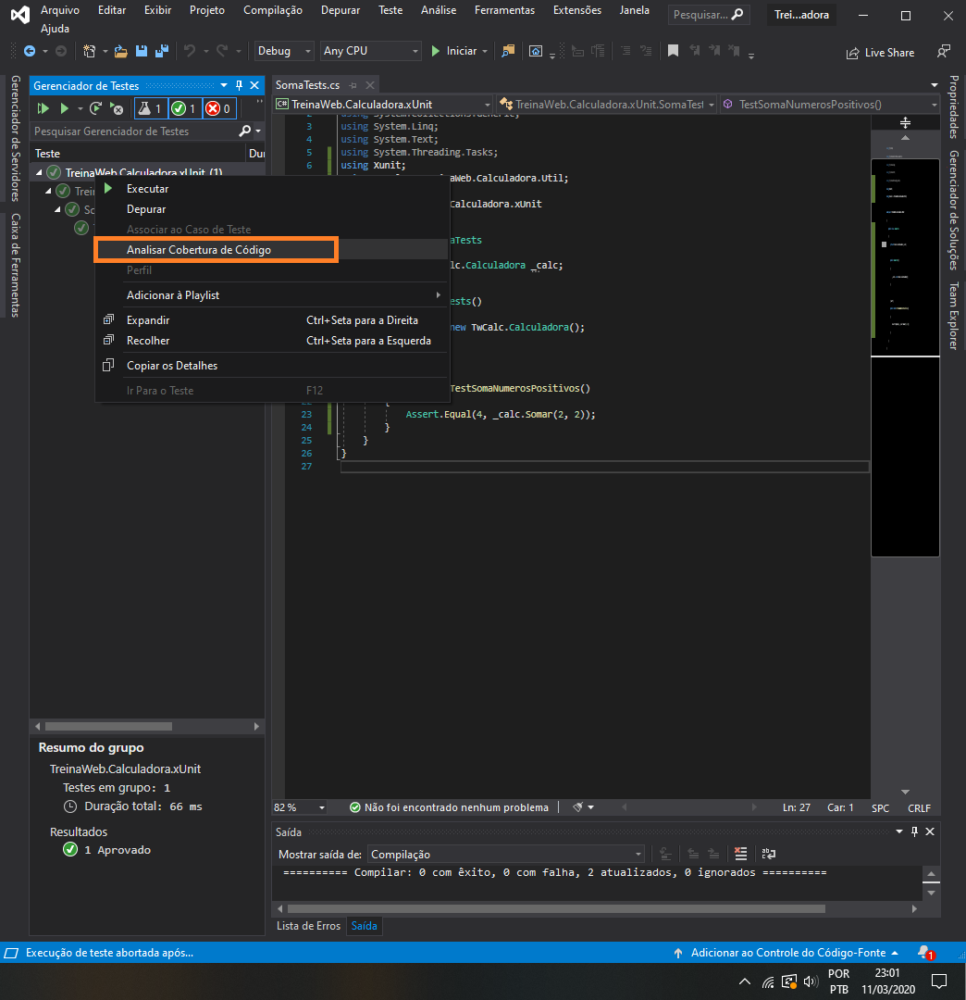
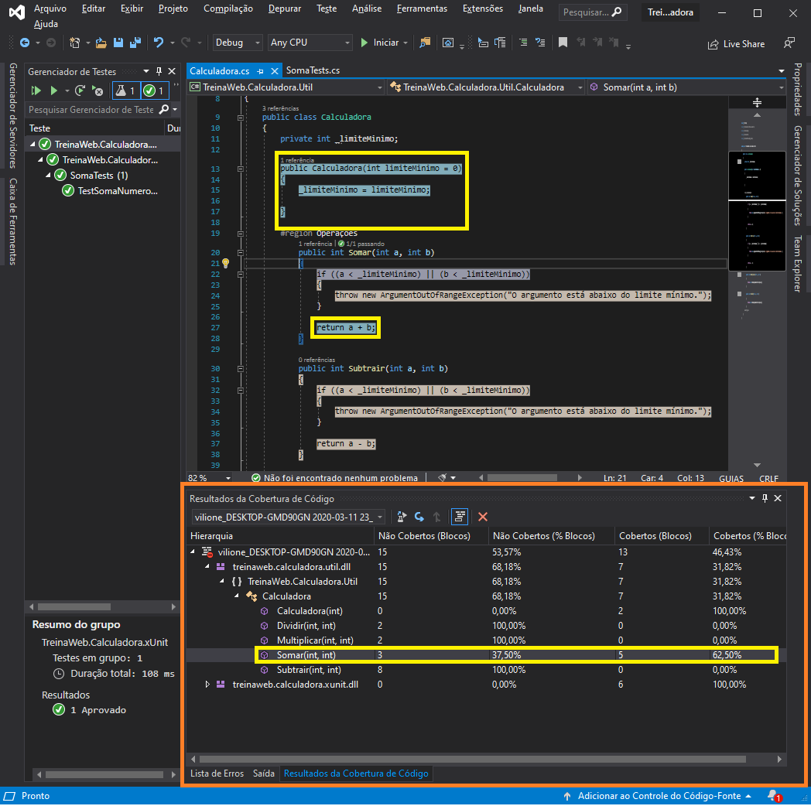
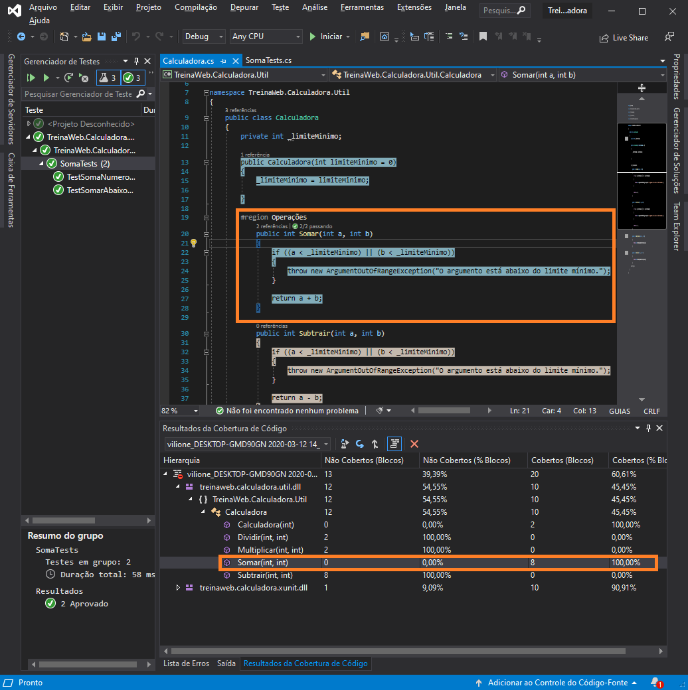

# Cobertura de teste

## O conceito de cobertura de teste
Quando escrevemos testes unitários, nos deparamos com uma situação de maneira geral bem difícil de se tratar: “Será que os testes unitários que estou escrevendo abrangem todas as situações e comportamentos possíveis para minhas unidades de software?”... “Será que meus testes realmente estão testando todas as possibilidades que minha aplicação poderá passar?”. Mais complicado ainda, é que muitas vezes precisamos sair do subjetivo e passar para algo que pode ser mensurado para provar que nossos testes estão corretos: “Quanto do meu código está sendo de fato testado?”... E, por isso, mais uma questão aparece: “Como quantificar a quantidade de código que está sendo testado pelos meus testes unitários?”...

Quando falamos em quantificar e determinar quais linhas de código estão passando por algum teste ou não, estamos tocando no termo **cobertura de testes**. Com isso, estamos falando de quantas e quais linhas estão passando pelos meus testes unitários. Perceba que, ao utilizarmos o termo “cobertura de testes”, estamos saindo da subjetividade e partindo para uma métrica, uma quantificação.

O Visual Studio oferece uma funcionalidade de cobertura de código que tem como objetivo mensurar e identificar quais partes de código foram cobertas ou não pelos testes unitários. A ideia é que para garantir uma maior qualidade do software, reduzindo a possibilidade de bugs, os seus testes devem cobrir a maior porcentagem possível de código. Na verdade, o ideal é que a cobertura de código seja 100%, o que é na verdade praticamente impossível, como veremos adiante. Então, quanto mais próximo desse percentual, melhor.

A cobertura de código é uma ótima opção quando você executa os testes utilizando o Test Explorer. O resultado final é exibido em uma tabela onde é apresentada a porcentagem de código coberto em cada assembly, classe e método. Adicionalmente o editor de código irá exibir qual trecho de código foi ou não testado. Porém, é importante ressaltas: este recurso só está disponível nas edições Ultimate, Premium e Enterprise do Visual Studio. Nem a versão Community oferece este recurso. Opcionalmente, para verificarmos este recurso, instale a versão RC do Visual Studio 2015 conforme ilustrado na aula “0”.

---

## Mensurando e qualificando seus testes unitários: medindo a cobertura de código

Um único teste de Soma

Cobertura de código

Passou em todas as linhas, mas quer dizer que fez todas as possibilidades, No caso todas as possibilidades do argumento `A` e `B`

---

## Exercícios

Questão 1 de 3
O que é a cobertura de testes?

É a quantidade de linhas que um teste pode possuir.

✔ É a quantidade de linhas da aplicação que estão sendo testadas.

É a quantidade total de linhas dos testes da aplicação.

Nenhuma das alternativas.

É a quantidade mínima de linhas que a aplicação precisa testar para que seja considerado que a aplicação implementa testes.

Questão 2 de 3
Na janela Test Explorer, qual é a opção que analisa a cobertura de código?

✔ Analyze Code Coverage for All Tests.

Analyze Code Coverage for this Application.

Show Code Coverage.

Analyze Code Coverage.

Analyze Code Coverage for This Test.

Questão 3 de 3
Qual é a porcentagem de código ideal que deve ser coberto por testes?

✔100%.

50%.

99%.

80%.

75%.

