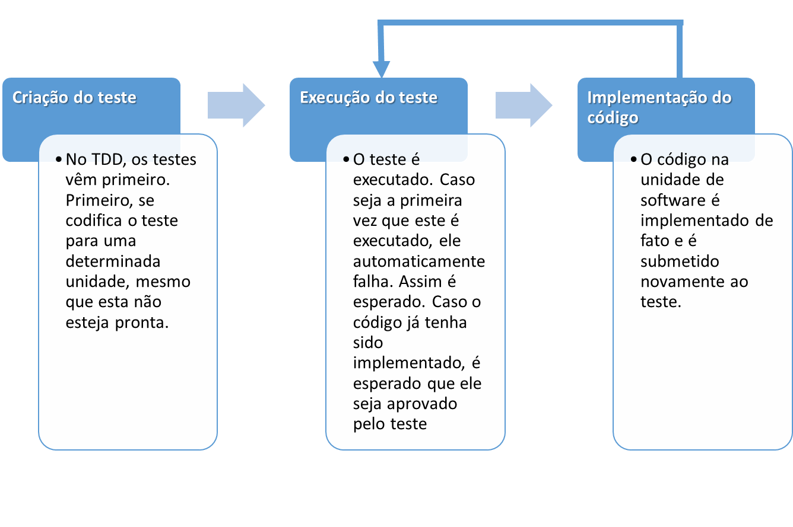
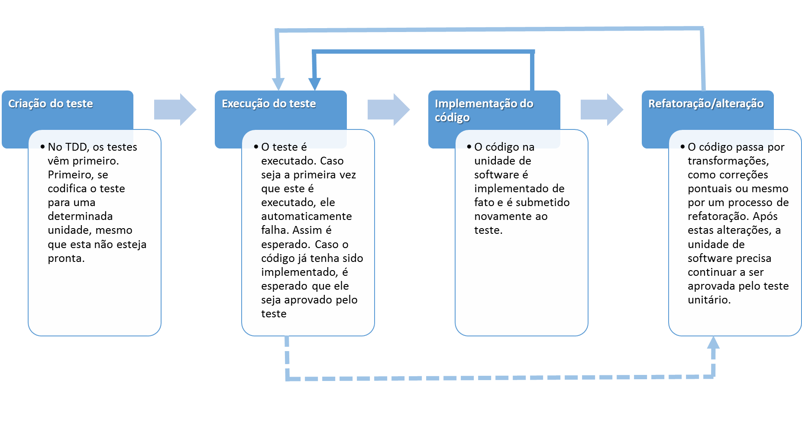
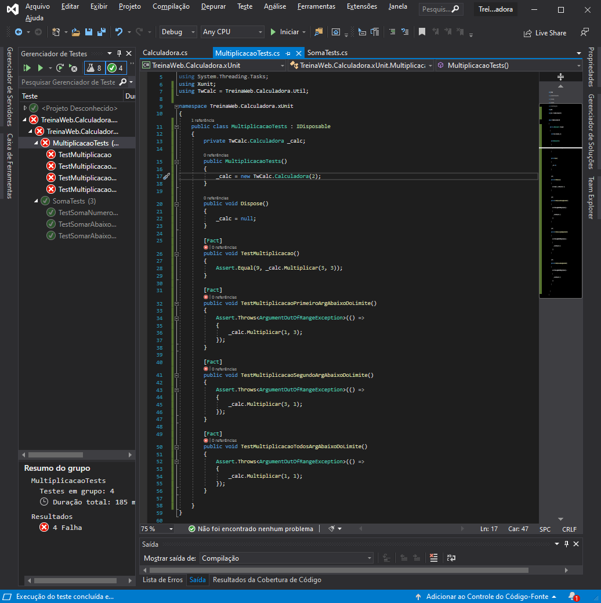
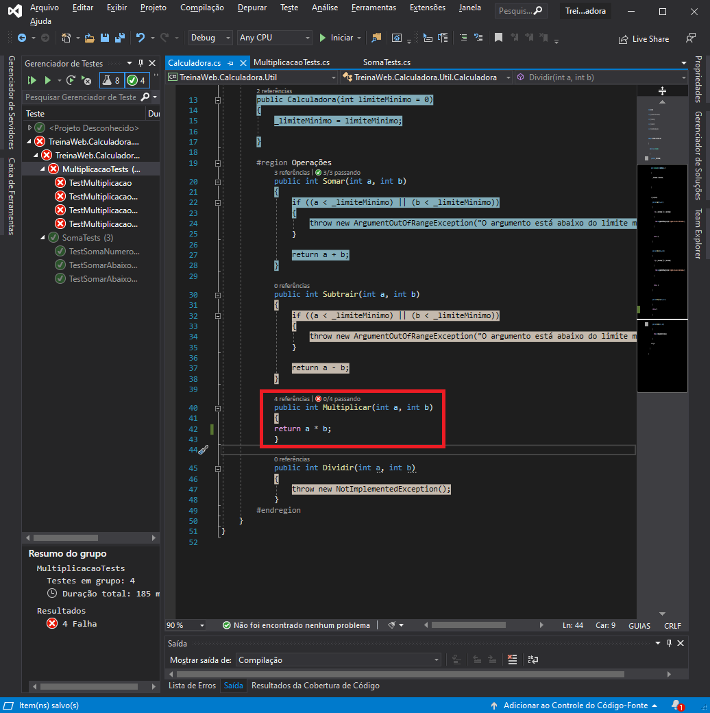
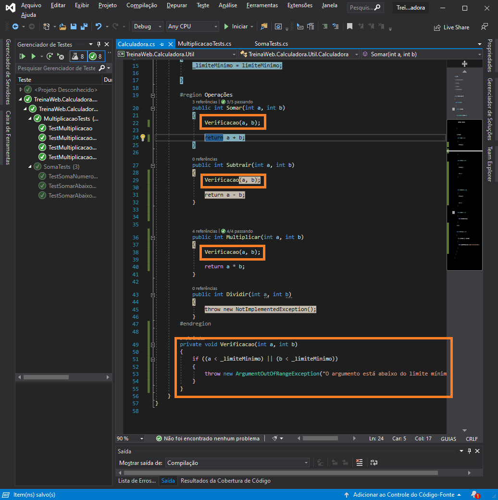

# TDD – Test Driven Development

## TDD – Test Driven Development

Como verificamos, testar um software é essencial para garantirmos a qualidade do produto que desenvolvemos. Porém, infelizmente, um cenário muito comum é que o software seja cortado do ciclo de desenvolvimento de uma aplicação. Não são raras as situações onde um projeto de software está com prazos e custos “apertados” ou até mesmo “estourados”. E, geralmente, a etapa de garantia de qualidade de software é a primeira a ser cortada nestes casos. Muitas organizações e empresas que desenvolvem software não enxergam o teste como uma etapa essencial, muito pelo contrário: grande parte acredita que o teste de software é uma etapa opcional, que pode ser descartada quando necessário. Porém, geralmente, o resultado de um software que não é corretamente testado é uma aplicação instável e não consistente, muitas vezes, até inoperante. Mas, será que existe uma maneira de se acoplar o ciclo de desenvolvimento a pelo menos testes funcionais unitários, fazendo com que seja possível pelo menos desenvolver e testar o nosso código ao mesmo tempo? Sim, isso existe: estamos falando de TDD.

O TDD - Test-Driven-Development ou, em português, Desenvolvimento Dirigido a Testes é uma das diversas técnicas de desenvolvimento de software que visa acoplar o ciclo de desenvolvimento ao ciclo de testes de software, ao menos no nível unitário, diminuindo as chances que um software tem de não atender a, por exemplo, requisitos funcionais e mesmo regras de negócio. Basicamente, o TDD consiste em uma técnica onde primeiro são desenvolvidos os casos de testes e somente depois é desenvolvido o código para que esses testes sejam satisfeitos e executados com sucesso.

No início parece algo estranho, pois é um processo invertido ao processo que estamos acostumados, onde primeiro é desenvolvido o código para que depois seja testado. Porém podemos destacar alguns benefícios do TDD:

- Permite lidar com pequenos aspectos do sistema, inicialmente, e evoluir conforme os requisitos evoluem;
- Os testes servem também como documentação do sistema. Inclusive, várias empresas, ao requisitarem a execução de seus projetos, exigem que também hajam documentação e evidência dos testes para considerar o software como concluído;
- Os testes servem também como testes de regressão, garantindo que mudanças de código não iram quebrar funcionalidades existentes. Depois de o teste unitário ser escrito uma vez, não é mais necessário reescrevê-lo, porém, o software, em suas diferentes versões, deverá sempre ser aprovado pelos testes.

Podemos afirmar que, quando trabalhamos com TDD, temos o seguinte macro-diagrama de trabalho:

Note mais uma vez que, quando utilizamos o TDD, **os testes vêm primeiro**. Nós implementamos primeiro o teste em uma unidade para, depois, implementar a unidade correspondente ao código de teste, afim de que agora o teste aprove a unidade.

O grande ponto é que uma unidade de software pode passar por alterações, quer seja refatoração de código ou mesmo uma total reescrita do código. Dentro deste cenário, poderíamos ter o diagrama da seguinte maneira:

Perceba que, quando um código sofre algum tipo de alteração, é necessário testá-lo novamente, afim de garantir que as alterações não alteraram o comportamento esperado daquela unidade de software. Esse ponto inclusive acaba caracterizando a utilização do TDD como também um teste de tipo de regressão, já que os testes são repetidos a cada alteração afim de garantir que o comportamento das unidades de software permanece inalterado. Mais um ponto positivo para a utilização do TDD: seu código é sempre retestado quando sofre algum tipo de alteração.

De maneira resumida, quando trabalhamos com TDD, temos os seguintes tópicos:

- Criação do teste de uma determinada unidade de software. No TDD, o teste é a primeira coisa, pois todo o restante do desenvolvimento se dará em cima dele. Este teste deve ser um teste de tipo unitário, pois o TDD enfoca no teste de cada unidade de software sem necessariamente se preocupar com a integração entre elas;
- Execução do teste. Na primeira vez, a unidade de teste nem apresentará implementação, o que fará com que o teste falhe;
- Implementação da unidade de software. Para satisfazer o teste que foi escrito, a unidade de software é implementada, afim de ser aprovada no teste unitário;
- Nova aplicação do teste unitário. O teste, escrito no tópico 2, é aplicado novamente, afim de validar a unidade de software. Caso a unidade não seja aprovada, o código deve ser alterado até o momento em que ela pode ser aprovada pelo teste escrito no tópico 2;
- Quando a unidade for finalmente aprovada, o código deve ser revisto e então possíveis refatorações devem ser aplicadas para garantir qualidade e legibilidade do código, caso este apresente algum trecho que peque nestes dois quesitos;
- Caso tenha havido qualquer tipo de alteração na unidade de software, esta deve ser novamente submetida ao seu conjunto de testes unitários;
- Caso, após alguma alteração ou refatoração, o conjunto de testes da unidade de software não aprove mais unidade de software em questão, a unidade deve ser revista e alterada até que seja aprovada novamente pelos seus testes unitários vinculados.

Esse ciclo de repetição dos testes quando utilizamos TDD também é conhecido por “red/green/refactor (blue)”. Podemos também associar à estas cores o ciclo de desenvolvimento utilizando-se TDD: o vermelho (red) consiste na primeira vez que o teste de uma determinada unidade de software é executado e, por padrão, deve falhar. O verde (green) diz respeito à etapa que de fato a unidade de software é implementada de modo a ser aprovada no teste unitário e é de fato aprovada. A refatoração (refactor - blue) é o momento onde o código é melhorado, caso seja necessário.

Um ponto que é importante ser ressaltado: sim, a primeira vez que o teste de software for executado, ele deverá falhar, tendo em vista que a unidade de software nem deve ter sido implementada. É importante acontecer isso porque isso nos garante de que nosso teste realmente é capaz de detectar possíveis falhas nas unidades de software testadas.

Perceba que o conceito do ciclo de trabalho do TDD geralmente repete várias etapas, principalmente as etapas de teste e de refatoração/alteração das unidades de software. E isto, pelo TDD, não está incorreto: ele se baseia justamente neste ciclo de repetições das etapas. São justamente estas repetições que garantem que nosso código continuará funcional e produzindo as saídas esperadas, mesmo após possíveis alterações. Por isso, como foi ilustrado anteriormente, a utilização de TDD não deixa de implicar na utilização de testes de regressão.

Para que o TDD possa ser aplicado com sucesso, é imprescindível entender o valor que sua utilização agrega ao produto que é desenvolvido: o produto, pelo menos suas unidades, são testados durante o tempo inteiro, além de inspirarem os seus desenvolvedores a tomarem mais cuidado com o código produzido para que estes possam ser aprovados pelos testes unitários de maneira mais rápida. O resultado disso é sem dúvidas um produto com uma qualidade superior frente a uma versão que não utiliza os conceitos do TDD.

---

## Aplicando TDD com C# - Parte 1

Ciclo Vermelho

Implementação de Multiplicação

Ciclo Verde

---

## Aplicando TDD com C# - Parte 2

Ciclo Azul - Refatorar as validações e rodar os teste

---

## Exercícios

Questão 1 de 3
Selecione abaixo os benefícios do TDD.

Escolha 3 respostas.
Permite lidar com grandes aspectos do sistema, e gerenciar vários microservices se a aplicação implementá-los.

Os testes podem servir como autocomplete do sistema.

✔ Os testes podem servir como documentação do sistema.

✔ Os testes podem servir como testes de regressão.

✔ Permite lidar com pequenos aspectos do sistema, e evoluir conforme os requisitos evoluem.

Questão 2 de 3
Complete corretamente a afirmação abaixo:
Geralmente , o resultado de um software que não é corretamente 
 é uma aplicação 
 e , muitas vezes , até 
 .

 Questão 3 de 3
O que é o Test-Driven-Development?

É uma técnica de desenvolvimento de software que visa criar códigos mais enxutos que não necessitam serem testados.

É uma técnica de desenvolvimento de teste que visa separar o ciclo de teste do ciclo de desenvolvimento de software.

É uma técnica de teste de software que visa testar 80% do sistema, criando 20% menos casos de teste.

✔ É uma técnica de desenvolvimento de teste que visa acoplar o ciclo de desenvolvimento ao ciclo de testes de software.

É uma técnica de teste de software que visa testar 20% do sistema, mas cobrir 80% das regras de negócio.