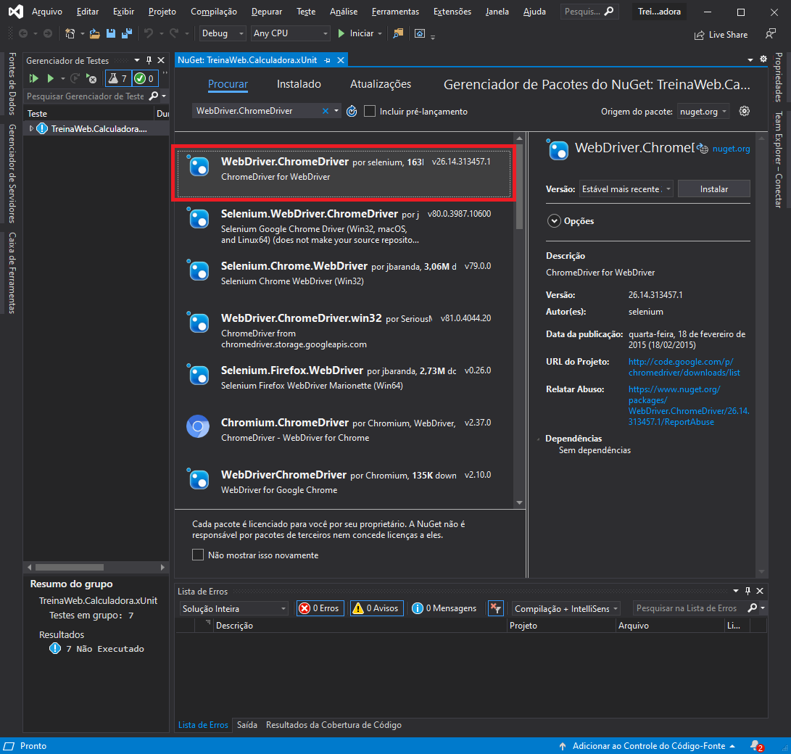

# Testes na interface de usuário

## Testes na interface de usuário

Até este ponto do treinamento, aprendemos como realizar testes em nosso código visando sempre garantir uma maior qualidade no resultado final. No entanto, por mais que consigamos garantir que nossas classes de regra de negócio estejam devidamente testadas e funcionando conforme o esperado, existe outro fator que pode acabar sendo o grande vilão: a interface com o usuário. Não adianta se nossas unidades de software funcionam corretamente se sua integração não ocorre da maneira correta.

Em situações corriqueiras, esse teste da interface da aplicação é feito através de um usuário ou um grupo de usuários que avaliam a aplicação levantando cenários onde a interface não executa as operações como deveria (por exemplo, um botão que deveria executar alguma ação e não executa) ou até mesmo cenários onde a interface funciona da maneira correta, mas as informações não são apresentadas da melhor maneira (por exemplo, o tamanho da fonte de um determinado texto que dificulta sua leitura). Porém, estes testes demandam uma boa quantidade de tempo por parte dos testadores, além de serem extremamente dificultosos para serem executados em larga escala. Também contam com o fato de dependerem da atenção destes testadores: se a equipe que é encarregada de avaliar a interface não dá a devida atenção aos testes, o risco de passar algum problema é bem grande.

Para resolver este problema, podemos utilizar o conceito de testes automatizados que guiam sua aplicação por meio da interface de usuário. Este conceito é também conhecido como Coded UI Tests (CUITs). A utilização deste tipo de teste permite incluir testes funcionais dos controles da interface gráfica, além de verificar se a aplicação está funcionando de ponta a ponta, incluindo a interface gráfica.

---

## Frameworks de teste de interface para a plataforma .NET

Assim como nos testes unitários, existem frameworks que auxiliam na criação de testes automatizados da interface para a plataforma .NET Framework. A utilização de algum destes frameworks é essencial para a criação de testes de interface automatizados.

### Microsoft Visual Studio Test Tools


O Visual Studio Test Tools também oferece ferramentas para criação de testes automatizados de interface. O VS Test Tools expõe algumas classes para criação e escrita destes testes através do namespace Microsoft.VisualStudio.TestTools.UITesting. Além disso, ao se criar um projeto de teste automatizado de interface, o Visual Studio oferece algumas ferramentas que permitem gravar e editar as operações na interface gráfica que deverão ser executadas nos testes automatizados, assim como também expõe ferramentas que possibilitem se fazer asserções de maneira facilitada.

Você pode criar testes de interface automatizados no Visual Studio criando um projeto do tipo Coded UI Test Project, na categoria Test, no wizard para criação de projetos no Visual Studio (File > New > Project...). Porém, este recurso só está presente nas versões pagas do Visual Studio.


### Selenium


O Selenium é um framework de código aberto para criação de testes automatizados de interface em aplicações Web. Ele é composto por duas partes:

WebDriver: consiste em uma API exposta para interação com os diversos browsers. É através do WebDriver que podemos, por exemplo, verificar se após se clicar em um link, a página é redirecionada corretamente;
IDE: uma espécie de IDE integrada através de um plugin para escrita de scripts de testes de maneira mais rápida diretamente no browser. Esse plugin está disponível para o Mozilla Firefox.
A página do GitHub do Selenium está hospedada em https://github.com/SeleniumHQ, enquanto a página oficial está hospedada em http://docs.seleniumhq.org

---

## Testes de interface com MSTests - Parte 1

Criar projeto de interface Windows Form Application

---

## Testes de interface com MSTests - Parte 2

criar teste de interface


Gravar a tela, executar o .exe no build, também é exibido no Test Explorer


---

## Testes de interface com Selenium - Parte 1

Adicionar na solução um projeto Web


Definir como projeto de inicialização

criar as páginas

---

## Testes de interface com Selenium - Parte 2

Add o Selenium pelo nuGet Package no projeto xUnit


Usar uma versão do chrome driver pro selenium



criar uma classe de teste do chrome

Baixar o chrome drive https://chromedriver.chromium.org/downloads

E colocar na raiz do projeto de teste

ir nas propriedades do chromedriver.exe e copiar sempre

```c#
using OpenQA.Selenium;
using OpenQA.Selenium.Chrome;
using System;
using System.Collections.Generic;
using System.Diagnostics;
using System.Linq;
using System.Text;
using System.Threading.Tasks;
using Xunit;

namespace TreinaWeb.Calculadora.xUnit
{
    public class ChromeTestes : IDisposable
    {
        // instancia do Webdrive
        private IWebDriver _driver;

        public ChromeTestes()
        {
            // instanciando o Chrome
            _driver = new ChromeDriver();
        }

        public void Dispose()
        {
            // implementação da interface para finalizar os teste

            if (_driver != null)
            {
                _driver.Close();

                // > 

                Process process = new Process();
                process.StartInfo.FileName = "cmd.exe";
                process.StartInfo.CreateNoWindow = true;
                process.StartInfo.RedirectStandardInput = true;
                process.StartInfo.RedirectStandardOutput = true;
                process.StartInfo.UseShellExecute = false; ;
                process.Start();
                process.StandardInput.WriteLine("taskkill /IM chromedriver.exe /F");
                process.StandardInput.Flush();
                process.StandardInput.Close();
                process.WaitForExit();
            }
        }

        [Fact]
        public void TestCadastro()
        {
            _driver.Navigate().GoToUrl("https://devradarr.netlify.com/");

            // retorna um IWebElement
            IWebElement txtGithub_username = _driver.FindElement(By.Id("github_username"));
            txtGithub_username.SendKeys("Franzanella");
                      
            IWebElement txtTechs = _driver.FindElement(By.Id("techs"));
            txtTechs.SendKeys("React, React Native, Node.js");

            IWebElement btnSalvar = _driver.FindElement(By.CssSelector("form > button[type=submit]"));
            btnSalvar.Click();

            Assert.Equal("Franciele Zanella", "Franciele Zanella");
        }
    }
}


```

---

## Exercícios

Questão 1 de 3
Supondo o trecho de código de View MVC:
```c#
@using (Html.BeginForm())
{

    @Html.LabelFor(model => model.Nome) <br />
    @Html.EditorFor(model => model.Nome) <br />

    @Html.LabelFor(model => model.Idade) <br />
    @Html.EditorFor(model => model.Idade) <br />

    <input type="submit" value="Salvar" id="btnSalvar" class="btn btn-default" />

    <label>Resultado:</label>
    @Html.TextBoxFor(model => model.Status)
}
```
Complete o código abaixo, de forma que ele realize um teste de interface com o Selenium:
```c#
public class TesteCliente
{
    [Fact]
    public void TestMensagemSalvarCliente()
    {
         //*
        var driver = new ChromeDriver();
        driver.Navigate().GoToUrl("http://www.aplicacao.com/cliente/create");

        var textBoxNome = driver.FindElement(By.Name("Nome"));
        textBoxNome.SendKeys("Carlos Silva");

        var textBoxIdade = driver.FindElement(By.Name("Idade"));
        textBoxIdade.SendKeys("33");

        driver.FindElementById("btnSalvar").Click();

        var mensagemCheck = driver.FindElementByXPath("//p[contains(text(),'Cliente salvo com sucesso')]").Displayed;

         //*
 
        Assert.IsTrue(mensagemCheck, "Mensagem não localizada");
    }
} 

```


Questão 2 de 3
Complete corretamente a afirmação abaixo:
Não adianta se as unidades de um software funcionarem corretamente se sua 
`integração` não ocorrer da maneira correta .


Questão 3 de 3
O que são Coded UI Tests?

São testes automatizados realizados na base de dados da aplicação.

São testes automatizados realizados no servidor, durante a publicação da aplicação.

São testes automatizados realizados no código fonte da aplicação.

Nenhuma das alternativas.

✔ São testes automatizados realizados na interface do usuário.