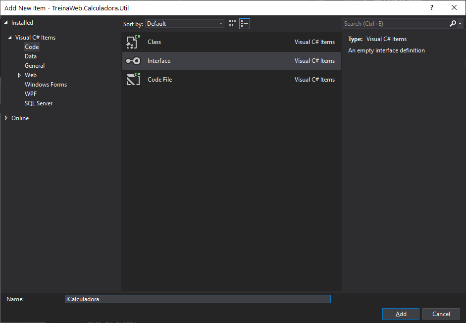
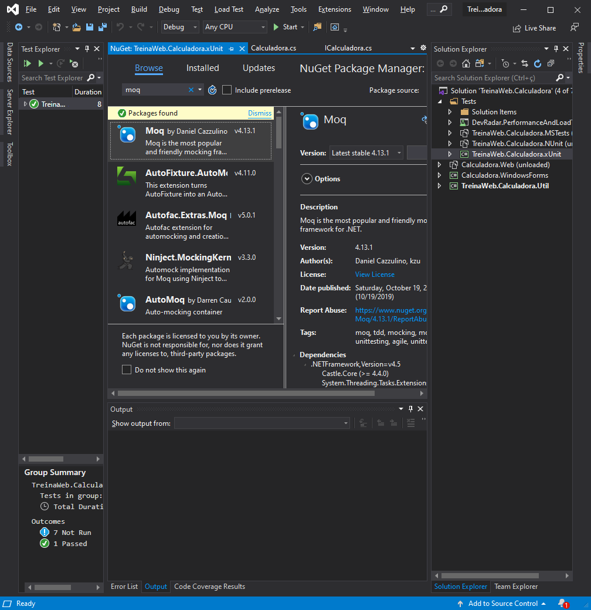

# Mocks

## Mocks

Imagine que existam testes unitários escritos em uma classe que é responsável por se conectar a uma base de dados remota e fazer um SELECT com um certo grau de complexidade, o que faz com que a consulta à base remota demore um certo tempo para ser executada. Esse tipo de cenário, que é bem comum, é uma das principais justificativas encontradas para que o processo de teste em nível unitário seja abolido do processo de desenvolvimento de software: a realização dos testes nessa base de dados para este SELECT faz com que o teste ocupe um espaço de tempo muito maior do que o desejado, teoricamente “atrasando” o desenvolvimento. Outra situação que pode ser acrescentada é quando a aprovação deste teste com relação a esse SELECT depende de certos registros da base de dados que podem ser modificados por outros testes unitários. Como contornar estas situações?

Para a realização dos testes em nível unitário, uma saída é a utilização de mocks. Um mock é um objeto que simula de maneira pré-definida o comportamento de outros objetos. No exemplo da base de dados remota poderíamos contornar a situação de latência de acesso e modificação constante das linhas da base de dados utilizando-se um mock para fazer o papel da base de dados: ao invés dos testes unitários sempre terem que abrir a conexão com essa base de dados, os testes unitários poderiam fazer requisições a um mock. Também é possível fixar a resposta a ser retornada para um determinado método com esse mock, corrigindo-se o problema de mutação da base de dados.

A utilização de mocks agiliza o desenvolvimento e execução dos testes unitários, já que é possível remover recursos que seriam necessários mas cuja utilização é onerosa. Mocks também removem a necessidade de se “preparar” um ambiente específico para a execução dos testes unitários, como por exemplo a atualização de linhas em um banco de dados para correta execução dos testes. Porém, é importante salientar: objetos mock são úteis somente em testes unitários. Você não deve utilizar mocks para testes de integração ou de carga e stress por exemplo, pois os resultados com toda certeza serão deturpados.

---

## Diferença entre mock e fake
É relativamente comum confundir objetos mock com objetos fake. Vamos às diferenças entre eles:

- Fake: são objetos que retornam uma resposta pré-determinada para uma requisição e nada mais ou ainda as respostas pré-determinadas para serem respondidas por um método. São estruturas bem mais simples. Um exemplo de fake é se comentássemos o return de um método e escrevêssemos outro com um resultado fixo. Este método simplesmente passaria a retornar uma resposta pré-determinada para qualquer requisição, independente dos parâmetros fornecidos. Isso caracteriza um objeto fake;
- Mock: ele faz tudo que um fake faz, porém, possui a capacidade de analisar o contexto da requisição. Ele pode, por exemplo, de acordo com a combinação de parâmetros, variar entre as respostas configuradas e determinar qual simulação deverá ser realizada dependendo do cenário.

Perceba que o mock é um fake “mais inteligente”, provendo mais extensibilidade e aumentando as possibilidades para nossos testes unitários sem de fato se aumentar o esforço ou demanda por infraestrutura.

---

## Moq: framework para criação de mocks

Existe também um framework para criação de mocks na plataforma .NET. Estamos falando do Moq, um projeto open source que visa facilitar a criação de objetos mock na plataforma .NET. Como um facilitador para criação de objetos mock, permite criação de comportamentos pré-especificados que podem variar com o valor dos parâmetros informados no método a ser mascarado, por exemplo. É totalmente integrado ao LINQ, ou seja: sua configuração é feita toda via código utilizando-se expressões lambda, além de que expressões LINQ de consulta podem ser utilizadas como parâmetros de configuração para o Moq.

O projeto Moq está hospedado no GitHub em https://github.com/Moq Sua documentação também está disponível no GitHub, em https://github.com/Moq/moq4/wiki/Quickstart

---

## Criando mocks e fakes com o Moq

Criar uma interface



```c#
using System.Linq;
using System.Text;
using System.Threading.Tasks;

namespace TreinaWeb.Calculadora.Util
{
    public interface ICalculadora
    {
        int Somar(int a, int b);
        int Subtrair(int a, int b);
        int Dividir(int a, int b);
        int Multiplicar(int a, int b);
    }
}
```

A Calculadora implementa a interface

```c#
public class Calculadora : ICalculadora
```

Add `Moq` o xUnit



```c#
using Moq;
using System;
using System.Collections.Generic;
using System.Linq;
using System.Text;
using System.Threading.Tasks;
using Xunit;
using TwCalc = TreinaWeb.Calculadora.Util;

namespace TreinaWeb.Calculadora.xUnit
{
    public class SomaTests
    {
        // var dos Mocks
        private TwCalc.ICalculadora _calc;
        private Mock<TwCalc.ICalculadora> _mockCalc;


        public SomaTests()
        {
            // instancia do mock
            _mockCalc = new Mock<TwCalc.ICalculadora>();
            _mockCalc.Setup(m => m.Somar(It.IsAny<int>(), It.IsAny<int>())).Returns(4);
            _mockCalc.Setup(m => m.Somar(It.IsAny<int>(), -1)).Throws<ArgumentOutOfRangeException>();
            _calc = _mockCalc.Object;
        }

        [Fact]
        public void TestSomaNumerosPositivos()
        {
            Assert.Equal(4, _calc.Somar(2, 2));
            _mockCalc.Verify(m => m.Somar(2, 2));
        }
    .
    .
    .
    }
}
```

---

## Exercícios

Questão 1 de 3
O que é um mock?

Um tipo de teste de unidade que possui um timer de execução.

Um tipo de teste de unidade que realiza o teste em menos de 5 segundos.

✔ Um objeto que simula de maneira pré-definida o comportamento de outros objetos.

Um objeto que simula de maneira pré-definida o comportamento dos objetos de Object.

Uma classe que simula de maneira pré-definida o comportamento de outras classes.

Nenhuma das alternativas.


Questão 2 de 3
Selecione abaixo os benefícios do uso de mock.

Escolha 2 respostas.
Limita a um tempo específico o tempo de execução de todos os testes de unidade da aplicação.

Otimiza a execução de todos os testes de unidade da aplicação.

✔ Evita a necessidade de se preparar o ambiente para a realização de testes.

Nenhuma das alternativas.

✔ Agiliza o desenvolvimento e execução dos testes de unidade.


Questão 3 de 3
Complete o código abaixo, de forma que ele defina corretamente um Mock:
```c#
public class Mensagem 
{
    public bool Enviar(string msg){
        Proxy.send(msg);
        return true;
    }
}

public interface IMensagem {
   bool Enviar(string);
}


public class TesteMensagem
{
    [Fact]
    public void TestEnvioMensagem()
    {
         
        var mock = new Mock<IMensagem>();
        mock.Setup(m => m.Enviar(It.IsAny<string>())).Returns(true);

        var mensagem = mock.Object;

        var msg = mensagem.Enviar("ping");
 
        Assert.IsTrue(msg, "Mensagem não enviada");
    }
} 
```
