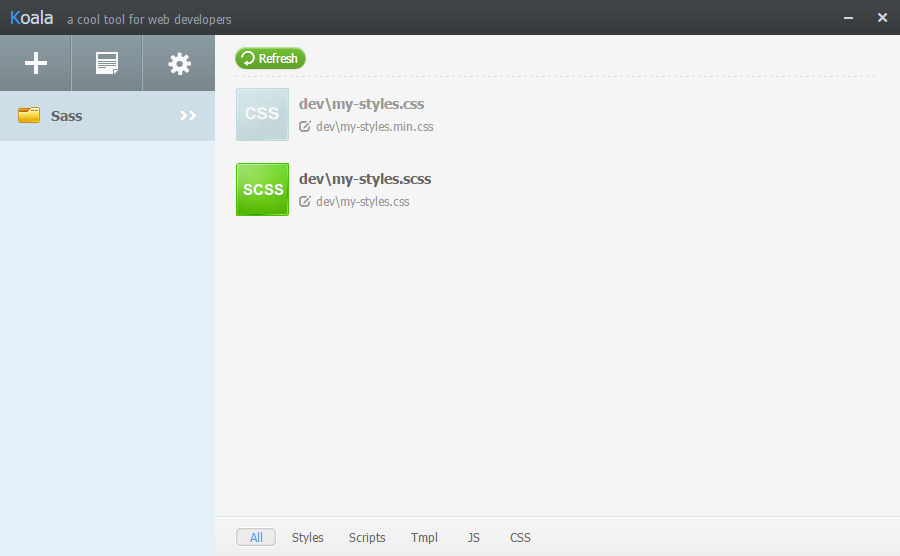

# Conhecendo o Sass

## O que são Pré-Processadores de CSS?
Para um desenvolvimento web moderno, o CSS é muitas vezes visto como primitivo e incompleto. Há muitas funcionalidades que nos facilitaria na hora de desenvolver aplicações mais complexa.

Um pré-processador é um programa que recebe um texto, realiza algumas alterações e nos devolve um novo texto.

E isso já nos ajuda com parte do nosso problema! Só conseguimos estilizar nossas páginas com CSS. E se criássemos uma espécie de “CSS com superpoderes”, criando novas funcionalidades? Então, nós usaríamos um pré-processador para utilizar esse código e transformar em CSS comum, fazendo com que qualquer navegador possa entender nosso código.

Assim, podemos trabalhar melhor e com mais produtividade, fazendo proveito de funcionalidades que são inexistentes no CSS comum.

Há vários pré-processadores, não só para CSS, mas também para HTML e JavaScript.

Para CSS, os mais famosos são Sass, Less e Stylus.

O que é Sass?

---

## O que é Sass?

O Sass (Syntactically Awesome Style Sheets ou Folhas de Estilo Sintaticamente Impressionantes) é um dos pré-processadores mais utilizados em todo o mundo.

O Sass é considerado, por seus autores, uma extensão do CSS3, porque permite trabalhar com aninhamento de regras, variáveis, mixins, herança de seletores, etc.

---

## Por que usar Sass?
O Sass possui uma sintaxe muito parecida com o CSS comum. Isso significa que qualquer código CSS é interpretado pelo Sass.

Possui uma grande comunidade e é utilizado por grandes frameworks, como o Bootstrap (que antigamente usava o Less), também possui um código bem maduro, com um desenvolvimento ativo há mais de 9 anos.

Segundo uma pesquisa feita pelo ashleynola.co.uk, o Sass é utilizado por pelo menos 66% dos desenvolvedores.


No Google Trends, se procurarmos por “Less” e “Sass”, veremos que o Sass é bem mais pesquisado:


Ambos são ótimos pré-processadores. Normalmente a escolha dependerá do gosto da equipe que estiver desenvolvendo o sistema.

---

## Sass ou Scss?
Quando começamos a ler sobre Sass, encontramos também o termo “SCSS”. Afinal, qual a diferença?

Sass é o nome do pré-processador, originalmente criado em Ruby. No começo, era necessário instalar o Ruby em sua máquina para poder gerar o CSS.

A sintaxe era bem diferente do CSS comum:

``` scss
#my-div
    color: red
    &:hover
        color: green
```

Veja que, diferente do CSS comum, não há “;“ nem “{ }”. Pela ausência de “{ }“, os espaços da indentação são importantes.

Depois de um tempo, o Sass passou por uma mudança. Sua sintaxe passou a ser mais parecida com o CSS comum:

```scss
#my-div{
    color: red;
    &:hover{
        color: green;
    }
}
```

A nova sintaxe do Sass utiliza a extensão “.scss”, diferente da antiga que utilizava a extensão “.sass”.

Resumindo: “sass” e “scss” são as duas sintaxes do Sass. Você ainda pode utilizar a sintaxe Sass, mas o mais recomendado é usar a sintaxe SCSS, por ser mais parecido com o CSS comum.

Além disso, pela popularização do Sass, hoje em dia não somos mais obrigados a ter o Ruby em nossa máquina para usá-lo. Podemos compilar o Sass a partir de C, Go, Java, Node.js, PHP, Python, etc.

Para uma lista completa, acesse: http://sass-lang.com/libsass

---

## Configurando o Ambiente com Koala
Vamos começar preparando nosso ambiente para que nosso código Sass seja transformado em CSS.

Uma das maneiras mais simples é usar um aplicativo, como o Koala. Ele observa o diretório com nossos arquivos SCSS e os transformam em CSS com apenas um clique (ou automaticamente, caso desejar).

Primeiro, baixe o programa do Koala em: http://koala-app.com/

Ele está disponível para Windows, Mac e Linux.

Após instalar o Koala em sua máquina, criaremos um diretório chamado Sass.

Dentro desse diretório, criaremos um diretório “dev” e outro “dist”.

Em “dev” nós iremos criar nossos arquivos SCSS.

“dist” será o diretório onde iremos inserir o nosso CSS final.

Em “dev”, crie um arquivo chamado “my-styles.scss” com o seguinte conteúdo:

```scss
#my-div{
    color: red;
    &:hover{
        color: green;
    }
}
```

Agora, abra o Koala. Teremos a seguinte tela:


Clique no botão “+” para selecionar um diretório. Selecione o diretório “Sass” que criamos.



Ele irá exibir os arquivos encontrados.

Se você clicar em “Refresh”, verá que terá surgido um arquivo CSS.

Sim! Automaticamente o Koala já compilou nosso arquivo. Mas não queremos que fique tudo no mesmo diretório. Em um cenário real, tudo no mesmo diretório deixará muito bagunçado.

Clique com o botão direito em cima do arquivo SCSS e clique em “Set Output Path”


Isso irá nos permitir escolher um diretório para onde os arquivos CSS irão. Selecione o diretório “dist”.

Também será solicitado um nome de arquivo. Colocaremos “styles.css”.

Clique no arquivo “my-styles.scss”. Do lado direito irá aparecer opções de compilação. Clique em “Compile” e o arquivo será compilado.


Veja que a opção “Auto Compile” está marcada. Isso significa que, basta fazermos uma alteração no arquivo “my-styles.scss” que o Koala automaticamente irá compilar.

---

## Configurando o Ambiente com Node.js

Como foi dito, não é mais preciso obter o Ruby em nossa máquina para poder utilizar o Sass. Podemos compilar o Sass a partir de C, Go, Java, Node.js, PHP, Python, etc.

Para uma lista completa, acesse: http://sass-lang.com/libsass

Como a maioria dos desenvolvedores front-end usam o Node.js atualmente, veremos como configurá-lo para compilar nosso Sass para CSS.

Primeiro, obtenha o Node.js em: https://nodejs.org/

Após instalar o Node.js em sua máquina, criaremos um diretório chamado Sass.

Dentro deste diretório, criaremos um diretório “dev” e outro “dist”.

Em “dev” iremos criar nossos arquivos SCSS.

“dist” será o diretório onde iremos inserir o nosso CSS final.

Em “dist”, crie um arquivo chamado “my-styles.scss” com o seguinte conteúdo:

```scss
#my-div{
    color: red;
    &:hover{
        color: green;
    }
}
```
Agora vamos instalar o Gulp, que é um automatizador de tarefas. Faremos com que ele observe nosso diretório “dev” e, caso note alteração em algum arquivo, automaticamente irá compilar nossos arquivos para CSS.

Um programa chamado “NPM” (Node Package Manager) será instalado junto ao Node.js. O NPM serve para baixar bibliotecas, frameworks e programas feitos em JavaScript.

Para isso, abra seu terminal e execute o comando:

```bash
$ npm install gulp -g
```

Isso irá instalar o Gulp em sua máquina, permitindo a execução do comando “gulp” direto do terminal.

Agora, abra o terminal no diretório “Sass” e execute o comando:

```bash
$ npm install gulp gulp-sass
```

Isso irá instalar em nosso projeto o Gulp e um plugin do Gulp para Sass.

Agora crie um arquivo chamado “gulpfile.js”. Nele criaremos uma função que irá automatizar a compilação do Sass.

No arquivo “gulpfile.js”, insira o seguinte código:

```scss
var gulp = require('gulp'),
    sass = require('gulp-sass');

gulp.task('sass', function(){
    return gulp.src(['./dev/**/*.scss'])
        .pipe(sass({
            outputStyle: 'expanded',
            errLogToConsole: true
        }))
        .pipe(gulp.dest('./dist'))
})

gulp.task('watch', function(){
    gulp.watch(['./dev/**/*.scss'], ['sass']);
```
Importamos as dependências e criamos duas tarefas.

A primeira irá pegar todos os arquivos “SCSS” em “/dev”, compilar e inserir em “/dist”.

A segunda irá observar todos os arquivos “SCSS” em “/dev”. Caso algum seja alterado, a tarefa “sass” será executada.

Para executar a compilação, basta executar o comando:

```bash
$ gulp sass
```

Para que a compilação seja feita automaticamente cada vez que algum arquivo for alterado, execute o comando:

```bash
$ gulp watch
```

## Tipos de Saída

Se você observar, no Koala temos a opção “Output Style”:


Também vimos essa mesma opção na hora de criar a tarefa de compilação do Sass no Gulp, como podemos ver na imagem, na linha 8:


O que são estas opções?

Elas nos indicam como queremos que seja o estilo do nosso CSS final. Veja as diferenças:

nested:


É a opção padrão.

Ele deixa o CSS indentado, para que se tenha uma melhor visão da relação entre os elementos.

expanded:


É uma forma expandida. Todos os seletores, inclusive os aninhados, estarão expandidos. Essa opção, junto ao “nested” são as formas mais simples de se ler.

A “expanded”, por deixar tudo expandido, é a que gera os maiores arquivos. Prefira usar essa opção apenas no momento do desenvolvimento, para facilitar sua leitura. Ao enviar esse código para produção, prefira evitá-lo para melhorar a performance de sua página.

Para melhor acompanhamento do curso, essa será a opção usada aqui.

compact:


Essa opção coloca todas as propriedades na mesma linha que o seu seletor, facilitando caso você precise olhar para uma lista de seletores, mas dificultando a leitura das propriedades.

compressed:


Todos os espaços e quebras de linha são removidos, o que faz com que seu código inteiro fique em apenas uma linha.

Torna a leitura muito difícil, mas é a opção que gera os menores arquivos, sendo a melhor para enviar arquivos para produção.