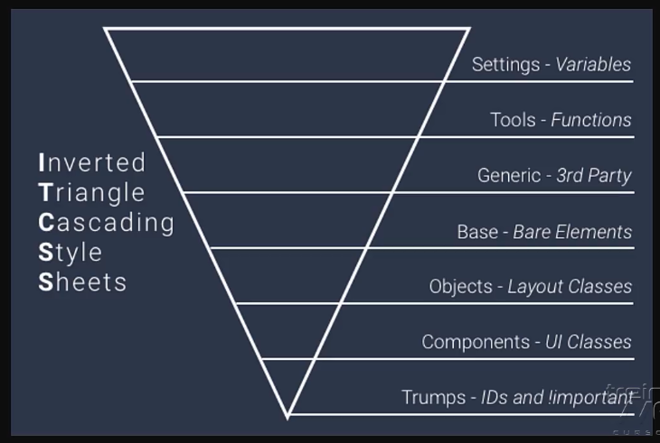
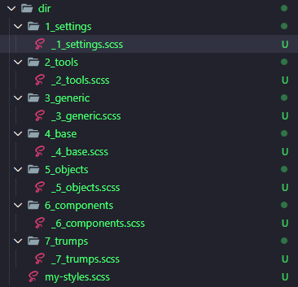

# Metodologias CSS com o poder do Sass

## Sass e o estilo BEM

Padrão de escrita do css

No lugar de fazer o `.box` e o `.box .button` usa-se o `__` na composição para elementos.

```css
.box{

}

.box__button{

}
```

O `--` representa o estado do elemento. No caso um estilo para um elemento com erro.

```css
.box{

}

.box--error{

}
```

Mas para não repetir o `.box` no nome, vamos utilizar o Sass

```scss
.box {
  border: 1px solid #000;
  &__button {
    color: red;
  }

  &--error {
    background-color: red;
  }
}
```
```css
.box {
  border: 1px solid #000;
}
.box__button {
  color: red;
}
.box--error {
  background-color: red;
}
```

---

## Sass e o ITCSS



---

## Conclusão

Estrutura das pastas



- 1_settings -> variáveis
- 2_tools -> código relacionado a pré-processador: funções, mixin
- 3_generic -> normalize, box-sizing
- 4_base -> seletor de elementos
- 5_objects -> estrutura de elementos, só classes e os padding, margin
- 6_components -> começa a estilizar( cor, fonte...)
- 7_trumps -> seletores de maior força para ajudar a estilizar