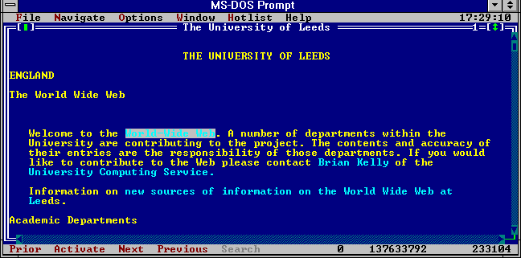
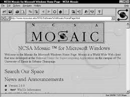
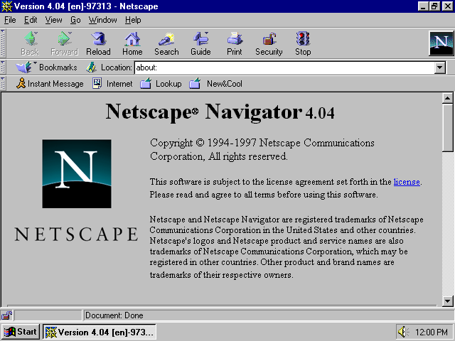
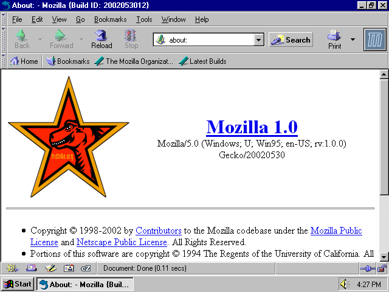
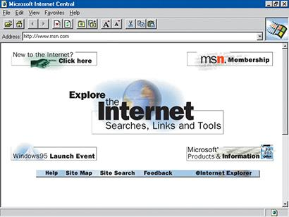

# Conhecendo a Web

## A criação da Internet e os primeiros navegadores

Olá Web developers! Vamos começar com nosso curso de HTML e CSS. Mas primeiro, temos que ter uma pequena noção de como a web funciona.

Para um bom aproveitamento deste curso, é muito importante que você seja proativo, que não tenha receio de executar os exemplos ou fazer seus próprios testes quando aprender um novo conteúdo. É com a prática que se absorve o conteúdo e que se cria experiência.

A Internet é basicamente uma grande rede de computadores conectados. Há várias utilidades para a Internet como acesso remoto, e-mail, compartilhamento de arquivos, etc. Mas aqui nós vamos nos focar na World Wide Web.

Navegador ou em inglês Browser, é o programa que utilizamos para conseguir interpretar os documentos com HTML5 e CSS3, que através de uma gama de protocolos e padrões consegue se comunicar com os servidores web.

```
Protocolos são formas utilizadas para a comunicação na internet, possibilitando a comunicação e a troca de informações entre duas ou mais máquinas.
```

Atualmente podemos escolher qual navegador queremos usar, e você provavelmente já ouviu várias discussões sobre qual deles é o melhor. Independente da resposta ou preferência, o mais importante é que desenvolver para front-end está se tornando cada vez mais simples, vários padrões foram criados para fazer o mesmo código gerar resultados iguais em todos os navegadores atuais e por isso hoje todos são muito compatíveis.

No começo tudo era acessado pelo terminal. Tim Berners-Lee criou o primeiro navegador, chamado WorldWideWeb, em 1990.



A Web só se popularizou mesmo quando apareceu o NCSA Mosaic, um navegador gráfico lançado em setembro de 1993, criado pelos desenvolvedores Marc Andreessen e Eric Bina entre 1992 e 1993. Na época, a Microsoft achou que a internet não ficaria grande, nem tomaria as proporções que ela tem hoje em dia, e acabou não investindo em melhorias. Acredite!




Em maio de 1994, Jim Clark, fundador da companhia de computadores Silicon Graphics Inc., Marc Andreessen e outros da equipe de desenvolvimento do Mosaic formaram uma empresa para desenvolver um navegador comercial com o nome de “Netscape Navigator”.

O Netscape tinha mais recursos que o Mosaic, e o seu uso espalhou-se muito rapidamente. Em outubro de 1994, a Netscape lançou a primeira versão beta de seu navegador, a Mozilla 0.96b, utilizando o download pela Internet como meio de distribuição. Em 15 de dezembro, a versão final foi lançada: o Mozilla 1.0, primeiro navegador comercial na web.

Veja abaixo como eram esses navegadores:






A Netscape fornecia rapidamente muitos novos recursos poderosos em seu navegador, e convenientemente integrava três tecnologias da Internet: uma aplicação web, sistema de e-mails e grupos de notícias. A Netscape também fez questão de garantir que o navegador funcionasse corretamente nos três principais sistemas operacionais da época: Windows, Macintosh e Unix.

Existem várias histórias e muitas teorias da conspiração, no entanto, o certo é que ao perceber como o mercado da internet e principalmente dos navegadores web era importante, a Microsoft começou a se mexer para tirar o atraso.

O primeiro IE - Internet Explorer foi derivado do Spyglass Mosaic, assim como o Netscape Navigator. O Mosaic original veio da NCSA, mas a NCSA era uma entidade pública que contou com a Spyglass como seu parceiro de licenciamento comercial. A Spyglass por sua vez, entregou duas versões do navegador Mosaic para a Microsoft, uma totalmente baseada no código fonte NCSA, e outra projetada a partir do zero, mas conceitualmente modelada no navegador do NCSA.

O navegador foi então modificado, melhorado e lançado pela Microsoft como o Internet Explorer 1.0, em agosto de 1995, para o Windows 95:



Começou aí a concorrência que daria início a “Guerra dos navegadores”, de um lado a Microsoft com o seu recém lançado Microsoft Internet Explorer e de outro lado a Netscape, detendo quase 100% do mercado com o seu Netscape Navigator. De lá para cá vários outros navegadores surgiram (Opera, Safari, Chrome, Firefox, etc), aumentando ainda mais essa concorrência, e o pior: Cada um interpretando o HTML (e outras linguagens) de uma forma diferente, o que tornava muito difícil desenvolver para várias plataformas e navegadores.

Felizmente, isso foi deixado para trás. Hoje em dia, apesar de uma parte deste problema ainda existir, todos os navegadores atuais utilizam dos mesmos padrões de interpretação, e por isso, podemos escolher entre várias opções, e ter um resultado muito similar (se não idêntico) em todas elas.

Para o curso, no entanto, recomendo que utilize a versão atual do Google Chrome, que pode ser baixado neste link: https://www.google.com.br/chrome/browser/desktop/

Se você estiver acostumado com outro navegador e achar que é melhor utiliza-lo, isso não será um problema, mas alguns dos recursos como atalhos e itens de menu de contexto mostrados e utilizados durante o curso, podem estar em locais diferentes caso opte por outro navegador.

```
Se você deseja saber quais as características do HTML5 suportadas por seu navegador atual, basta clicar neste link https://html5test.com/
```

---

## Servidor e Cliente

Como foi dito anteriormente, a Internet é uma rede de computadores e obtemos arquivos através da Web.

Em desenvolvimento para a Web sempre separamos dois setores: a parte do servidor e a parte do cliente.

O cliente é o computador do usuário, assim como o seu. É utilizado pelas pessoas para acessar sites ou sistemas a partir de um endereço. Os arquivos vindos por esse endereço são disponibilizados por um outro computador que serve estes arquivos. Estes computadores que estão em algum lugar do mundo que servem arquivos e outros serviços são chamados de servidores.


Nos servidores programamos com linguagens como PHP, Java, C#, Ruby, etc, e gerenciamos bancos de dados. Chamamos essa parte de back-end.

Os clientes, que podem ser qualquer dispositivo conectado à Internet como smartphones, notebooks e tablets, recebem arquivos desses servidores, como imagens, vídeos, arquivos HTML, CSS e JavaScript. Chamamos essa parte de front-end.

Na próxima aula veremos como o HTML funciona.