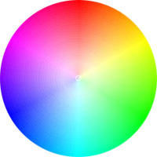

# Cores

## Cores
Nesta aula aprenderemos como alterar as cores. As cores são muito importantes na criação de um layout. Raramente iremos encontrar um site hoje em dia que seja todo branco com letras pretas, sem nenhum elemento com alguma cor.

Temos quatro maneiras de se passar cores como valores de propriedades.

## Nomes
Podemos passar as cores pelo seu nome. As pessoas não costumam decorar o nome de todas as cores e os softwares de edição de imagens normalmente não utilizam, portanto, não é muito utilizado na estilização.

Podemos usar valores como: red, blue, lightgreen, darkorange, chocolate, gold, lavender, coral, etc.

Agora o CSS também aceita “transparent” como valor, deixando a propriedade sem nenhuma cor.

## RGB
Todas as cores são basicamente criadas a partir de três cores básicas: vermelho, verde e azul. Com isso, temos o padrão RGB (Red, Green, Blue).

Para se obter uma cor, passamos a quantidade de vermelho, verde e azul que queremos. O menor valor é 0 e o maior é 255.

Se quisermos, por exemplo, ter uma cor vermelha, podemos passar o valor rgb(255, 0, 0). Isso porque passamos o valor máximo para vermelho e zero para verde e azul.

Se quisermos roxo, podemos passar algo como rgb(150, 0, 150). Com isso, passamos um valor para vermelho e azul, deixando o verde zerado.

Se todos os valores forem zerados, teremos a cor preta.

Se todos os valores forem máximos, teremos a cor branca.

Se todos os valores estiverem equilibrados, teremos cinza.

Também há o padrão RGBA, onde A (alpha) indica a transparência da cor. O valor máximo é 1 e o menor é 0.

0 deixará a cor totalmente transparente, e 1 deixará a cor totalmente opaca. Se quisermos uma cor 50% transparente, passaríamos 0.5.

```css
rgba(255, 153, 49, 0.3)
```

## Hexadecimal
O formato hexadecimal é o mais utilizado, principalmente em softwares de edição de imagens.

Eles seguem a mesma ideia do RGB: passamos os valores de vermelho, verde e azul. A diferença é que as cores em hexadecimal começam com um “#”, e os números de 0 a 255 seguem o formato hexadecimal.

Para quem não conhece, o hexadecimal é uma maneira diferente de contar. No nosso dia a dia utilizamos o sistema decimal, com números de 0 a 9. No hexadecimal, essa contagem vai de 0 a F, ou seja, uma contagem seria:

```css
. . ., 8, 9, A, B, C, D, E, F, 10, 11, ...
```

10 em hexadecimal seria o nosso 16 no decimal. A vale 10, B vale 11, etc. Com isso, o valor máximo que utilizamos no formato RGB, que é o 255, em hexadecimal seria FF.

Então, o nosso vermelho em RGB que era rgb(255, 0, 0) em hexadecimal será #FF0000;

Branco seria #FFFFFF e preto seria #000000;

O formato hexadecimal não aceita transparência. Caso transparência seja necessária, utilize o formato RGBA.

## HSL e HSLA
O HSL serve para declarar cores de acordo com três parâmetros:

+ H - Hue (tom);
+ S - Saturation (saturação);
+ L - Lightness (iluminação).

Para esse tipo de declaração, passamos um valor numérico (de 0 a 360) e duas porcentagens.

```css
hsl(80, 50%, 30%)
```

O primeiro valor é para o tom da cor em relação à roda de cores:

O primeiro valor é para o tom da cor em relação à roda de cores:



| Ângulo | Tom      |
| -------| -------  |
| 0      | Vermelho |
| 60     | Amarelo  |
| 120    | Verde    |
| 180    | Ciano    |
| 240    | Azul     |
| 300    | Púrpura  |
| 360    | Vermelho |

Assim como o RGB, o HSL também aceita transparência:

```css
hsla(50, 10%, 38%, 0.7)
``` 

---

## Editando Cores
Vamos brincar um pouco com algumas propriedades onde podemos alterar as cores.

### Color
A propriedade color serve para alterar a cor da fonte.

#### CSS

```css
div{
  color: red;
}
```

#### HTML

```html
<div>Meu Texto</div>
```

### Background
A propriedade background muda o fundo dos elementos. Para alterar a cor, utilizamos a propriedade “background-color”. Podemos também utilizar a propriedade “background-image” para passar uma imagem como fundo. Vamos nos focar nas cores:

#### CSS

```css
div{
  background-color: #00FF00;
}
```

#### HTML

```html
<div>Meu Texto</div>
```

### Opacity
A opacidade não é uma propriedade de cor, mas como influencia na visibilidade do elemento foi colocado aqui por motivos de organização. A opacidade é um número entre 0 e 1, onde 0 é transparente e 1 é opaco.

#### CSS

```css
div{
  opacity: 0.5;
}
```

#### HTML

```html
<div>Meu Texto</div>
```


### Borders
Veremos melhor sobre bordas em uma futura aula. Aqui só vamos ver que é possível mudar a cor das bordas dos elementos.

#### CSS

```css
div{
  border-width: 5px;
  border-style: solid;
  border-color: #00FF00;
}
```

#### HTML

```html
<div>Meu Texto</div>
```

---

## Exercícios

Questão 1 de 3
Marque as opções verdadeiras:

Escolha 2 respostas.
As cores devem ser definidas no HTML.

Podemos passar o nome das cores, como "background: verde".

✔ A declaração de cores no fomato hexadecimal não aceita transparência.

✔ A propriedade "opacity" muda a opacidade do elemento todo.

A propriedade "color" serve para alterar a cor de um elemento.


Questão 2 de 3
Qual a vantagem de se utilizar o formato hexadecimal para a declaração de cores?

Não sofre distorção.

Deixa as cores mais nítidas.

Aumenta a fidelidade de cor entre monitores diferentes.

Melhora a performance dos navegadores, principalmente em dispositivos móveis.

✔ É uma declaração mais curta e muito utilizada em softwares de edição de imagens.


Questão 3 de 3
Complete corretamente a afirmação abaixo:
O formato 
`hexadecimal` é o mais simples e mais utilizado em softwares de edição de imagens .