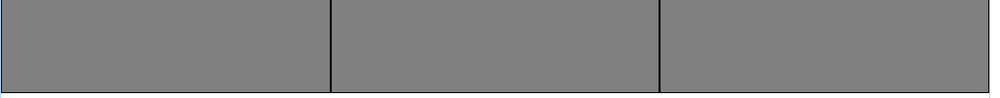

# Unidades de Medidas

## Unidades de Medidas
Assim como as cores, outro ponto importante a se conhecer são as unidades de medidas. São utilizadas para valores como altura, largura, tamanho de margens, posicionamento, tamanho de bordas, etc.

As unidades sempre são colocadas após um número, como:

```
15px, 25cm, 53%
```

Note que não deve haver espaço entre o número e a unidade de medida.

Temos dois grupos de medidas: absolutas e relativas.

---

## Medidas Absolutas
As medidas absolutas são fixas, ou seja, serão apresentadas exatamente da mesma maneira em todos os lugares.

O mais usado é o “px”. Aqui estão outras medidas absolutas:

+ *cm* - centímetros ( 96px / 2.54 )
+ *mm* - milímetros ( 1/10cm )
+ *q* - 1/4 de milímetro ( 1/40cm )
+ *in* - polegadas ( 2,54cm = 96px )
+ *pc* - pica ( 12pt ou 1/6in )
+ *px* - pixels ( 1/96in )
+ *pt* - pontos ( 1/71in )

---

## Medidas Relativas
As medidas relativas tem seu valor em relação ao valor de uma outra propriedade.

Por exemplo: se temos uma tela de 200px de largura e definimos uma div com 50% de largura, a div terá 100px de largura. Mas se a tela tiver 50px de largura, essa mesma div terá 25px;

As mais usadas são %, em e rem.

+ *%* - porcentagem (tecnicamente % não é uma unidade, e sim, um tipo de dado);
+ *em* - relativo ao tamanho da fonte do elemento. Se o tamanho da fonte for 16px e você colocar 0.5em, o valor será igual a 8px;
+ *rem* - igual ao em, mas em relação ao tamanho da fonte do elemento raiz;
+ *ex* - altura da letra x da fonte do elemento;
+ *ch* - largura mais espaçamento em volta do número 0 da fonte do elemento.

---

## Outras Unidades
Além dessas medidas, também temos outras propriedades que pedem outros tipos de unidades:

+ *Ângulos:* deg, grad, rad, turn;
+ *Duração:* s, ms;
+ *Frequência:* Hz, kHz;
+ *Resolução:* dpi, dpcm, dppx.
+ *deg* - grau ( um círculo possui 360deg );
+ *grad* - grado ( um círculo possui 400grad );
+ *rad* - radiano ( um círculo possui 2PIrad );
+ *turn* - volta ( um círculo possui 1turn ).
+ *s* - segundos;
+ *ms* - milissegundos ( 1/1000s ).
+ *Hz* - Hertz ( número de ciclos por segundo );
+ *kHz* - KiloHertz ( 1000Hz ).
+ *dpi* - dots per inch ( pontos por polegada );
+ *dpcm* - dots per centimeter ( pontos por centímetro );
+ *dppx* - dots per pixel ( pontos por pixel ).

---

## Função calc()
Também podemos fazer alguns cálculos quando vamos passar alguns valores no CSS.

Imagine que a gente queira criar três colunas iguais que ocupem toda a largura da tela, e que esse tamanho não importe em relação ao tamanho da tela. Elas devem ficar uma ao lado da outra.

Nesse caso, devemos usar a %. Como a tela mede 100%, 100%/3 = 33.33333…%. Por ser uma dízima periódica, a soma das três colunas dará uma largura de 99.9999%, ou seja, nunca ocuparemos 100% da largura, deixando um pequeno espaço sobrando.


Podemos então, colocar algo como:

```css
width: calc( 100% / 3 );
```



Com isso, o próprio navegador irá cuidar do cálculo em tempo real. Podemos misturar várias unidades diferentes no cálculo, por exemplo: na imagem acima, coloquei bordas de 1px para podermos visualizar melhor a separação das colunas. Como cada coluna tem uma borda do lado direito e uma do lado esquerdo, isso quer dizer que acrescentamos 2 pixels a cada coluna. Então, para que elas não passem os 100% da linha, temos que descontar esses 2 pixels, resultando em:

```css
width: calc( (100% / 3) - 2px )
```

Note que utilizamos parênteses para indicar qual o cálculo deve ocorrer primeiro, igual a uma conta comum de matemática. Outro ponto importante também é que os operadores ( +, -, / e *) não podem estar grudados aos números ou unidades.

---

## Conhecendo as unidades de medidas

Vídeo

---

## Exercícios


Questão 1 de 3
O que caracteriza as unidades de medidas absolutas?

✔ Elas terão sempre o mesmo valor.

Nos possibilitam realizar cálculos.

Elas servem para elementos grandes.

Elas mudam de valor de acordo com o elemento pai ou tamanho da tela.

Possuem um valor diferente dependendo do dispositivo.


Questão 2 de 3
Marque as opções verdadeiras em relação à função calc().

Escolha 2 respostas.
✔ Podemos misturar valores de unidades diferentes.

Não funciona com elementos com unidades absolutas.

✔ Podemos utilizar parênteses e operadores como +, -, * e /.

Só funcionam com unidades relativas.

Apenas funcionam com a propriedade "width".


Questão 3 de 3
Marque as opções que contenham unidades relativas:

Escolha 2 respostas.
cm.

px.

✔ %.

m.

✔ em.