# Formatando Textos

## Fontes
Quando se é definida uma fonte para ser exibida em um website, esta fonte pode estar instalada no sistema operacional do usuário ou no servidor remoto do site. As fontes instaladas em um servidor remoto são conhecidas como web-fonts. Antes de conhecer as declarações CSS para a definição das fontes em um website, vamos conhecer os seus tipos.

---

## Tipografia
Nas imagens abaixo vamos conhecer quais são os principais tipos de fontes disponíveis para o alfabeto latino.

### serif
É dado o nome de fontes do tipo serif às fontes que recebem continuações em suas extremidades, conhecidas como serifas:

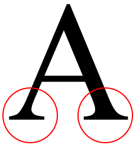

### sans serif
Fontes do tipo sans serif são fontes que não contém serifas.

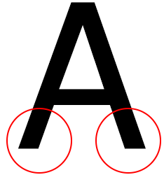

### cursive
As fontes do tipo cursive ou cursiva são aquelas que se assemelham da escrita a mão livre.


### fantasy
Fontes do tipo fantasy ou fantasia são aquelas com características decorativas.


### monospace
Fontes do tipo monospace ou mono-espaçadas são aquelas em que a largura e altura de todos os caracteres são as mesmas.


É importante saber que existem fontes do alfabeto latino que podem ou não receber acentos. Fique atento ao definir o tipo da fonte utilizada para saber se a fonte pode receber acentuação.

Também fique atento para saber se a fonte selecionada pode receber variações de largura e peso como efeitos de negrito, itálico e sublinhado.

Agora que sabemos um pouco mais sobre as fontes em si, vamos conhecer as declarações CSS para o uso de fontes.

---

## font-family
A propriedade font-family é utilizada para definir o nome da fonte a ser utilizada em um documento. Pode-se declarar mais de um tipo de fonte. Assim, caso a primeira fonte declarada não seja encontrada no sistema operacional do usuário, a segunda será utilizada e assim por diante. Veja o exemplo abaixo.

```html
<p>A TreinaWeb Cursos é um dos maiores centros de ensino à distância do Brasil, líder e especializado no ensino e desenvolvimento de TI, Tecnologia da Informação.</p>
```

A declaração CSS:

```css
p{
  font-family: "Times New Roman", Tahoma, arial;
}
```

No exemplo acima o seletor `<p>` utilizará a fonte Times New Roman. Caso não seja encontrada no sistema operacional do usuário, a fonte Tahoma será utilizada. Caso também não seja encontrada, a fonte arial será utilizada.

Observe que os nomes de fontes que possuem espaços devem vir entre aspas:

```
"Times New Roman"
```

### @font-face

A regra @font-face é utilizada para se utilizar fontes hospedadas em servidores remotos. Essa funcionalidade é utilizada para resolver o problema caso o sistema operacional do usuário não tenha a fonte utilizada no website.

Veja o exemplo abaixo:

```css
@font-face {
  font-family: Amaze;
  src: url("AMAZR___.ttf");
}
```

Neste exemplo o arquivo “AMAZR___.ttf” (que é o arquivo da fonte que será utilizada) deverá estar hospedado na mesma pasta onde está o arquivo de estilo ou o arquivo HTML caso o código CSS estiver incorporado ao arquivo HTML.

Neste caso, a propriedade “font-family” é o nome que estamos dando a fonte que está sendo carregada do arquivo passado em “src”. Você pode dar o nome que quiser, e ele será utilizado para o uso dessa fonte.

Baixe os arquivos da fonte: amaze.zip

Descompacte o arquivo zipado e observe que os arquivos do tipo .ttf serão exibidos:

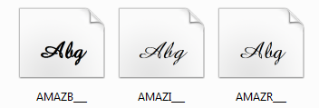

Copie o arquivo AMAZR___.ttf para o mesmo diretório do nosso exemplo HTML. Altere o HTML do exemplo para:

```
<p>Exemplo de texto</p>
```

E o CSS:

```css
@font-face {
  font-family: MinhaFonte;
  src: url("AMAZR___.ttf");
}

p {
  font-family: MinhaFonte;
}
```

Em execução:

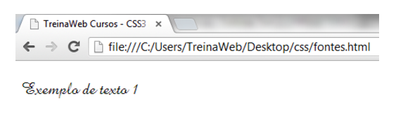

Teste com outras fontes de sua preferência.

---

## API de fontes do Google
A API de fontes criado pelo Google tem como objetivo acessar de forma remota fontes hospedadas no servidor do Google criando apenas um link na seção `<head>` do site. Com o uso desta API não há a necessidade de baixar e hospedar as fontes. Basta apenas indicar qual fonte deseja utilizar (desde que ela esteja disponível no servidor remoto do Google).

Para consultar as fontes disponíveis acesse o link abaixo:

http://www.google.com/webfonts

No campo de busca pesquise por “Allura”:

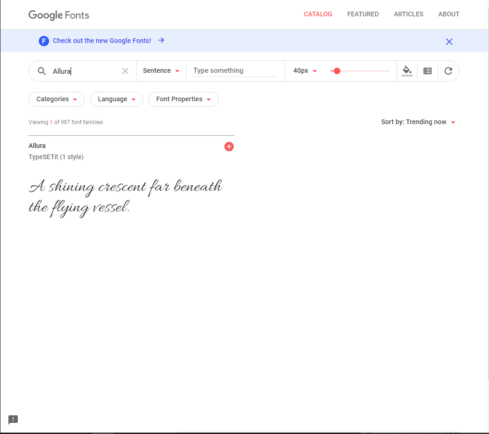

Para usá-la em nosso projeto clique “Quick-use” no lado direito da tela:

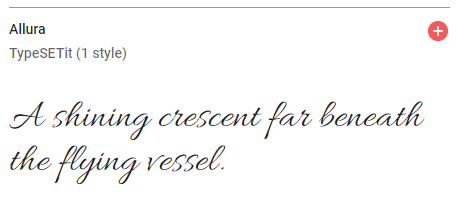

Na tela que abrir terá o código HTML do `<link>` para incorporação da fonte:

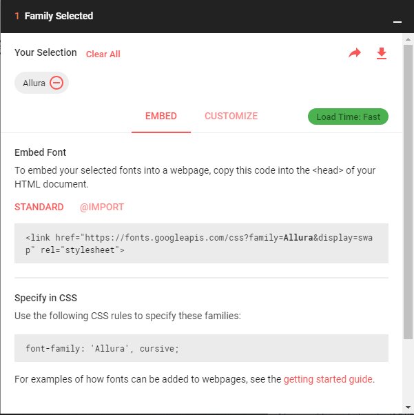

E logo abaixo, informações sobre a font-family que deveremos usar:

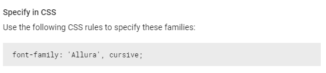

Coloque o código dentro da tag `<head>` do seu HTML.

```html
<head>
    <link href="https://fonts.googleapis.com/css?family=Allura&display=swap" rel="stylesheet">
</head>
```

---

## font-style
A propriedade font-style é utilizada para definir o estilo da fonte, sendo que os valores possíveis são:

+ italic
+ normal
+ oblique

Veja o exemplo abaixo:
```css
p{
  font-family: "Times New Roman", Tahoma, arial;
  font-style: italic;
}
```

Em execução:

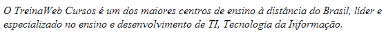

---

## font-variant
A propriedade font-variant é usada para escolher entre as variantes normal ou small-caps. Por exemplo, uma fonte small-caps é aquela que usa letras maiúsculas de tamanhos reduzidos.

```html
<p>TreinaWeb Cursos</p>
```

```css
p{
  font-family: "Times New Roman", Tahoma, arial;
  font-variant: small-caps;
}
```

Exemplo:

Em execução:

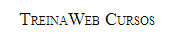

---

## font-weight
A propriedade font-weight é utilizada para definir o peso da fonte. O peso da fonte é a espessura dos traços que formam o caractere. É normalmente utilizado para definir um maior ou menor grau de destaque para o texto. Na tabela abaixo você verá a descrição dos valores aceitos por ordem de peso.

| Valor  | Descrição da W3C                                                 |
| -------| ---------------------------------------------------------------  |
| 100    | Thin                                                             |
| 200    | Extra light                                                      |
| 300    | Light                                                            |
| 400    | Normal                                                           |
| 500    | Medium                                                           |
| 600    | Semi bold                                                        |
| 700    | Bold                                                             |
| 800    | Extra bold                                                       |
| 900    | Black                                                            |
| bold   | Peso entre 600 e 900 dependendo da família da fonte selecionada. |

Veja o exemplo de utilização abaixo:

```html
<p>TreinaWeb Cursos</p>
```

```css
p {
  font-family: "Times New Roman", Tahoma, arial;
  font-weight: 700;
}
```

Em execução:

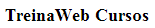

No entanto, o mais comum é utilizar valores pré-definidos, como:

```css
font-weight: bold;
```
ou

```css
font-weight: bolder;
```

---

## font-size
Propriedade utilizada para definir o tamanho da fonte em uso. Pode-se definir o tamanho de uma fonte por: valores absolutos, valores relativos ou ainda por um valor de porcentagem.

Na tabela abaixo estão representados os valores possíveis para declarar o tamanho da fonte:

+ xx-small
+ x-small
+ small
+ medium
+ large
+ x-large
+ xx-large

Veja o exemplo abaixo e faça testes com os valores acima:

```css
p {
  font-family: "Times New Roman", Tahoma, arial;
  font-size: x-large;
}
```

Vamos agora visualizar alguns exemplos de utilização com unidades de medida, que são as formas mais utilizadas para definir tamanho de fonte:

```css
p{ font-size: 1em; }
```
Nesse exemplo o parágrafo terá 100% do tamanho da fonte do seu elemento pai (nesse caso, o elemento `<body>`).

Exemplo com diferentes unidades:

```html
<p>TreinaWeb Cursos</p>
```

```css
p{ font-size: 1em; }
p{ font-size: 20px; }
p{ font-size: 1.5rem; }
p{ font-size: 75%; }
```

Cada um desses exemplos resultaria em:

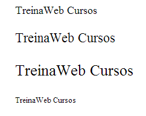

---

## font-stretch
Propriedade utilizada para indicar o grau de condensação ou expansão dos caracteres de uma fonte. Veja abaixo os valores possíveis para esta propriedade:

+ normal
+ ultra-condensed
+ extra-condensed
+ condensed
+ semi-condensed
+ ultra-expanded
+ extra-expanded
+ expanded
+ semi-expanded


Exemplo:

```css
p{
  font-stretch: condensed;
}
```

O resultado de font-stretch varia de acordo com a família da fonte que você estiver usando. Dependendo da família de fonte que você usar não terá nenhuma diferença, pois ela pode não possibilitar diferentes variedades de largura. Mais uma vez, faça alguns testes, e veja a diferença entre cada um dos valores acima, na prática.

---

## font-size-adjust
A propriedade font-size-adjust especifica que o tamanho da fonte deve ser escolhido baseado na altura das letras minúsculas. Recurso utilizado para melhorar a legibilidade de caracteres muitos pequenos.

Exemplo:

```
TreinaWeb Cursos
```

```css
p{
  font: 12px verdana;
  font-size-adjust:0.545;
}
```

Em execução:

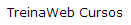

Obs: No momento da criação deste curso, este recurso funciona por padrão apenas no Firefox.

---

## Texto
Formatar e estilizar textos são itens chave para qualquer web designer / front-end developer. Aprenderemos a seguir as principais propriedades dos textos no CSS.

### color
Talvez esta seja umas das propriedades mais utilizadas. Ela define a cor da fonte do elemento.

Exemplo:

```html
<p>TreinaWeb Cursos - Ensino inteligente à distância</p>
```

CSS:

```css
p{
  color: blue;
}
```

### text-indent
A propriedade text-indent permite aplicar espaço à primeira linha de um parágrafo.

Exemplo:

```css
p{
  text-indent: 20px;
}
```

Atualize o exemplo:

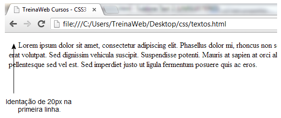

### text-align
Com a propriedade text-align, os textos podem ser alinhados à esquerda (left), à direita (right) ou centralizados (center). Tem também o valor justify, que justifica o texto.

Exemplo:

```css
h1{
  text-align: left;
}

h2{
  text-align: right;
}

h3{
  text-align: center;
}
```

Em execução:

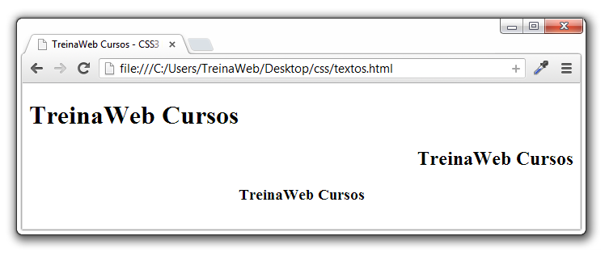

E o alinhamento justificado é aquele quando queremos que o bloco de texto tenha uma forma mais uniforme.

Por exemplo, abaixo temos um texto não justificado:

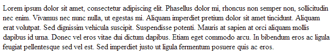

Agora, o mesmo texto justificado:

```css
p{
  text-align: justify;
}
```

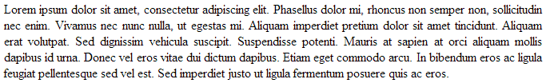

### text-decoration

A propriedade text-decoration possibilita aplicar "efeitos" ou "decorações" em textos. Você pode sublinhar textos, riscar o texto com uma linha, colocar uma linha sobre o texto e etc. No exemplo a seguir o cabeçalho `<h1>` é sublinhado, o cabeçalho `<h2>` leva uma linha em cima e o cabeçalho `<h3>` é cortado por uma linha.

```html
<h1>Texto com decoração</h1>

<h2>Texto com decoração</h2>

<h3>Texto com decoração</h3>
```

CSS:

```css
h1{
  text-decoration: line-through;
}

h2{
  text-decoration: overline;
}

h3{
  text-decoration: underline;
}
```

Em execução:

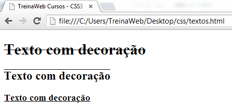

Ainda existe o valor “none” para text-decoration que cancela qualquer decoração que o elemento venha a ter.

### text-transform
A propriedade text-transform controla o tipo de "caixa" (maiúscula ou minúscula) do texto. Você pode escolher entre capitalize, uppercase ou lowercase, independente do modo como o texto foi informado no HTML.

+ *capitalize* - Capitaliza a primeira letra de cada palavra. Por exemplo: "treinaweb cursos" transforma-se em "Treinaweb Cursos";
+ *uppercase* - Converte todas as letras para maiúscula. Por exemplo: "treinaweb cursos" transforma-se em "TREINAWEB CURSOS";
+ *lowercase* - Converte todas as letras para minúscula. Por exemplo: "TREINAWEB CURSOS" transforma-se em "treinaweb cursos";
+ *none* - Sem transformações - o texto é apresentado como foi informado no HTML.

Exemplo:

```css 
p.letter{
  text-transform: uppercase;
}
```

Atualize o exemplo:

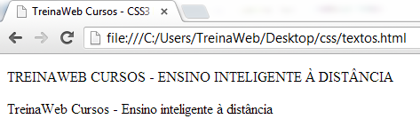

Teste também os outros valores.

### Text Shadow
Essa propriedade adiciona sombras ao texto.

Passamos a posição horizontal, posição vertical, nível de ofuscação e cor da sombra.

```html
<h1>TreinaWeb</h1>
```

```css
h1 {
    text-shadow: 2px 2px 5px #FF0000;
}
```


Cuidado com o uso dessa propriedade. Abusar dela pode deixar suas páginas lentas, principalmente em dispositivos móveis.

---

## Letras, Palavras e Linhas

### Letter Spacing
A função do letter-spacing é aplicar um espaço entre as letras do texto do elemento.

Exemplo:

```html
<p>TreinaWeb Cursos - Ensino inteligente à distância</p>
```

CSS:

```css
p{
  letter-spacing: 2px;
}
```

Atualize o exemplo:

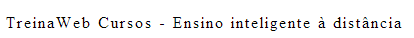

Esta propriedade é bastante interessante para ser utilizadas em destaques ou em textos maiores, pois facilita bastante a leitura.

### Word Spacing
Define um espaçamento entre as palavras do texto.

Exemplo:

```css
p{
  word-spacing: 10px;
}
```

Em execução:

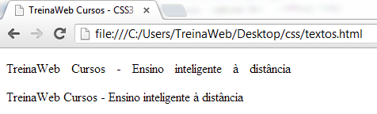

### Line Height
Aplica a altura da linha em porcentagem.

```css
p{
    line-height: 200%;
}
```

```html
<p>
TreinaWeb <br />
TreinaWeb <br />
TreinaWeb <br />
</p>
```

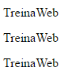

### White Space
Esta propriedade aceita os seguintes valores:

+ *normal* - Os espaços (e tabs) em branco são ignorados pelo browser;
+ *pre* - Os espaços (e tabs) em branco são preservados pelo browser e não há quebra de linha. Novas linhas são preservadas;
+ *pre-wrap* - Os espaços (e tabs) em branco são preservados pelo browser e há quebra de linha. Novas linhas são preservadas;
+ *nowrap* - O texto é apresentado em uma única linha na tela. Não há quebra de linha até ser encontrada uma tag `<br/>`. Novas linhas não são preservadas, não há quebra de linha;
+ *pre-line* – Sequências de quebra de linha são preservadas.

Exemplos:

```html
<div>
  TreinaWeb Cursos - Ensino inteligente à distância
</div>
```
CSS:

```css
div{
  width: 200px;
  border: solid 1px #cecece;
}
```

Quando não especificamos é usado o valor normal de white-space. Os múltiplos espaços são ignorados e há quebra de linha:

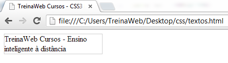

Agora, se definirmos no CSS a propriedade white-space como “pre”:

```css
div{
  width: 200px;
  border: solid 1px #cecece;
  white-space: pre;
}
```

Os espaços são mantidos (tanto em cima quanto dos lados) e não há quebra de linha:

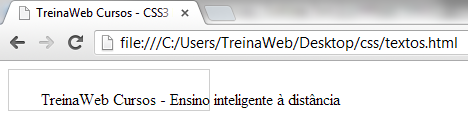

Exemplo de nowrap:

```html
<div>
  TreinaWeb Cursos - Ensino inteligente à distância

  TreinaWeb Cursos - Ensino inteligente à distância
</div>
```

CSS:

```css
white-space: nowrap;
```

Em execução:

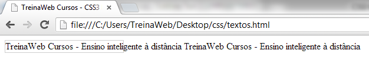

---

## Formatando textos com CSS

vídeo

---

## Exercícios

Questão 1 de 3
Complete corretamente a afirmação abaixo:
Abusar da propriedade `text-shadow` pode dar problemas de performance .


Questão 2 de 3
Marque as opções falsas:

Escolha 2 respostas.
✔ Não há diferença entre formatar textos com CSS ou HTML.

Podemos sublinhar um texto com "text-decoration".

✔ Podemos usar o "font-style" para definir o nível do parágrafo entre H1 e H6.

Alteramos o tamanho da fonte com "font-size".

Fontes serifadas possuem continuações em suas extremidades.


Questão 3 de 3
Marque as opções verdadeiras:

Escolha 2 respostas.
O CSS possui valor semântico.

"text-color" altera a cor da fonte.

✔ "color" alterar a cor da fonte.

Formatar com HTML sempre trás mais performance à página.

✔ Com CSS podemos regular a distância entre letras, palavras e linhas.