# Box Model
 
## Box Model
Os elementos HTML podem ser considerados como caixas. Imagine que cada elemento que colocamos na tela tem um contorno em forma de retângulo. Entender essas caixas é importante para criarmos nossos layouts.

Há basicamente dois tipos básicos de tipo de exibição dessas caixas: block e inline.

+ **Block (bloco):** elementos que ocupam a linha inteira, ou seja, o próximo elemento será jogado para a linha de baixo. Podemos definir a largura e altura desses elementos.
+ **Inline (linha):** elementos que seu tamanho depende do tamanho do conteúdo, então não podemos definir uma largura e altura para eles. Como não ocupam a linha inteira, o elemento seguinte será exibido na mesma linha caso haja espaço
+ **Inline-Block:** esse tipo especial é uma mistura do comportamento de linha e bloco. Tem o mesmo comportamento do Inline, com a diferença que podemos definir largura e altura.

Podemos alterar esse comportamento com a propriedade display. Caso a gente queira que o elemento não seja apresentado, passamos o valor **none**.

```css
h1{
  display: block;
}

h2{
  display: none;
}

h3{
  display; inline-block;
}
```

Essa caixa, da qual os elementos são compostos, possuem margens internas e externas (padding e margin), bordas (border) e o conteúdo (content).

Para algumas propriedades do CSS também precisaremos trabalhar em apenas um dos lados da caixa. Imagine que a gente queira colocar uma borda apenas na parte de baixo da caixa, ou do lado direito. Para isso temos as direções top, right, bottom e left (essa ordem é importante saber. Imagine como a ordem de um ponteiro de relógio saindo do número 12).

E por fim, temos as dimensões. Podemos alterar a largura (width) e altura (height) das caixas.

Esse é o modelo de uma caixa:


Vamos ver na prática para ficar mais fácil de entender.

```html
<h1>TreinaWeb Cursos</h1>
```

```css
h1{
  color: #ffffff;
  background-color: #264968;
  width: 400px;
  margin: 10px;
  padding: 15px;
  border: 5px solid #cecece;
}
```

Abra o arquivo no Google Chrome:


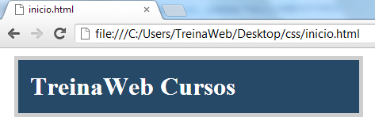

Acesse as ferramentas de desenvolvedor do Google Chrome. O Atalho para essa ferramenta é F12.

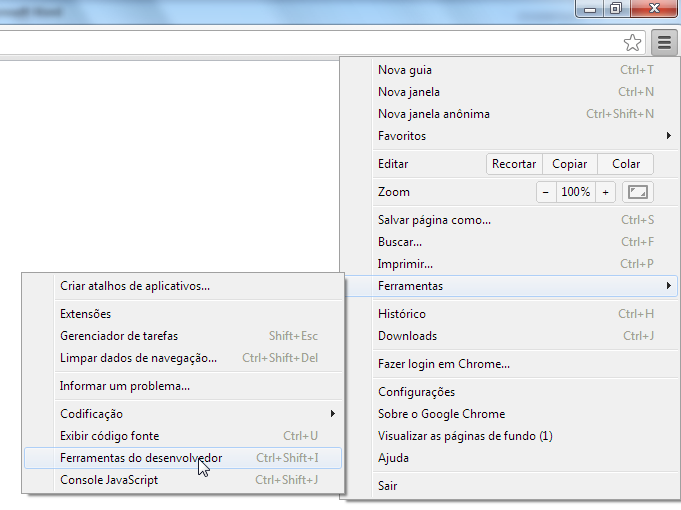

O importante para nós neste momento é termos acesso à área "Metrics". Para isso, configuramos a largura da janela do navegador. Você não precisa deixar a janela assim, foi feito apenas para facilitar a nossa visualização:

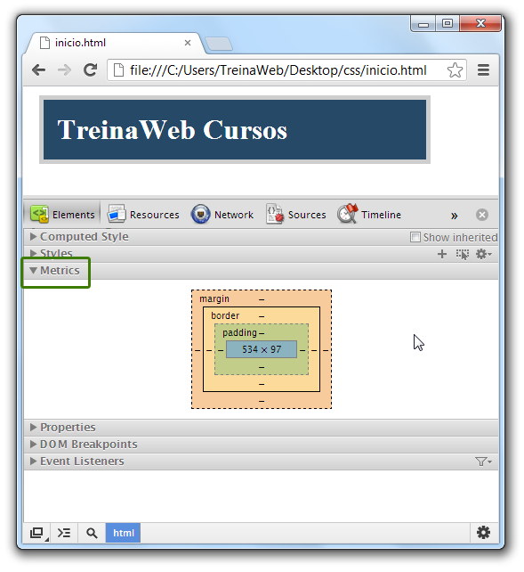

De primeira já deu para visualizarmos o gráfico de um Box Model. Agora vamos selecionar o elemento `<h1>` para inspeção, para isso, clique no ícone de "lupa":

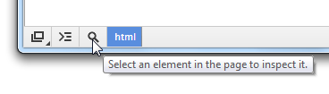

Em seguida clique no elemento `<h1>` ("TreinaWeb Cursos"):

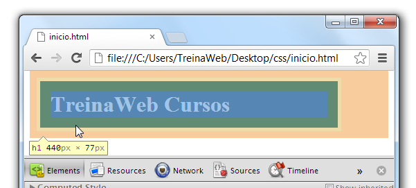

Pronto. Isso é o suficiente para o elemento ser inspecionado pela ferramenta. Outra forma de inspecionar é pela área que exibe a estrutura em árvore do documento:

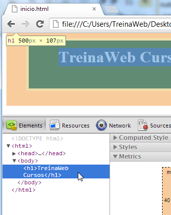

Agora olhe o Box Model:

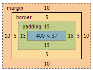

Ele está retratando exatamente as propriedades CSS do nosso elemento `<h1>`. Façamos uma análise comparativa do Box Model com as propriedades CSS que definimos para ele:

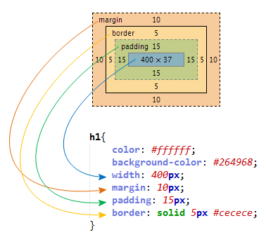

Traduzindo o significado de cada uma dessas declarações:

+ **width** - Define a largura do elemento. Definimos uma largura de 400px;
+ **margin** - Define a margem externa do elemento. Definimos para 10px;
+ **padding** - Define a margem interna do elemento. Definimos para 15px;
+ **border** - Define uma borda para o elemento. Neste exemplo colocamos uma espessura igual a 5px, estilo de borda sólida (linha contínua) e de cor cinza.

Para uma análise individual, podemos selecionar entre as camadas do Box Model. Por exemplo, selecionamos a camada "Border" e automaticamente a borda foi selecionada no elemento `<h1>` renderizado no navegador:

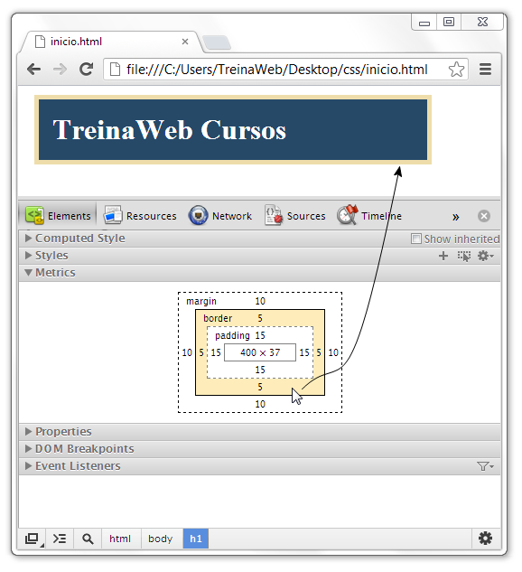

Da forma com que declaramos o CSS, as declarações **margin** e **padding** possuem o mesmo valor para todos os lados do retângulo: superior, direito, inferior e esquerdo. Declaramos assim:

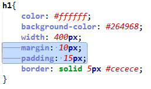

Agora altere esse CSS para:

```css
h1{
  color: #ffffff;
  background-color: #264968;
  width: 400px;
  margin: 10px 20px 30px 40px;
  padding: 15px 30px 45px 60px;
  border: solid 5px #cecece;
}
```

Atualize o exemplo no navegador (aperte a tecla F5 para atualizar):

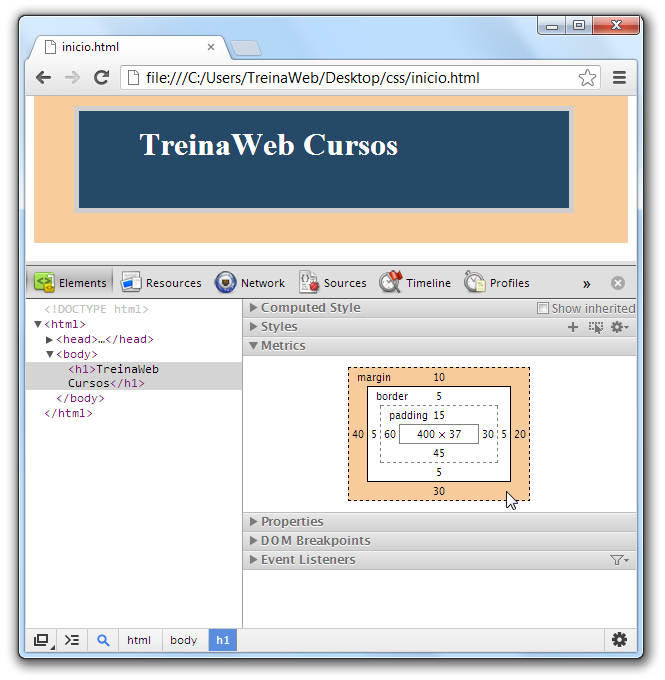

Entendeu o novo resultado? Tivemos margens bem mais espaçadas e não simétricas, ou seja, cada lado do retângulo do Box Model do elemento teve uma margem diferente. Definimos valores diferentes para cada lado da margem:

+ Lado superior (top): 10px;
+ Lado direito (right): 20px;
+ Lado inferior (bottom): 30px;
+ Lado esquerdo (left): 40px.

Para ilustrar melhor:

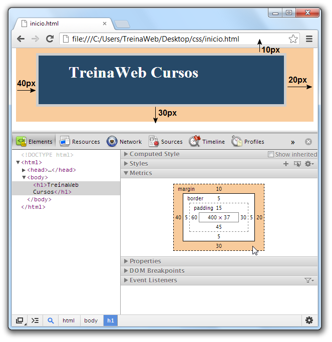

Conforme especificamos em nosso CSS:

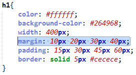

Conseguimos o mesmo efeito se alterarmos nosso CSS para:

```css
h1{
  color: #ffffff;
  background-color: #264968;
  width: 400px;
  margin-top: 10px;
  margin-right: 20px;
  margin-bottom: 30px;
  margin-left: 40px;
  padding: 15px 30px 45px 60px;
  border: solid 5px #cecece;
}
```

A diferença está aqui:

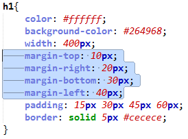

Ao invés de declararmos todos os valores dos lados da margem usando apenas o seletor "margin", declaramos individualmente um valor para cada lado.

+ **margin-top** – Margem superior;
+ **margin-right** – Margem direita;
+ **margin-bottom** – Margem inferior;
+ **margin-left** – Margem esquerda.

Estes seletores são bastante úteis, caso deseje implementar margem em apenas um dos lados, por exemplo. No entanto, o recomendado é utilizar o seletor padrão, sempre com os valores para as 4 bordas, tornando assim o código mais limpo, mesmo que seja necessário definir margem apenas para um dos lados.

Por exemplo, ao invés de:

```css
h1{
  margin-top: 10px;
}
```

Utilize:


```css
h1{
  margin: 10px 0 0 0;
}
```

Com os tópicos anteriores, visualizamos como cada elemento HTML é representado pelo navegador, ou seja, no formato de uma "caixa" imaginária.

Para melhor ilustrar, segue uma demonstração gráfica das camadas de um Box Model com visão 3D:

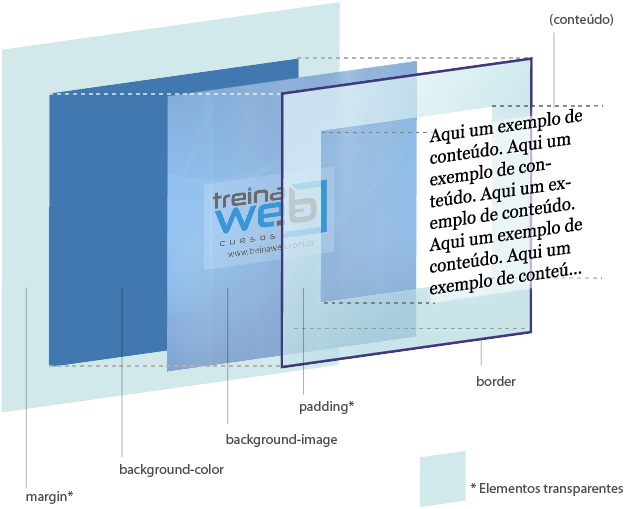

Para finalizar o tópico, outra funcionalidade interessante para o estudo está na seção "Styles", onde podemos ativar ou desativar uma declaração CSS e ver o resultado em tempo real. Por exemplo:

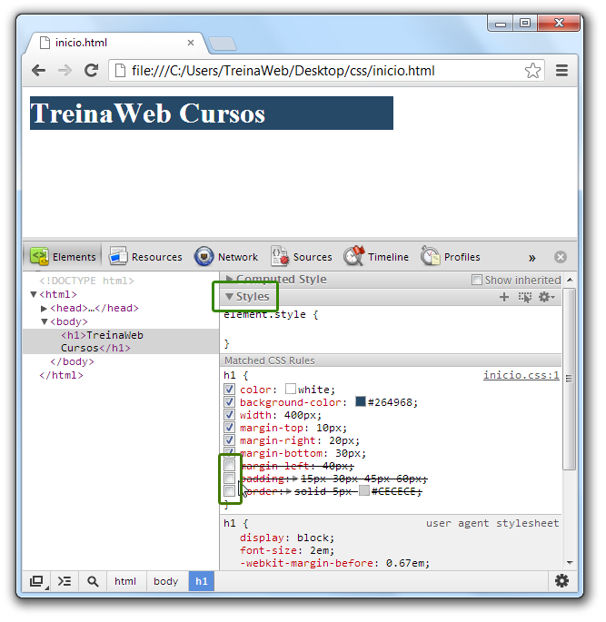

---

## Border Radius
Serve para arredondarmos as bordas do elemento.

```html
<div></div>
```

```css
div{
  width: 100px;
  height: 100px;
  border: 2px solid black;
  border-radius: 30px;
}
```

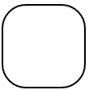

---

## Max e Min
Imagine que a gente queira que uma div ocupe 100% da tela. Sem problemas. Basta colocarmos.

```css
div{
  width: 100%;
}
```

Mas e se o usuário estiver com um monitor muito largo? Nosso layout poderia ficar estranho. Para isso, temos a possibilidade de passar um valor máximo para as dimensões de um elemento.

```css
div{
  width: 100%;
  max-width: 1200px;
}
```

Dessa maneira nossa div ocupará a tela inteira, mas irá ter um limite de 1200px.

Imagine quando quiser que um elemento tenha largura de 5%, mas há a possibilidade de o usuário acessar sua página de um celular muito pequeno. Podemos utilizar essa mesma ideia para valores mínimos também.

As propriedades disponíveis são:

+ **max-width**
+ **max-height**
+ **min-width**
+ **min-height**

---

## Box Sizing
Imagine que a gente defina um elemento com 200px de largura e 20px de margem. O elemento deve ter 200px de largura ou 220px no total?

Essa propriedade indica se o navegador deve levar bordas e margens em consideração ao definir uma largura e altura ao elemento.

---

## Box Shadow
A propriedade box-shadow serve para aplicar sombras ao elemento.

Passamos a posição horizontal, verical, nível de ofuscamento e cor da sombra.

Cuidado para não exagerar no uso dessa propriedade, pois pode deixar sua página lenta, principalmente em dispositivos móveis.

```html
<div>TreinaWeb</div>
```

```css
div {
  box-shadow: 10px 10px 5px #888888;
}
```


---

## Outline
Outline é uma linha que existe em volta dos elementos e serve para destacá-los.

Um exemplo é a linha azul que aparece em volta do input quando clicamos nele:

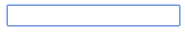

Diferente da propriedade de borda, o outline não faz parte das dimensões de um elemento.

A propriedade outline é um atalho para as seguintes propriedades:

+ **outline-color:** cor da linha;
+ **outline-offset:** distância da linha em relação à borda do elemento;
+ **outline-style:** estilo da borda, como hidden(oculto), dashed(traços) e solid(linha contínua);
+ **outline-width:** largura da linha da borda.

---

## Overflow
A propriedade overflow define quando o conteúdo de um elemento deve ser exibido, escondido ou gerar uma barra de rolagem quando este conteúdo for maior do que o elemento que o contém.

A propriedade overflow é um atalho para overflow-x e overflow-y, para especificarmos o comportamento apenas para a horizontal e vertical, respectivamente.

Vamos utilizar o seguinte HTML e CSS como base:

```html
<div>TreinaWeb</div>
```

```css
div {
    background-color: #eee;
    width: 50px;
    height: 50px;
    border: 1px dotted black;
}
```

E agora vamos ver como os diferentes valores da propriedade overflow se comportam:

**overflow: hidden;**

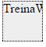

O valor hidden faz com que o conteúdo do elemento que ultrapasse as dimensões seja escondido.

**overflow: visible;**

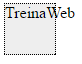

O valor visible faz com que o conteúdo que ultrapasse os limites do elemento continue visível.

**overflow: scroll;**


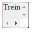

O valor scroll faz com que a barra de rolagem fique disponível sempre. Note que apareceu uma horizontal e outra vertical.

**overflow: auto;**

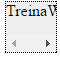

O valor auto faz com que a barra de rolagem fique disponível automaticamente quando necessário. Note que dessa vez a barra vertical não apareceu, já que não há conteúdo para ser exibido.

---

## Conhecendo o Box Model e dimensionando elementos

Vídeo

---

## Exercícios

Questão 1 de 3
Quando se usa propriedades como margin e padding, qual a ordem das direções?

left, top, right e bottom.

bottom, left, top e right.

top, bottom, right, left.

right, bottom, left e top.

✔ top, right, bottom e left.


Questão 2 de 3
O que caracteriza um elemento de linha?

Não pode ser reposicionado.

O seu valor semântico.

Possui formato linear.

✔ Não ocupa a linha toda e não pode ser redimensionado.

Ocupa a linha inteira.


Questão 3 de 3
Marque as características de um elemento inline-block:

Escolha 3 respostas.
Como os block, jogam o próximo elemento para a linha de baixo.

Como os inline, não podem ser redimensionados.

✔ Como os inline, podem ficar na mesma linha que outros elementos.

✔ Como os block, podem ser redimensionados.

✔ Jogam o próximo elemento para a linha de baixo caso falte espaço.