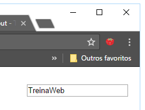
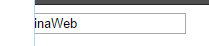
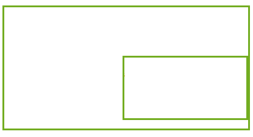
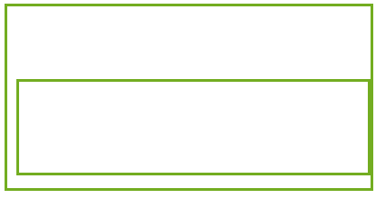
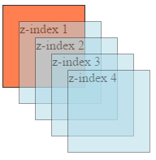
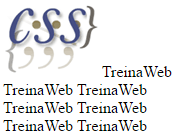
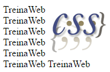
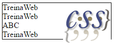
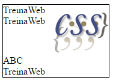
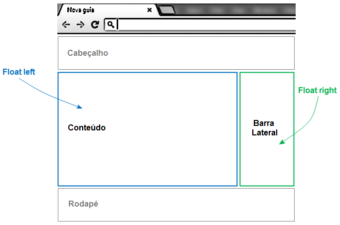

# Posicionamento

## Posicionamento
Agora que já vimos como cuidar das caixas dos nossos elementos, falta vermos outra parte importante da construção de layouts: o posicionamento.

Quando queremos alterar a posição, mudamos os valores das propriedades top, left, bottom e right. O modo como definimos a propriedade “position” irá mudar o modo do elemento responder ao posicionamento.

---

## Posicionamento Estático
O padrão de todos os elementos é o “static” (estático). Nesse modo os elementos são apresentados de acordo com o fluxo do código HTML, sem nada especial. Por essa razão, as propriedades top, right, bottom e left não surtirão efeito nenhum.

---

## Posicionamento Fixo
Quando definimos a propriedade position como “fixed”, o elemento será posicionado em relação à tela.



Não importa se houver conteúdo o suficiente para dar scroll, o elemento sempre estará fixo na tela na mesma posição.

---

## Posicionamento Relativo
Quando definimos a propriedade position como “relative”, o elemento será “empurrado” em relação à sua posição normal.

Se colocarmos “right: 30px”, o elemento será empurrado por 30px a partir do seu canto direito, ou seja, irá para a esquerda.



Exemplo de um input sendo empurrado para a esquerda, fazendo-o sair da tela.

Como estamos falando de “empurrar”, não podemos atribuir propriedades opostas. Se você empurrar um elemento para a esquerda, não tem como empurrá-lo para a direita. Entre outras palavras, não podemos ter top com bottom e left com right.

---

## Posicionamento Absoluto
Quando definimos a propriedade position como “absolute”, o elemento será posicionado em relação ao seu elemento antecessor mais próximo que tenha uma posição relativa.

Como esse exemplo:



```css
div{
  position: absolute;
  right: 0;
  bottom: 10px;
}
```

Em relação ao elemento pai, ela tem uma distância 0 na direita e distância de 10px na parte de baixo.

Quando temos um elemento que possamos redimensionar, podemos utilizar propriedades opostas, como top com bottom e right com left.



Na imagem acima acrescentamos “left: 10px”. Isso fez com que, além da distância right ser 0, o elemento também tenha distância left como 10px. Isso causa um redimensionamento no elemento. O tipo de position como “fixed” também permite esse comportamento.

---

## Z Index
Quando posicionamos elementos, eles basicamente se movem no eixo X e Y (horizontal e vertical). Não temos algo que indique profundidade para definir que um elemento esteja mais perto ou mais longe da tela.

Mesmo assim, podemos observar que conforme alteramos as posições dos elementos, um vai acabar ficando em cima do outro. Os elementos normalmente seguem a ordem em que foram declarados no HTML. Os que foram declarados depois sempre ficarão mais em cima.

Porém, podemos alterar essa ordem de empilhamento dos elementos com a propriedade z-index. Os elementos que tiverem um valor maior ficarão mais em cima na pilha.



Exemplo:

```css
div{
  position: relative;
  z-index: 2;
}
```

É importante lembrar que a propriedade z-index só funciona em elementos que tenha a propriedade position declaradas como fixed, relative ou absolute.

---

## Float e Clear
A propriedade float define quando um elemento deve flutuar. Isso significa que os textos e elementos ao seu lado o contornem ao invés de levar a sua caixa em consideração.

Um exemplo visual irá deixar tudo mais claro:

```html
<p>
    
    TreinaWeb
    TreinaWeb
    TreinaWeb
    TreinaWeb
    TreinaWeb
    TreinaWeb
    TreinaWeb
</p>
```

```css
img {
    float: right;
}
```





A imagem da esquerda mostra o comportamento original. A imagem foi declarada primeiro, então está à esquerda, e o texto segue na mesma linha. Ao acabar o espaço, os textos são jogados na linha de baixo.

Com a propriedade float com o valor right, a imagem passa a ficar à direita, e o texto contorna a imagem.

Elementos que tem position igual a absolute ignoram a propriedade float.

Os elementos seguintes tentarão contornar o elemento flutuante. Como o elemento flutuante não está no fluxo normal da árvore de elementos, o container não terá uma altura que leva em consideração a imagem.

Para parar com o comportamento do float, utilizamos a propriedade **clear**.

```html
<p>
    
    TreinaWeb
    TreinaWeb
    <div>ABC</div>
    TreinaWeb
</p>
```

```css
p{
    border: 1px solid black;
}
img {
    float: right;
}

div{
    clear: both;
}
```

Resultado:





Veja na imagem da esquerda o código apenas com float. A nossa div tenta contornar a imagem. Como a imagem está fora do fluxo, sua altura acaba não sendo levada em consideração para o cálculo da dimensão do parágrafo.

Na imagem da direita vemos o resultado por colocarmos “clear: both;” na div. Isso faz com que o elemento ignore o float do outro elemento, voltando ao fluxo normal. A div acaba indo para a linha de baixo ao invés de tentar contornar a imagem, fazendo com que o parágrafo tenha sua altura calculada da maneira certa.

A propriedade clear aceita um valor que indica de onde queremos ignorar o elemento flutuante, “right” ou “left”. Mas é mais comum o uso como mostramos aqui, “both”, que limpa a flutuação de ambos os lados.



Essa propriedade era muito utilizada na criação de layouts, mas lembre-se dos problemas de dimensionamento. Essa propriedade foi criada para textos contornarem algum elemento.

Se quiser que elementos fiquem na mesma linha, utilize a propriedade display com o valor inline-block.

Para a criação de layouts, o mais recomendado hoje em dia é o uso do Flexbox. Essa propriedade será abordada no curso avançado de CSS.

---

## Posicionando Elementos

Vídeos

---

## Exercícios
Questão 1 de 3
Marque as opções verdadeiras:

Escolha 2 respostas.
✔ Posicionamento fixo deixa o elemento em uma posição fixa em relação à tela.

Float com valor "both" faz o elemento flutuar em ambas as direções.

Float com valor "right" faz o elemento flutuar à esquerda.

✔ Z-index nos permite definir qual elemento deve ficar mais à frente.

Border-radius serve para a criação de radiobuttons.


Questão 2 de 3
Complete corretamente a afirmação abaixo:
`Z-index` serve para indicar a ordem de empilhamento dos elementos .


Questão 3 de 3
O que é posicionamento relativo?

✔ Quando o elemento se move em relação à sua posição original.

Quando o elemento é posicionado em relação a outro elemento.

Quando relativamente um elemento é posicionado em relação ao elemento antecessor.

Quando utilizamos unidades de medidas relativas para posicionar os elementos.

Quando a posição é em relação ao elemento pai.