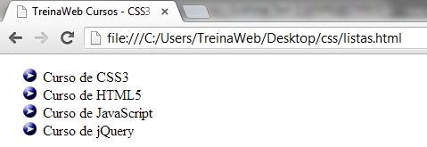
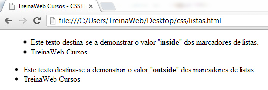
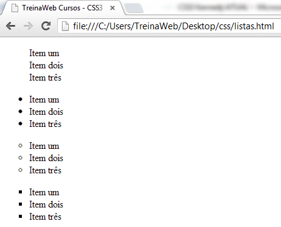
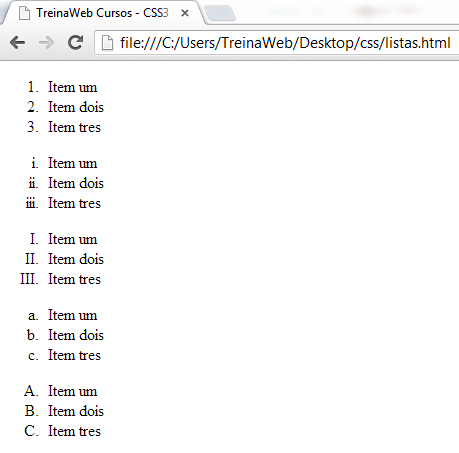

# Formatando Listas

## Formatando Listas
As propriedades relativas às listas permitem controlar diversos aspectos da apresentação de uma lista, como escolher os símbolos para os marcadores, usar uma imagem como marcador ou escolher a posição dos marcadores.

A seguir serão explicadas as seguintes propriedades:

+ list-style-image;
+ list-style-position;
+ list-style-type;
+ list-style (forma abreviada).

Valores válidos para as propriedades da lista:

**list-style-image**

+ **none:** Nada definido;
+ **url:** url("caminho/marcador.gif").

**list-style-position**

+ **outside:** marcador fora do alinhamento do texto;
+ **inside:** marcador alinhado com texto.

**list-style-type**

+ none: sem marcador;
+ disc: círculo (bolinha cheia);
+ circle: circunferência (bolinha vazia);
+ square: quadrado cheio;
+ decimal: números 1, 2, 3, 4, ...;
+ decimal-leading-zero;
+ lower-roman: romano minúsculo i, ii, iii, iv, ...;
+ upper-roman: romano maiúsculo I, II, III, IV, ...;
+ lower-alpha: letra minúscula a, b, c, d, ...;
+ upper-alpha: letra maiúscula A, B, C, D, ...;
+ lower-greek;
+ lower-latin;
+ upper-latin;
+ hebrew;
+ armenian;
+ georgian;
+ cjk-ideographic;
+ hiragana;
+ katakana;
+ hiragana-iroha;
+ katakana-iroha;

---

## List-style-image
Define uma imagem como marcador para os itens da lista. Exemplo:

```html
<ul>
  <li>Curso de CSS3</li>
  <li>Curso de HTML5</li>
  <li>Curso de JavaScript</li>
  <li>Curso de jQuery</li>
</ul>
```

CSS:

```css
ul{
  list-style-image: url(https://d2v0x26thbzlwf.cloudfront.net/prod/5/arquivos/seta.gif);
}
```
 
Em execução:



---

## list-style-position
Esta propriedade altera a posição dos marcadores. Exemplo:

```html
<ul>
  <li>Este texto destina-se a demonstrar o valor "<b>inside</b>" dos marcadores de listas.</li>
  <li>TreinaWeb Cursos</li>
</ul>
```

CSS:

```css
ul{
  list-style-position: inside;
}
```

Em execução:


```html
<ul>
  <li>Este texto destina-se a demonstrar o valor "<b>outside</b>" dos marcadores de listas.</li>
  <li>TreinaWeb Cursos</li>
</ul>
```

CSS:

```css
ul{
  list-style-position: outside;
}
```

Em execução:



---

## list-style-type
Esta propriedade define o tipo de marcador (estilo) a ser usado. Exemplo:

```html
<ul>
  <li>Item um</li>
  <li>Item dois</li>
  <li>Item três</li>
</ul>
```

CSS:

Os seguintes valores

```css
list-style-type: none;
list-style-type: disc;
list-style-type: circle;
list-style-type: square;
```

Resultarão em:



As outras opções de lista são citadas no início. Teste mais algumas delas.

As listas entre `<ul>` são as chamadas listas não ordenadas.

---

## Listas ordenadas
Este exemplo demonstra como definir estilo para os marcadores de listas ordenadas. Listas ordenadas são aquelas que ao invés de um marcador, possuem números ou letras.

```html
<ol>
  <li>Item um</li>
  <li>Item dois</li>
  <li>Item tres</li>
</ol>
```

CSS:

Os seguintes valores

```css
list-style-type: decimal;
list-style-type: lower-roman;
list-style-type: upper-roman;
list-style-type: lower-alpha;
list-style-type: upper-alpha;
```

Resultarão em:



---

## list-style
Esta é a maneira abreviada de escrevermos uma regra para as propriedades das listas. Podemos declarar duas das propriedades estudadas em uma única regra:

Sintaxe da primeira forma:

```css
list-style: position imagem;
```

Exemplo:

```css
ul{
  list-style: inside url("setinha.gif");
}
```

Sintaxe da segunda forma:

```css
list-style: position type;
```

Exemplo:

```css
ul{
  list-style: inside circle;
}
```

Faça alguns testes.

---

## Estilizando Listas

Vídeo

---

## Exercícios

Questão 1 de 3
Marque as opções verdadeiras:

Escolha 3 respostas.
✔ Com CSS podemos criar o efeito de listas ordenadas utilizando listas não ordenadas, mas não é recomendado por causa da semântica.

Border-radius serve para a criação de radiobuttons.

Float com valor "both" faz o elemento flutuar em ambas as direções.

✔ Com CSS é possível criar listas sem marcadores.

✔ Se declararmos a propriedade "display" com "inline" nos elementos `<li>`, teremos uma lista horizontal.


Questão 2 de 3
Como mudar o tipo de uma lista utilizando CSS?

✔ Com a propriedade list-style-type.

Alterando a propriedade list-style na tag.

Utilizando o list-type.

Com o atributo type na tag.

Alternando entre as tags `<ul>` e `<ol>`.


Questão 3 de 3
Complete corretamente a afirmação abaixo:

`<ul>` são elementos utilizados para se criar listas `não ordenadas`.