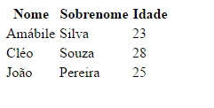
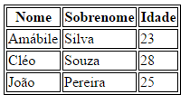
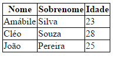
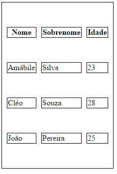
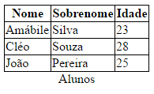
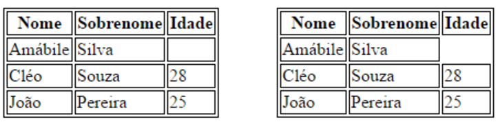

# Formatando Tabelas

## Formatando Tabelas
Vamos agora ver como melhorar a aparência das tabelas com o CSS.

Vamos pegar o seguinte HTML como base para os nossos exemplos:

```html
<table>
  <thead>
    <tr>
      <th>Nome</th>
      <th>Sobrenome</th>
      <th>Idade</th>
    </tr>
  </thead>
  <tbody>
    <tr>
      <td>Amábile</td>
      <td>Silva</td>
      <td>23</td>
    </tr>
    <tr>
      <td>Cléo</td>
      <td>Souza</td>
      <td>28</td>
    </tr>
    <tr>
      <td>João</td>
      <td>Pereira</td>
      <td>25</td>
    </tr>
  </tbody>
</table>
```



---

## Border
Já vimos essa propriedade antes. É comum utilizá-la para definir melhor as divisões da tabela.

```css
table, th, td, th {
   border: 1px solid black;
}
```

Resultado:



---

## Border Collapse
Indica que as bordas dos elementos das tabelas devem se juntar.

```css
table {
    border-collapse: collapse;
}

table, th, td, th {
    border: 1px solid black;
}
```

Resultado:



Compare com o exemplo anterior, onde as bordas estavam duplicadas. Agora, com o border-collapse, as bordas estão juntas.

---

## Border Spacing
Indica a distância entre as bordas das células da tabela.

```css
table {
    border-collapse: separate;
    border-spacing: 10px 50px;
}
```

Resultado:



---

## Caption Side
Indica onde a legenda da tabela será posicionada.

Para isso, vamos incluir a tag `<caption>` na nossa tabela.

```html
<table>
  <caption>Alunos</caption>
  . . .
  <thead>
```

```css
table, td, tr, th {
    border: 1px solid black;
    border-collapse: collapse;
}

caption {
    caption-side: bottom;
}
```



---

## Empty Cells
Define quando uma célula vazia deve ser oculta. Disponível apenas quando as bordas são separadas.

```css
table, td, tr, th{
    border: 1px solid black;
    empty-cells: hide;
}
```



---

## Estilizando Tabelas

Vídeo

---

## Exercícios

Questão 1 de 3
Marque a opção correta.

Não é indicado o uso de tabelas para exibir dados tabulados.

Alterando o tamanho das margens possibilita evitar bordas duplicadas.

Com CSS é aceitável o uso de `<table>` para se criar layouts.

✔ Podemos utilizar CSS para melhorar a aparência das tabelas.

Alterando a posição de cada célula é a melhor maneira de evitar bordas duplicadas.


Questão 2 de 3
Marque as opções verdadeiras:

Escolha 2 respostas.
✔ A propriedade "empty-cell" permite exibir ou esconder células vazias.

✔ Para utilizar caption-side, temos que utilizar a tag `<caption>`.

Border-collapse serve para juntar células de uma tabela em uma só.

Caption é uma propriedade da tabela.

Tabelas devem ser utilizadas para definir o layout da página.


Questão 3 de 3
Qual a maneira de se evitar que apareçam bordas duplicadas nas tabelas?

Alterando a posição de cada célula.

✔ Utilizando a propriedade "border-collapse".

Alterando o tamanho das margens.

Fazendo os elementos ficarem o mais próximos possível.

Diminuindo a grossura das bordas.

