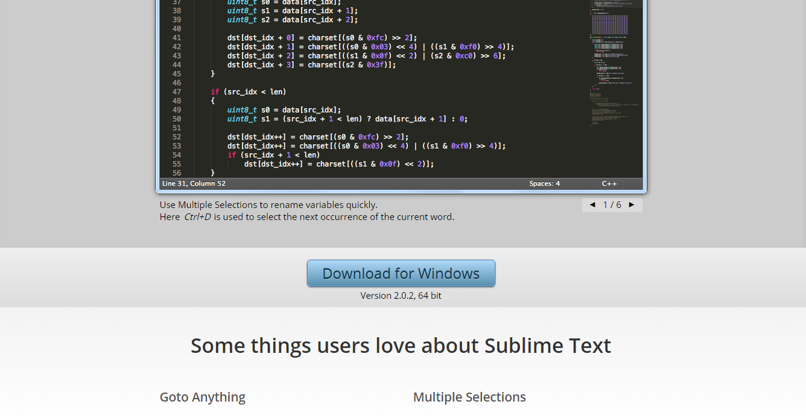
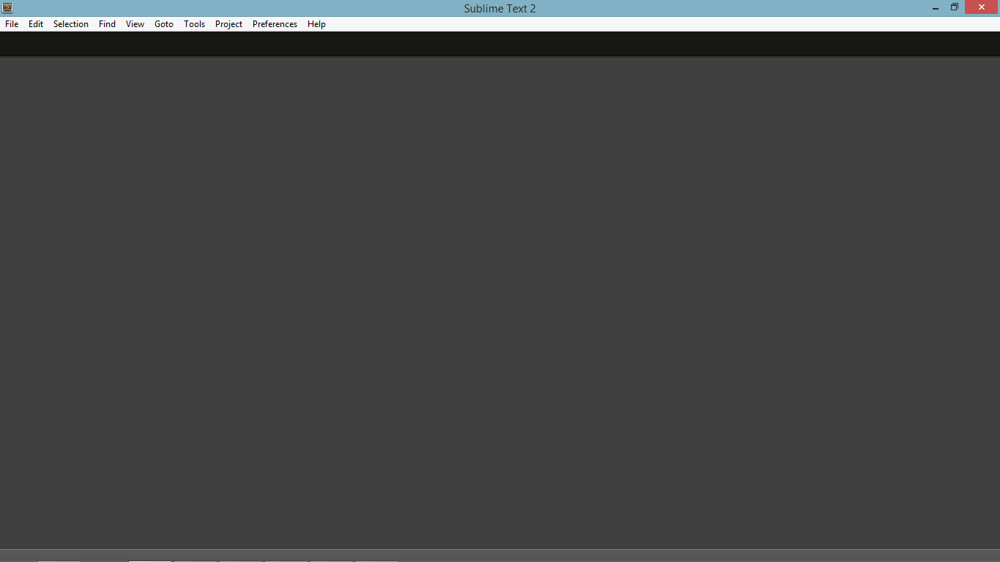

## Nosso Primeiro Documento

Antes de entrar na prática, e aprender a como usar HTML e CSS, precisamos falar sobre a ferramenta mais importante dentro do seu computador a partir de agora: o seu editor de textos. É nele que você irá digitar os códigos HTML5 e CSS3.

Existem muitas opções de editores no mercado. Você poderia por exemplo, utilizar até o bloco de notas do seu computador. No entanto, para este curso, iremos utilizar um dos principais, mais atuais e mais utilizados editores para desenvolvimento front-end: Sublime Text.


Por ser um editor muito avançado, ele automatiza algumas tarefas para você. Essa automatização, assim como vários outros recursos, facilitam e aceleram o desenvolvimento no dia-a-dia, porém, neste primeiro contato, mesmo que o editor possa por exemplo, criar linhas e linhas de código por você, não faça desta forma. Inicialmente, sempre digite o código do zero, pois assim sua assimilação será melhor. =)

Para baixar o Sublime Text acesse o link: http://www.sublimetext.com/



Após baixar e instalar o editor para a versão do seu sistema operacional (Windows, Mac ou Linux), o Sublime Text irá se apresentar com uma aparência semelhante à imagem abaixo:



---

# Documento HTML5 Básico

```html
<!DOCTYPE html>
    <html>
        <head>
            <title>Título</title>
            <meta charset="utf-8" />
        </head>
    <body>

    </body>
</html>
```

Esse é um documento HTML básico. Sempre que formos criar um documento novo ele deverá ter essa estrutura no mínimo.

- `<!DOCTYPE html>` - indica ao navegador que este é um documento HTML5;
- `<html>` - elemento raiz de uma página HTML;
- `<head>` - elemento onde colocamos informações sobre o documento;
- `<title>` - indica o título da página. Esse título aparece na aba do navegador;
- `<meta>` - elemento opcional. Ele indica ao navegador algumas informações sobre o documento. Neste exemplo, indicamos que estamos escrevendo nosso documento com um grupo de caracteres chamado “utf-8”. Indicar o charset evita que o navegador interprete algum caractere de maneira errada, como por exemplo, exibir “c�o” ao invés de “cão”;
- `<body>` - é o corpo do nosso documento.
Dentro de `<body>` que escreveremos todos os nossos códigos.

Também podemos escrever comentários no HTML. Comentários são textos que escrevemos apenas para deixar como uma anotação. Eles são ignorados pelo navegador, portanto não influenciam no código.

```html
<!-- nada aqui será interpretado pelo navegador -->
```

## Criando um documento HTML

Minimo do HTML

```html
<!DOCTYPE html> --> doc HTML5
    <html> --> Raiz do doc
    <head> --> cabeçalho das 
        <title>Título</title> --> titulo do aba
    </head>
    <body> --> corpo

    </body>
</html>
```