# Formulários

## Formulários
Uma necessidade muito comum para desenvolvedores são locais onde o usuário possa interagir com a página e enviar informações para serem processadas, como por exemplo, um formulário de cadastro, um formulário de login ou um campo para pesquisa.

Essas formas de se comunicar com a página irão variar de acordo com a necessidade de cada desenvolvedor. Em um determinado site podemos fazer um cadastro somente com nome, e-mail e senha, já em outros sites pode haver a necessidade de obtermos várias outras informações.

Iremos então aprender quais são as formas que o HTML nos oferece para interação com os nossos usuários.

Antes de qualquer coisa, vamos ver a tag `<form>`, essa tag não apresenta uma referência visual quando criada, mas representa semanticamente um formulário, então é dentro dela que devemos criar nossos campos.

```HTML
<form>
  <!-- campos do formulario -->
</form>
```

A tag de formulário (form) pode aceitar vários tipos de atributos, com os quais poderemos, por exemplo, configurar como o formulário irá enviar as informações digitadas para o servidor.

---

## accept-charset
É utilizado para definir qual o charset será utilizado pelo formulário. Por exemplo: utf-8

```HTML
<form accept-charset="utf-8"></form>
```

---

## autocomplete
Sempre definirmos o atributo autocomplete (auto completar), a medida em que usamos os campos de um formulário o navegador irá começar a sugerir valores para o que estamos digitando, com base em valores que foram digitados anteriormente. Por exemplo:

```HTML
<form autocomplete="on">
  <input type="text" name="email">
</form>
```

Depois de digitarmos TreinaWeb e submeter o formulário, quando voltarmos o campo, o autocomplete será ativado, e quando iniciarmos a digitação da palavra, ele já vai nos sugerir o complemento:

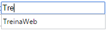

---

## action
Este atributo especifica para onde os dados do formulário serão enviados. Normalmente será o link de uma página no servidor:

```HTML
<form action="http://www.nosso-servidor.com.br/cadastro/usuario.php"></form>
```

---

## method
Especifica o método do HTTP que será utilizado para a submissão (get ou post):

```HTML
<form action="http://www.nosso-servidor.com.br/cadastro/usuario.php" method="post"></form>
```

---

## enctype
Especifica quando os dados do formulário precisam ser codificados antes de serem enviados ao servidor.

```HTML
<form action="http://www.nosso-servidor.com.br/cadastro/usuario.php" method="post" enctype="multipart/form-data"></form>
```

`Esse parâmetro só funciona para métodos do tipo POST`

---

## novalidate
Impede a validação dos campos antes da submissão:

```HTML
<form novalidate></form>
```

---

## target
Assim como na tag `<a>`, o target indica onde a página de destino será aberta.

```HTML
<form target="_blank"></form>
```

` Repare que target="_blank" foi o mesmo atributo que utilizamos anteriormente para abrir um link em uma nova aba do navegador. `

---

## Elementos
Os formulários possuem campos onde inserimos dados. Os campos mais comuns dos formulários são criados pela tag `<input />`, que tem o atributo type onde indicamos o tipo de campo que queremos. Vamos ver cada um deles:

---

## Inputs de Texto e Text Area
Para escrever um pequeno texto utilizamos a tag `<input />`. Note que ela não tem uma tag de fechamento, ela mesma se fecha.

Quando não passamos o atributo type, por padrão ele será do tipo “text”, mas é uma boa prática sempre passar o tipo.

```HTML
<input type="text" />
```

Podemos ainda passar outros atributos na tag, como:

- *placeholder* - texto que aparece quando o campo está vazio;
- *maxlength* - quantidade máxima de caracteres;
- *required* - indica que o campo é necessário, não permitindo submeter o formulário se o campo estiver em branco;
- *disabled* - deixa o campo desabilitado;
- *readonly* - impede edições no campo, permitindo apenas que o usuário leia o valor.

Caso queira permitir que o usuário escreva mais de uma linha, utilize a tag `<textarea></textarea>`

```HTML
<textarea>Meu Texto</textarea>
```

No textarea podemos passar os atributos rows e cols para indicar quantas linhas e colunas o campo irá exibir.

Voltando para a tag `<input />`, vamos ver os tipos:

---

## Email, Search e Url

```HTML
<input type="email" />
<input type="search" />
<input type="url" />
```

Esses tipos são idênticos ao tipo “text”. Em dispositivos que exibem teclado na tela, como smartphones e tablets, esses tipos fazem com que o teclado exibido seja diferente. Um exemplo é o tipo “email”, que exibe uma tecla @, ou “url” que exibe uma tecla “.com”.

Também haverá validação se não escrevermos um formato válido.

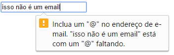

---

## Number

```HTML
<input type="number" />
```

Indica um campo do tipo number. Em computadores o campo fica com botões para aumentar e diminuir o número. Em dispositivos com teclado virtual é exibido um teclado numérico.

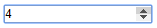

---

## Radio Button

```HTML
<form>
  <input type="radio" name="sexo" checked="checked" /> Homem
  <input type="radio" name="sexo" /> Mulher
</form>
```

Cria um Radio Button, onde podemos selecionar apenas uma opção. Note que colocamos o mesmo nome nos dois inputs. Isso faz com que o navegador entenda que ambos pertencem ao mesmo campo. Se passarmos nomes diferentes poderíamos selecionar os dois valores, o que não é o objetivo dos Radio Buttons.

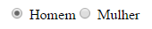

---

## CheckBox
Diferente do Radio Button, onde só selecionamos uma opção, o CheckBox serve para selecionarmos mais de uma opção.

```HTML
<h2>Escolha quantas cores você desejar.</h2>
<form>
  <input type="checkbox" name="cor1" /> Azul
  <input type="checkbox" name="cor2" /> Vermelho
  <input type="checkbox" name="cor3" /> Amarelo
</form>
```

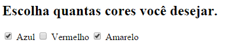

---

## Date, Time, Datetime-local, Month e Week
Serve para selecionar datas e tempo.

```HTML
<input type="date" />
```

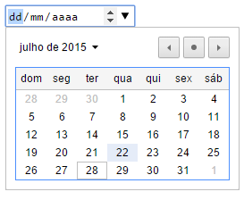

```HTML
<input type="time" />
```

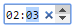

```HTML
<input type="datetime-local" />
```

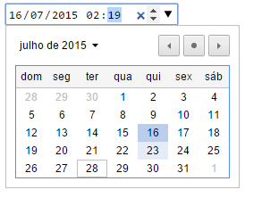


```HTML
<input type="month" />
```

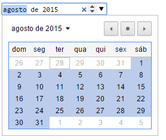


```HTML
<input type="week" />
```

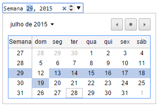

---

## Range
Permite que o usuário escolha um valor entre os valores mínimo e máximo passados.

```HTML
<input type="range" min="0" max="10" />
```


---

## Color
Abre uma paleta de cores para a seleção de uma cor.

```HTML
 <input type="color" />
```

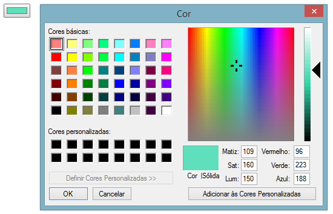

---

## File
Permite que a gente selecione um arquivo de nosso computador.

```HTML
<input type="file" />
```

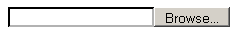

---

## Button, Submit e Reset
Esses tipos criam um botão.

```HTML
<input type="button" value="Botão" />
```

O tipo “submit” é usado para que o usuário clique quando quiser enviar o formulário.

O tipo “reset” serve para quando o usuário quiser reiniciar o formulário. Cuidado, pois ao clicar o formulário inteiro será apagado!

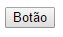

---

## Select e DataList
A tag `<select>` nos permite criar uma lista onde podemos selecionar um item. Cada uma das opções é criada pela tag `<option>`. O atributo “value” da tag option é o valor a ser enviado ao servidor, e o valor escrito dentro da tag é o que será exibido ao usuário.

```HTML
<select>
  <option value="html">HTML 5</option>
  <option value="css">CSS 3</option>
  <option value="js">JavaScript</option>
</select>
```

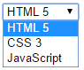

Podemos ter um efeito parecido com a tag DataList, mas ela funciona em conjunto com a tag input.

```HTML
<input list="browsers" name="browser">
  <datalist id="browsers">
    <option value="Internet Explorer">
    <option value="Firefox">
    <option value="Chrome">
    <option value="Opera">
    <option value="Safari">
  </datalist>
```

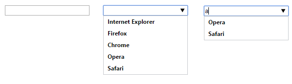

Note que a tag `<datalist>` também recebe um conjunto de `<option>`, mas ela também tem um id para identificá-la. Enquanto isso, também temos um input de texto. Ele tem um atributo “list”, onde passamos o id da nossa `<datalist>`.

Perceba que conforme a gente digita algo no input, as options de datalist aparecem como um autocomplete.

---

## FieldSet e Legend
Serve para criarmos um campo dentro do formulário para poder melhor organizar os campos. A tag `<legend>` serve para darmos um título à seção.

```HTML
<fieldset>
  <legend>Cadastro</legend>
  Nome: <input type="text"><br>
  Email: <input type="text"><br>
</fieldset>
```

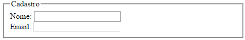

---

## Label
Esta tag serve para darmos nomes aos campos. Se passarmos o id do input no atributo “for”, estaremos indicando ao navegador que o Label é referente àquele campo. Quando o usuário clicar no texto do Label, o input receberá foco, permitindo que o usuário já entre com os dados.

```HTML
<form autocomplete="on">
  <label for="email">Email</label>
  <input type="text" id="email">
</form>
```

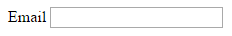

---

## Output
Esse campo serve para exibirmos a saída de alguma entrada.

```HTML
<form oninput="x.value=parseInt(a.value)+parseInt(b.value)">
0 <input type="range" id="a" value="50"> 100
+
<input type="number" id="b" value="50">
=
<output name="x" for="a b"></output>
</form>
```

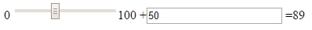

Neste exemplo, utilizamos o range e um campo de número que o usuário pode mudar à vontade. Conforme os valores forem alterados, o campo output exibe o resultado da soma que fizemos por JavaScript.

---

## Conhecendo os elementos de um formulário

vídeo

---

## Exercícos

Questão 1 de 3
Como fazer com que vários radiobuttons sejam do mesmo grupo?

Agrupando-os dentro de uma mesma tag.

Indicamos um nome de grupo para todas as tags.

Deixar um ao lado do outro.

Ocorre automaticamente quando criados dentro de um mesmo formulário.

✔ Dar o mesmo "name" a todos.

Questão 2 de 3
Se campos como text, email, number e url possuem a mesma aparência, por que definir cada um deles?

Para que os editores de texto interpretem o HTML corretamente.

Para o usuário saber o que digitar.

Exclusivamente para a validação do formulário.

Para poder estilizar com CSS depois.

✔ Pela semântica e para melhorar a experiência de usuários de dispositivos móveis.

Questão 3 de 3
Marque as opções que estão corretas em relação aos formulários:

Escolha 2 respostas.
Podemos fazer a tag input do tipo texto ter várias linhas.

✔ A tag mais utilizada é a `<input />`, por disponibilizar vários meios de entrada diferentes.

O input do tipo "reset" reinicia a página.

✔ Formulários são usados sempre que precisarmos que o usuário nos forneça dados.

Podemos indicar o destino do formulário com o atributo "sendTo".