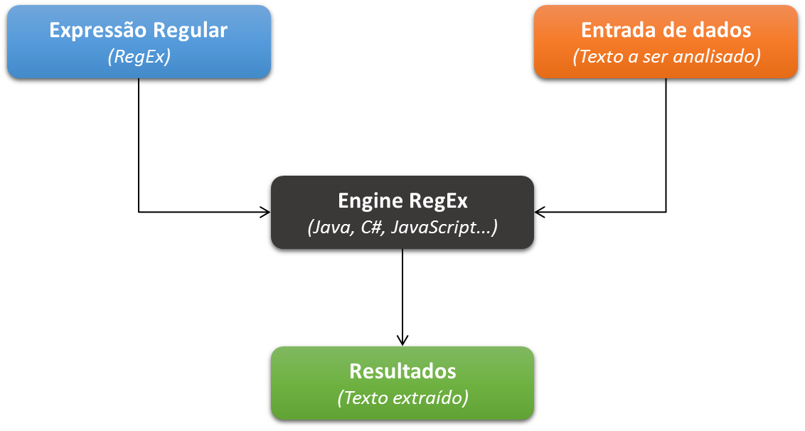

# Expressões regulares: o que são?

## O que são expressões regulares?
Imagine que você tem uma forma de bolo em um formato específico. Imagine, por exemplo, aquelas formas que têm aquele “furo” no meio. Elas, quando utilizadas, produzem bolos com bordas circulares com um buraco ao centro, buraco este que também é circular.

Se você fizer bolos em formas como a descrita acima, você só poderá obter bolos que sejam circulares e que possuam “furos” circulares ao centro. Qualquer outro formato de bolo que você encontrar (um bolo quadrado, por exemplo) simplesmente será um bolo que não pode ter sido feito nesta forma, pois o bolo não segue o formato da forma em questão. A forma serve justamente para definir a forma do bolo, e bolos que possuam formas diferentes dessa forma circular com certeza foram produzidos por quaisquer outras formas.

Pois bem, as expressões regulares (popularmente chamadas de RegEx – Regular Expression) são exatamente como uma forma de bolo: elas descrevem e determinam um padrão ou formato que um determinado texto deverá seguir. Se o texto em questão não seguir o formato definido pela expressão regular, ele simplesmente será “desprezado”, já que não segue o formato estipulado. Sendo assim, expressões regulares são expressões que descrevem formatos de texto.

Você pode utilizar expressões regulares principalmente para extrair e validar informações. Você pode determinar um padrão ou formato e aplicá-lo em um texto de entrada com o intuito de encontrar as palavras que obedeçam ao formato estipulado. Ou pode também montar expressões regulares para validar se uma entrada de um usuário está no formato esperado ou não.

---

## Como elas são “executadas”?
Quando estamos falando da execução de expressões regulares, nós temos principalmente três componentes:

+ A expressão regular em si;
+ A entrada de dados, que sofrerá a ação da expressão regular;
+ A engine, componente responsável por aplicar e interpretar a expressão regular sob a entrada de dados.

O primeiro item corresponde exatamente à expressão regular que definirá o padrão do texto esperado.

A entrada de dados corresponde ao texto a ser analisado. Pode ser um arquivo de log para extração de informações ou mesmo um input disponível para o usuário, por exemplo. No caso do log, podemos utilizar a RegEx para extrair informações específicas, como por exemplo os horários onde os eventos ocorreram. No caso da entrada de usuário, podemos utilizar a RegEx para validarmos se o usuário entrou digitou uma informação em um formato correto (um e-mail, por exemplo).

Por fim, temos a engine.A engine é o componente responsável por fazer “tudo acontecer”. Ela é quem valida a expressão regular, a aplica sob a entrada e guarda os resultados obtidos. No caso de desenvolvedores de software, a engine é a biblioteca que é responsável por manipular as expressões regulares. Como expressões regulares são cada vez mais comuns e solicitadas, a grande maioria das linguagens de programação conseguem interpretar e aplicar expressões regulares de maneira “nativa”, sem precisar do auxílio de bibliotecas externas. Assim, podemos falar que o C#, o Java ou o JavaScript, por exemplo, também são engines RegEx. Obviamente, só podemos falar dessa maneira quando estivermos lidando com expressões regulares de fato.



---

## Meta-caracteres
Os meta-caracteres são as estruturas que nós utilizamos para definir o padrão que desejamos. Eles são na verdade caracteres “normais”, mas que dentro de uma expressão regular ganham um significado. Por exemplo: se quisermos indicar em nossa expressão regular que estamos à procura de um número, existe um caractere que indica um número qualquer nas expressões regulares (neste caso, o caractere “d”). Se quisermos procurar um caractere no começo de nossa entrada de dados, existe um meta-caractere para indicar que queremos analisar o começo de nossa entrada de dados (neste caso, o caractere “^”). Perceba que cada caractere indica uma determinada análise a ser realizada pela engine RegEx, mas estes caracteres são “comuns”. Eles ganham um significado somente no contexto das expressões regulares.

Uma expressão RegEx é então na verdade a junção de vários meta-caracteres diferentes. Estes meta-caracteres, quando combinados, acabam descrevendo um formato de texto.

---

## Formato de expressões regulares
Uma expressão regular sempre estará contida entre barras `(\)`. A primeira barra determina o início da expressão regular, enquanto a segunda indica o término da expressão regular. Logo após a barra de finalização da RegEx, ainda podem existir algumas indicações de execução da expressão regular. Estas indicações são conhecidas como flags.

Sendo assim, uma expressão regular possui o seguinte formato:

```
/<meta-caracteres>/[flags]
```

Uma expressão regular obrigatoriamente precisa estar delimitada entre as barras de início e fim, além de precisar conter ao menos um meta-caractere. Já as flags de execução são opcionais.

Nós, de maneira geral, podemos possuir as seguintes flags:

| Flag | Significado |
| ---- |-------------|
| i    | “Ignore case”. A expressão regular não levará em conta se a entrada está em caixa-alta ou caixa baixa, assim como a própria expressão regular. Com esta flag, “a” é igual a “A”, por exemplo |
| g    | “Global search”. Guarda os índices dos textos recuperados a partir de uma RegEx aplicada em uma entrada de dados, permitindo “navegação” entre os resultados. |
| m    | “Multiline”. A expressão regular será aplicada para cada linha da entrada de dados se for o caso de uma entrada com várias linhas. |

> A utilização das flags não é uma regra, já que na verdade seu suporte depende da engine que será utilizada. Algumas engines suportam o formato e as flags destacadas acima; outras suportam somente algumas das flags; outras suportam a utilização das flags em um formato diferente e outras nem suportam a utilização de flags. Isso ocorre porque não existe uma padronização de compilação e execução de expressões regulares, o que faz com que na verdade cada engine determine as suas próprias regras.

---

## Matches
A aplicação de uma expressão regular pela engine em uma entrada de dados produz o que chamamos de match. Um match é um “pedaço” da entrada de dados que foi extraído porque o “pedaço” possuía o formato definido pela expressão regular. A aplicação de uma expressão regular em uma entrada de dados pode produzir vários matches: a quantidade de matches vai depender de quantos “pedaços” de texto vão corresponder ao formato especificado pela expressão regular.

Expressões regulares também podem ser utilizadas para validação de dados graças a este conceito de match: caso uma entrada possua um formato válido, um match deverá ser produzido; caso contrário, nenhum match será produzido.

---

## Preparando o ambiente - conhecendo o RegExR

[Ambiente RegExR](https://regexr.com/)

---

## Exercícios

Questão 1 de 3
O que são meta-caracteres?

São símbolos gráficos utilizados para definir o padrão da expressão regular.

São barras utilizadas para definir o padrão da expressão regular.

São números utilizados para definir o padrão da expressão regular.

Nenhuma das alternativas.

✔ São caracteres utilizados para definir o padrão da expressão regular.


Questão 2 de 3
Selecione apenas os três principais componentes das expressões regulares.

Escolha 3 respostas.

✔ Os dados que sofrerão a ação da expressão regular.

✔ A expressão regular em si.

✔ A engine responsável por aplicar a expressão regular.

O parser responsável por interpretar a expressão regular.

O compilador responsável por analisar a expressão regular.


Questão 3 de 3
O que são expressões regulares?

Nenhuma das alternativas.

São expressões que descrevem marcas de texto.

✔ São expressões que descrevem formatos de texto.

São expressões que descrevem formatos de imagem.

São formas que descrevem formatos de bolos.