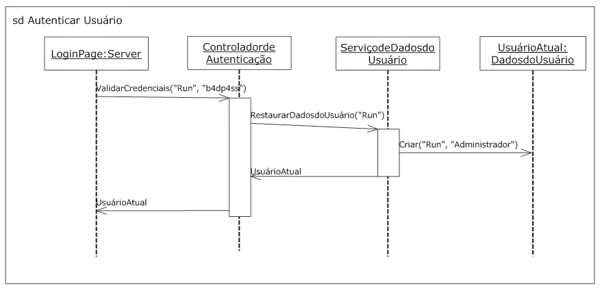

# Diagramas de Interação

## Diagramas de Interação

A UML tem como objetivo fundamental permitir aos usuários documentar mais do que apenas relações estruturais e destina-se a capturar processos e fluxos de eventos. Os diagramas de Interação se destacam entre as facetas da linguagem por unir um conjunto de diagramas que capturam comunicações entre os objetos. A UML 2.0 expandiu a capacidade da UML 1.x em descrever complexos fluxos de controle, sendo a seção de diagramas de interação uma das maiores seções da especificação UML 2.0.

---

## O que são Interações?

Os diagramas de interação são definidos pela UML para enfatizar a comunicação entre os objetos, e não a manipulação de dados associados a essa comunicação. Os diagramas de Interação têm foco em mensagens específicas entre os objetos e como essas mensagens se reúnem para realizar a funcionalidade. Enquanto as estruturas compostas mostram quais objetos se encaixam para cumprir um requisito particular, os diagramas de interação mostram exatamente como os objetos farão isso.

Os diagramas de interação são geralmente possuídos por elementos do sistema. Por exemplo, é possível ter um diagrama de interação associado a um subsistema que mostra como realiza um serviço oferecido na interface pública. A forma mais comum de associar um diagrama de interação com um elemento é fazer a referência do diagrama de interação em uma nota anexa ao elemento.

Os detalhes de uma interação podem ser mostrados com diversas notações diferentes, porém os diagramas de sequência são os mais comuns. Outras anotações incluem resumos de interações, diagramas de comunicação, diagramas de tempo e tabelas de interação. Como os diagramas de sequência são usados com mais frequência, cada conceito é introduzido usando essa notação. O símbolo básico para um diagrama de interação é um retângulo com a palavra-chave sd e o nome da interação em um pentágono, no canto superior esquerdo. Confira o exemplo:



---

## Participantes da Interação

Os participantes de uma interação são mostrados com um retângulo chamado linha de vida. O termo linha de vida ilustra a tendência da UML em representar os diagramas de interação utilizando a notação de diagrama de sequência. Quando mostrados em diagramas de sequência, os participantes têm uma linha tracejada caindo a partir de um retângulo que mostra há quanto tempo o objeto realmente existe. Quando utilizado em outras notações de diagramas de interação, tais como diagramas de comunicação, uma linha de vida é simplesmente um retângulo. O nome do participante é mostrado dentro do retângulo, usando-se a seguinte notação:

**object_name [selector]: class_name ref decomposition**

Onde:

**object_name**

Especifica o nome da instância envolvida na interação.

**selector**

É parte opcional do nome e pode identificar qual a instância em particular, em um elemento com múltiplos valores, deve ser utilizada.

**class_name**

É o nome do tipo desse participante.

**decomposition**

É parte opcional do nome e pode apontar para outro diagrama de interação, que mostra os detalhes de como o participante processa as mensagens que recebe.

UML define o nome do participante reservado, self, indicando que ele é o classificador que possui o diagrama de interação.

A imagem a seguir mostra um diagrama de interação trivial, com dois participantes e uma mensagem entre eles. Confira:


Para mostrar a destruição de um participante durante uma interação use o símbolo de parada. Normalmente o objeto é precedido da mensagem “destruir”, embora não seja estritamente necessário. Coloque um X na parte inferior da linha de vida onde o objeto deixará de existir. Veja o exemplo:


As variáveis locais podem ser introduzidas para ajudar o diagrama de sequência a capturar com precisão o comportamento que está sendo modelado. Elas podem conter valores de retorno, informações de laços ou apenas os dados necessários para processamento posterior. Os valores das variáveis locais, relevantes para a interação, são mostrados usando-se a mesma sintaxe de atributos usados dentro de classificadores. Coloque o nome e os valores no canto superior esquerdo do diagrama, ou numa nota anexada ao diagrama. Veja o exemplo:


Além de variáveis locais, os diagramas de sequência podem acessar os dados dos participantes.

---

## Mensagens

O foco de diagramas de interação é a comunicação entre as linhas de vida. Essa comunicação pode assumir diversas formas: chamadas de método, envio de sinal, criação de uma instância, destruição de um objeto etc., que são chamadas coletivas de mensagens. Uma mensagem indica o tipo de comunicação, seu remetente e seu receptor. Por exemplo, a classe OficialdePolicia instanciando a classe MultaporExcessodeVelocidade é representada como mensagem da instância do OficialdePolicia para a instância recém-criada MultaporExcessodeVelocidade.

O uso mais comum de mensagens é para representar as chamadas de método entre dois objetos. Quando as mensagens são usadas para indicar uma chamada de método, os parâmetros passados para o método podem ser mostrados na sintaxe da mensagem. Os parâmetros devem ser um dos seguintes procedimentos:

- Atributos do objeto remetente;
- Constantes;
- Valores simbólicos (expressões mostrando quais podem ser os valores legais);
- Parâmetros explícitos da própria interação;
- Atributos da classe proprietária da interação envolvida.

A sintaxe para uma mensagem é:

**atributo = nome_do_sinal_ou_operação (argumentos): valor_retorno**

Onde:

**atributo**

É parte opcional da sintaxe e fornece uma forma abreviada de mostrar que o valor de retorno dessa mensagem é armazenado no atributo especificado. O atributo deve ser um atributo da linha da vida que está enviando a mensagem, um atributo global da interação, ou um atributo da classe que contém a interação.

**nome_do_sinal_ou_operação**

Especifica o nome da operação a ser invocada, ou do sinal que está sendo emitido.

**argumentos**

Uma lista de argumentos separados por vírgulas para passar para a operação ou sinal. Os argumentos podem ser valores ou nomes de parâmetros. Se somente os valores de argumento forem utilizados, os argumentos serão acoplados com a operação ou assinatura do sinal, em ordem. Para pular um argumento, coloque um traço – onde o argumento deveria estar. Argumentos pulados têm valores desconhecidos. Para identificar explicitamente o nome de um parâmetro, coloque dois pontos : a seguir do texto do nome e depois o valor. Se forem usados os nomes de parâmetro, os argumentos não relevantes para a interação podem ser omitidos. Tal como acontece com o traço, argumentos ignorados têm valores desconhecidos.

Um argumento pode ser prefixado com a palavra-chave out (fora) ou inout (dentro/fora) para indicar que será retornado um valor. Se for usado como argumento out, o valor que está depois dos dois pontos na especificação argumento será interpretado como valor de retorno.

**valor_retorno**

Afirma explicitamente qual será o valor de retorno da mensagem.

A notação de mensagem varia de acordo com a notação específica utilizada para mostrar os detalhes da interação. Como a representação mais comum de interações é com diagramas de sequência, utilize a notação mais comum para tais diagramas.

Ao usar a notação de diagrama de sequência, deve ser mostrada uma mensagem com uma linha contínua, apontando da linha de vida do remetente para a linha de vida do destinatário. Se a mensagem for assíncrona (ou seja, o remetente não fica esperando a resposta) coloque uma seta aberta na extremidade da linha do destinatário. Veja o exemplo:


As mensagens assíncronas podem chegar fora de ordem, dependendo do mecanismo de transporte, pois não exigem que o remetente espere a entrega da mensagem. Por exemplo, dois pacotes de rede podem seguir por rotas diferentes para o mesmo destino, com a chegada de segundo antes do primeiro. A recepção pode ser mostrada fora de ordem, com a primeira mensagem apontando para um ponto abaixo do ponto de recepção da segunda mensagem, conforme mostrado na imagem a seguir:


No exemplo acima, Workstation envia dois pacotes de ping para Servidor. Devido às diferenças de rede nas rotas tomadas, a resposta do segundo ping chega antes da resposta do primeiro.

Se a mensagem representa uma comunicação síncrona (geralmente uma chamada de método), coloque uma seta preenchida na ponta do destinatário. Para mostrar os valores de retorno do método, use uma linha tracejada com uma seta aberta apontando de volta para o remetente. Confira o exemplo:


Se a mensagem representa a criação de um objeto, mostre a linha tracejada com uma seta aberta apontando para a linha de vida do objeto recém-criado. Por convenção, a mensagem normalmente é marcada com alguma variação de criar. Se não houver argumentos para a mensagem, simplesmente rotule-a com a palavra-chave «criar». Se houver argumentos, mostre-os como parâmetros para a mensagem criar(). Se houver alguma razão especial para mostrar a mensagem de criação através de um rótulo diferente (como um método de fábrica), você deverá usá-lo. Confira o exemplo:


Embora essa técnica não seja mencionada na especificação, alguns modeladores preferem baixar o retângulo, que representa o objeto, para o fim da linha da mensagem para indicar claramente que o objeto não existia antes desse evento de criação. A vantagem dessa notação é que ela demonstra claramente quando o objeto passa a existir. A desvantagem é que não se pode remover a fileira do topo e nem ver os participantes. Veja o exemplo:


A UML define dois tipos especiais de mensagens: as perdidas e as achadas. As mensagens perdidas foram enviadas, mas nunca chegaram ao seu destino. As mensagens achadas foram recebidas por um objeto, mas têm remetente desconhecido. Por exemplo, para modelar um mecanismo de manipulação de exceção, o envio da exceção é realmente irrelevante para o mecanismo em si, de modo que se pode modelar como uma mensagem achada. Veja que remetentes e receptores desconhecidos são conceitos relativos. O remetente ou o destinatário de uma mensagem pode ser desconhecido até que uma interação em particular seja levada em consideração, significando que está realmente fora do escopo do que se está tentando mostrar, e não que a mensagem necessariamente desaparece.

Uma mensagem achada ao iniciar a mensagem é mostrada com um círculo sólido preto, ao invés da linha de vida do remetente. Confira o exemplo:


Da mesma forma, uma mensagem perdida é mostrada finalizando a seta da mensagem com um círculo sólido preto, ao invés da linha de vida do destinatário. Veja o exemplo:


---

## Ocorrências de Execução

A ocorrência de execução é usada para mostrar que um objeto está envolvido na execução de algum tipo de ação (normalmente chamada de método), por uma quantidade mensurável de tempo. As ocorrências de execução são mostradas com retângulos cinza ou branco na linha de vida. Na prática, é comum chamar as ocorrências de execução de "foco de controle", pois indicam que um objeto está ocupado (tem o foco do sistema) durante certo período de tempo. Confira o exemplo:


Embora oficialmente não seja parte da especificação, era prática comum em UML 1.x mostrar as mensagens a partir de uma ocorrência de execução na linha de vida para indicar que um objeto irá enviar mensagens a outros objetos como parte do processamento da mensagem recebida. Com a UML 2.0, pode ser mais apropriado mostrar um conjunto de mensagens como fragmento de interação. Usando fragmentos de interação, um operador de interações adequado e um nome razoável, é maior a flexibilidade para expressar, exatamente, como a parte do sistema executa e como ela se encaixa no contexto geral.

---

## Constantes de Estado

UML permite colocar etiquetas, ao longo da linha de vida, para transmitir as condições que devem ser verdadeiras para o restante da interação ser válida. Essas condições são chamadas de constantes de estado. As constantes de estado geralmente são expressões booleanas, embora possam estar cheias de estados UML. Por exemplo, suponha ter uma série de mensagens que inicializa um participante. Após a mensagem ter se completado, o participante deve estar em um estado conhecido para que o resto da interação se conclua com sucesso. Isso pode ser forçado colocando-se uma constante de estado no diagrama, após as mensagens de inicialização.

Uma constante de estado booleana é mostrada simplesmente colocando-se a condicional dentro de chaves **{}** sobre a linha de vida do objeto que se deseja verificar. A constante será avaliada depois das mensagens que vêm acima dela no diagrama. Confira o exemplo:


Uma constante pode ser mostrada como estado UML simplesmente desenhando o símbolo do estado (retângulo com lados arredondados) sobre a parte correspondente à linha de vida do objeto que se deseja verificar. A informação real, validada pelo estado, pode ser expressa utilizando-se a notação normal de estado UML, conforme demonstrado na imagem abaixo:


UML permite colocar as informações de constante de estado dentro de uma nota, ligando-a a linha de vida, embora isso não seja tão óbvio para o leitor como ver a constante diretamente sobre a linha de vida na sequência correta, como demonstrado no exemplo abaixo:


---

## Ocorrências de Eventos

As ocorrências de eventos são os menores blocos de construção dos diagramas de interação, que representam momentos em que alguma coisa acontece. Enviar e receber mensagens são os tipos mais comuns de ocorrências de evento, embora tecnicamente elas possam ser qualquer ação associada ao objeto. Por exemplo, se objeto1 envia uma mensagem para objeto2, há duas ocorrências do evento: o envio e o recebimento de mensagens. UML cuidadosamente define os fragmentos de interação como um conjunto de ocorrências de eventos, onde a ordenação é significativa porque eles representam os eventos ao longo do tempo.

Cada tipo de notação de diagrama de interação (sequência, comunicação etc.) tem uma maneira de expressar a natureza sensível ao tempo das ocorrências de eventos. Em um diagrama de sequência, as ocorrências de eventos são ordenadas de acordo com as linhas de vida e são lidas de cima para baixo. Confira o exemplo a seguir:


---

## Traços

UML define o traço como uma sequência de ocorrências de eventos. O termo traço é usado para os conjuntos de ocorrências de eventos e como eles podem ser combinados. Os diagramas de interação permitem combinar fragmentos de tal maneira que as ocorrências de eventos sejam intercaladas. Esse conjunto combinado de sequência de eventos é considerado um novo traço.

---

## Criando um diagrama de sequência

---

## Fragmentos Combinados

Muitas vezes, há momentos em que determinada sequência de ocorrências de eventos tem restrições especiais, ou as propriedades. Por exemplo, pode haver uma região crítica na interação, onde um conjunto de chamadas de método deve ser executado atomicamente, ou um loop que itera sobre uma coleção. A UML chama essas peças menores de fragmentos de interação.

Fragmentos de Interação, por si só, não são muito interessantes. No entanto, UML permite colocá-los em um recipiente chamado de fragmento combinado (é chamado de fragmento combinado mesmo se houver apenas um fragmento de interação dentro dele). Assim que são colocados nesse recipiente, UML permite especificar detalhes adicionais para cada fragmento, ou como vários fragmentos se relacionam entre si.

Cada fragmento combinado é composto de um operador de interação e um, ou mais, fragmento de interação, chamado de operando de interação. O operador de interação especifica como os operandos de interação devem ser interpretados.

Igual ao que é feito com interações, mostra-se um fragmento combinado com um retângulo, com o operador de interação em um pentágono no canto superior esquerdo, e os operandos de interação dentro do retângulo. Veja o exemplo abaixo:


Dependendo do operador de interação escolhido para o fragmento combinado, pode ser preciso especificar operandos múltiplos. Os operandos são separados com uma linha horizontal tracejada através do retângulo. As mensagens não têm permissão de cruzar entre os fragmentos de interação. A ordem dos operandos é significativa para alguns dos operadores. Por isso, um fragmento combinado sempre deve ser lido de cima para baixo.

--- 

## Condições de Proteção

O fragmento de interação pode ter uma condição de proteção que informa quando ele será válido (pode ser executado), como em condição "se-então" (IF-THEN). A sintaxe para uma condição de proteção é:

**[expressão_booleana]**

A condição de proteção é mostrada diretamente acima da primeira ocorrência do evento, no fragmento de interação relevante, e no topo da linha de vida associada. A condição de proteção pode se referir a qualquer dado local disponível para a linha de vida, ou a qualquer dado global disponível para a interação completa, não podendo se referir a dados locais de outra linha de vida. A imagem que se encontra no tópico Operadores Alternativos traz um exemplo de condição “se-senão” (if-else).

--- 

## Operadores de Interação

Cada operador de interação definido na especificação UML será explicado em detalhes nos próximos tópicos. Cada operador tem um número de operandos associados e uma palavra-chave que é colocada no Pentágono de um fragmento combinado.

Alternativo

Alternar é uma escolha do comportamento e que executa com base nas condições de proteção colocadas antes de cada operando. O operador de interação é alt. Pode ser incluída uma condição de proteção chamada “else” (senão), que executa o operando associado quando as outras condições forem falsas. Confira o exemplo abaixo:


Opção

As opções são fragmentos de interação que executam somente se a condição de proteção for verdadeira. O operador de interação é opt. Conceitualmente, as opções são semelhantes a um operador alt com apenas um operando. Veja:


Corte

Um corte indica que o operando do fragmento de interação associado deve executar e, em seguida, encerrar a interação incluída. O operador de interação é break. Um corte é semelhante ao seguinte bloco de código:

**if (guardCondition) { ... ; return; }**


--- 

## Paralelo

O paralelo indica que os fragmentos de interação associados devem ser mixados e executados em paralelo. O operador de interação é par. UML especifica que a intercalação real das ocorrências de eventos dos operandos deve ser feita de tal forma que a ordem dos operandos originais seja mantida. Por exemplo, se o primeiro operando for constituído por:

```
Step1
Step2
Step3
```

E o segundo consistir de:

```
StepA
StepB
StepC
```

Eles podem ser mesclados em:

```
Step1
StepA
StepB
Step2
StepC
Step3
```

Mas não em:

```
Step1
StepB
Step2
StepA
Step3
StepC
```

Porque StepA e StepB seriam executados fora de ordem. A imagem abaixo mostra um exemplo do operador paralelo:


Se for preciso informar que uma ocorrência de determinado evento deve vir antes de outra ocorrência de evento, a UML tem notação explícita chamada **ordenamento geral**. Um ordenamento geral pode ser mostrado em qualquer lugar no diagrama de interação, mas deve ligar-se a duas ocorrências do evento. Simplesmente se desenha uma linha pontilhada entre as duas ocorrências de evento, com uma seta preenchida no meio da linha apontando para a ocorrência que deve ocorrer em segundo lugar. Por exemplo, para que a tela de login da imagem acima seja ocultada, até que as aplicações tenham sido iniciadas, deve-se indicar que a chamada IniciarAplicsLoginUsuário() deverá ocorrer antes da chamada OcutarTeladeLogin(). Confira o exemplo a seguir:


--- 

## Sequenciamento tênue

O sequenciamento tênue indica que as ocorrências de eventos em cada operando podem ser intercaladas, de acordo com as seguintes regras:

- A ordenação das ocorrências de eventos dentro de cada operando é mantida. Por exemplo, se o primeiro operando tem <step1, step2, step3> e o segundo operando é <stepA, stepB, stepC>, podem ser intercalados para <step1, stepA, step2, stepB, step3, stepC> porque a ordem é mantida, mas não para <step1, step3, stepA, step2, stepB, stepC> porque a ordenação das ocorrências de eventos no primeiro operando foi alterada.
- Se as ocorrências de eventos em operandos diferentes ocorrem em linhas de vida diferentes, elas podem ser intercaladas em qualquer ordem.
- Se as ocorrências de eventos em operandos diferentes ocorrem na mesma linha de vida, elas podem ser intercaladas apenas de forma que as ocorrências de eventos do primeiro operando executem antes das ocorrências do segundo operando.

O operador de interação é seq. No exemplo acima, uma sequência tênue não mudaria a forma como as chamadas são intercaladas porque o primeiro operando somente tem chamadas para ServiçodeDesktop e o segundo operando tem apenas chamadas para ServiçodeAplicação. No entanto, se a sequência for alterada para que o segundo operando inclua uma chamada para ServiçodeDesktop, ele não terá permissão para executar até que todas as chamadas para ServiçodeDesktop, no primeiro operando, estejam completas (Regra n º 3). Veja a imagem a seguir:


--- 

## Sequenciamento estrito

Sequenciamento estrito indica que a ordenação das ocorrências de eventos é significativa, através de linhas de vida, e não apenas dentro da mesma linha de vida (como o sequenciamento tênue). Os operandos de uma sequência estrita devem ser executados na ordem, de cima para baixo. O operador de interação é stric.

Negativo

Negativo indica um conjunto de ocorrências de eventos consideradas inválidas, ou seja: a interação pode nunca executar este passo em particular. O operador de interação é neg. Esse operador raramente é usado, mas pode informar que determinada sequência em particular não é permitida. Confira o exemplo:


--- 

## Região crítica

A região crítica indica que dadas ocorrências de eventos devem ser tratadas como um bloco atômico. O operador de interação é critical. Regiões críticas são normalmente utilizadas dentro de outros fragmentos de interação (tal como um fragmento paralelo) para garantir que o grupo de ocorrências de eventos não possa ser separado.

A imagem abaixo mostra um exemplo de loop que verifica se todos os dados dos desenhos estão disponíveis. Como o carregamento de dados dos desenhos pode ser uma operação de custo alto, será permitido que o carregamento execute em paralelo à descrição. No entanto, os dados dos desenhos compactados não podem ser descritos, de forma que carregamento e descompactação ocorram como operação atômica. Veja:


--- 

## Ignorar/ considerar

Ignorar especifica um conjunto de mensagens não mostradas no fragmento de interação e que podem ser ignoradas com segurança. Isso normalmente significa que as mensagens ignoradas são irrelevantes para o propósito do diagrama. No entanto, elas ainda podem ocorrer durante a execução real. O operador de interação é ignore, e a sintaxe é:

**ignore (nomedamensagem, nomedamensagem, ... )**

A imagem a seguir mostra um exemplo do operador ignore que modela um simples protocolo de transmissão e-mail. Nessa sequência, as mensagens de ping e de status são explicitamente ignoradas. Isso significa que elas podem ocorrer em qualquer lugar durante a sequência e devem ser manipuladas pelo sistema, mas são irrelevantes para o fluxo da execução que está sendo modelada. Veja:


Considerar especifica um conjunto de mensagens explicitamente relevantes para o diagrama. Assim, qualquer outra mensagem pode ser ignorada. O operador de interação é consider, e a sintaxe é:

**consider (nomedamensagem, nomedamensagem, ... )**

A imagem a seguir traz a mesma sequência de transmissão de e-mail mostrada na imagem acima, mas considera explicitamente authenticateUser (UsuárioAutenticado), sendEnvelope (EnviaEnvolope), sendBody (EnviarCorpo), desconectar, desligar e reiniciar. Como desligar e reiniciar não são mostrados no diagrama de sequência, serão inválidas para qualquer mensagem que ocorra durante a execução. Confira:


--- 

## Asserção

Uma asserção indica que as ocorrências de eventos incluídas constituem o único caminho válido para a execução. O operador de interação é assert. As asserções são basicamente combinadas com algum tipo de constante de estado para impor o estado de um sistema.

A imagem abaixo mostra um diagrama de sequência no qual o usuário solicita que desenhos sejam refeitos. Veja:


--- 

## Loop

Um loop indica que a ocorrência de eventos contida deve ser executada determinado número de vezes. O operador de interação é loop. A notação para o loop inclui um número mínimo e máximo de vezes que o loop deve ser executado. Também pode ser usada uma condição de proteção, avaliada a cada vez pelo loop, para finalizar a execução. A sintaxe do operador é:

**loop (min, max)**

Onde min e max são opcionais. Se max for omitido, ficará igual a min. Max pode ser um asterisco * para indicar um loop infinito (ou pelo menos enquanto a condição de proteção for avaliada como verdadeira). Se ambos, min e max, forem omitidos, min será igual a 0 e max será igual a infinito. Nesse caso, uma condição de proteção será necessária para impedir que o loop execute indefinidamente.

A imagem a seguir mostra um exemplo de loop: um com condição de proteção e outro com mim e Max. Acompanhe:


--- 

## Ocorrências de Interação

A ocorrência de interação é uma abreviação para copiar determinada interação em outra interação maior. Por exemplo, pode ser criada a interação que simplesmente mostre a autenticação de usuário e, em seguida, referenciar isso (criar uma ocorrência de interação) num maior e mais completo diagrama de interação.

A sintaxe para ocorrência de interação é um retângulo de fragmento combinado com o operador de interação ref. Coloque o nome da interação referenciada no retângulo. UML permite que parâmetros sejam passados para as interações referenciadas, utilizando-se a seguinte sintaxe:

**attribute_name = collaboration_occurrence.interaction_name (arguments): return_value**

Onde:

**attribute_name**

É parte opcional da sintaxe. Especifica a qual atributo o valor de retorno deve ser aplicado. O atributo deve ser de uma linha de vida na maior interação.

**collaboration_occurrence**

É o escopo opcional da interação referenciada, se ela for parte de uma colaboração maior.

**interaction_name**

É o nome da interação a ser copiada.

**arguments**

É a lista de argumentos, separados por vírgulas, a serem passados para a interação referenciada e seguem as mesmas regras dos argumentos das mensagens.

**return_value**

É parte opcional da referência que, se presente, indica o valor retornado pela interação copiada.

A imagem abaixo traz um simples diagrama de sequência de transmissão de e-mail, que usa uma ocorrência de interação para se referir a outro diagrama de sequência que ilustra a autenticação do usuário. Neste exemplo, o valor de retorno da ocorrência de interação é ignorado e, por isso, não é atribuído para qualquer variável. Confira:


--- 

## Decomposição

O participante de um diagrama de interação pode ser um elemento complexo por dentro e por fora. UML permite ligar diagramas de interação, através da criação de uma referência de decomposição de partes de um participante, em diagrama separado. Por exemplo, num diagrama de interação Comprar Item, que tem um participante executando a autorização de cartão de crédito, os detalhes do processo de autorização provavelmente não serão de interesse dos demais leitores. No entanto, são de vital importância para os desenvolvedores responsáveis pelo subsistema de autorização. Para ajudar a reduzir a sobrecarga dos diagramas pode ser criado um diagrama separado, mostrando como o subsistema de autorização valida os cartões de crédito, e colocar uma referência de decomposição para ele no diagrama Comprar Item.

Para criar uma referência de decomposição de parte, simplesmente coloque ref nome_do_diagrama_de_interação, após o nome da instância, no alto da linha de vida, conforme demonstrado no exemplo a seguir:


Mensagens que chegam e saem da linha de vida decomposta são tratadas como portas e podem ser recebidas pelas portas correspondentes na decomposição. Uma porta representa o ponto onde uma mensagem cruza o limite entre o fragmento de interação imediato e o ambiente externo. Uma porta não tem símbolo próprio, simplesmente mostra-se uma mensagem que aponta para a borda da estrutura de um fragmento de interação. O propósito final de uma porta é mostrar o objeto que envia uma mensagem conectando com o objeto que recebe a mensagem.

Por padrão, o nome de uma porta se baseia na direção (para dentro – in – ou para fora – out) e a mensagem em questão. Por exemplo, uma porta mostrando a mensagem chamada VerificarPagamento deixando um fragmento de interação é chamada out_VerificarPagamento. No entanto, é possível nomear explicitamente uma porta se isso adicionar legibilidade ao diagrama.

Se as mensagens mostradas na decomposição forem parte de um fragmento combinado no maior diagrama de interação, a decomposição deve herdar o mesmo operando da interação. UML define isso como extra-global. Por exemplo, se a maior interação fizer parte de um operando de interação de asserção e a constante de estado for declarada sobre a linha de vida que se quer para decompor, essa constante de estado (e sua asserção) deve ser aplicada à decomposição. Os fragmentos combinados extra-globais podem ser mostrados desenhando-se o fragmento combinado na decomposição, mas fazendo o retângulo de fragmento combinado maior que o retângulo de decomposição:


A especificação UML recomenda que os diagramas de decomposição sejam nomeados usando-se abreviaturas dos objetos que estão sendo decompostos, seguidas de sublinhado **_** e depois o nome da interação.

Também podem ser mostradas decomposições em linha, mostrando partes do elemento decomposto anexadas a retângulos menores, na base da cabeça da linha de vida. Cada parte recebe sua própria linha de vida. Isso pode ser útil para mostrar as classes internas, recebendo ou enviando mensagens. Caso isso seja relevante para a interação, tal nível de detalhe pode ser mostrado no diagrama de interação principal. Contudo, a notação em linha é relativamente incomum porque as decomposições são tipicamente usadas para mostrar uma subinteração complexa, o que sobrecarrega o diagrama de mais alto nível.

A imagem abaixo traz um exemplo de decomposição de parte em linha, onde JanelaPrincipal tem duas classes internas: uma anônima e uma instância de ManipuladordeEvento. Confira:


---

## Continuações

Normalmente usado com referências de interação, as continuações permitem definir diferentes ramos de uma interação alternativa fora da própria alternativa. As continuações são conceitualmente semelhantes para nomear blocos de funcionalidade.

A notação para continuações pode ser particularmente confusa. Uma continuação é mostrada usando-se o símbolo de estados – um retângulo com lados arredondados. Porém, a posição do retângulo muda o significado do diagrama. Uma continuação colocada no início da interação define o comportamento para aquela continuação. Utiliza-se a continuação mostrando o retângulo no final de uma interação. Finalmente, as continuações com o mesmo nome devem cobrir a mesma linha de vida (e somente aquelas linhas de vida).

A imagem seguinte traz o primeiro dos três diagramas de sequência, demonstrando uma continuação, que mostra os detalhes de uma sequência de Login. Depois que a senha é obtida, a partir do banco de dados, uma interação alternativa é inscrita. Se as senhas forem compatíveis, várias flags serão definidas na CredenciaisdoUsuário. Depois de definir as flags, há uma continuação chamada Sucesso de Login, em que os usuários deste diagrama de sequência podem conectar sua própria funcionalidade. Se as senhas não coincidirem, a parte “else” da interação alternativa será executada, o que leva à continuação Falha de login. Observe que os símbolos de continuação estão ao final de cada operando interação, indicando que o esquema utiliza uma continuação externamente definida. Veja:


A imagem a seguir mostra o segundo diagrama, um diagrama de sequência, que faz uso da sequência de Login e define continuações para Sucesso de Login e Falha de Login. Se a senha correta tiver sido inscrita, a continuação de Sucesso de Login será executada. Caso contrário, a continuação de Falha de Login é que será executada. Observe, neste diagrama, que os símbolos continuação estão no topo da interação, indicando que o diagrama define o comportamento a ser executado. Veja:


Tomados juntos, esses dois diagramas são equivalentes ao diagrama da imagem abaixo:


---

## Temporização de Sequência

UML fornece anotação para capturar um tempo específico associado a uma ocorrência de evento. Basta colocar uma pequena linha horizontal, próxima à ocorrência de evento, para capturar o tempo da ocorrência; ou colocar uma restrição de tempo sobre ela. Normalmente uma variável é usada para capturar uma instância específica no tempo e, em seguida, representar as restrições como desvios daquele tempo. As restrições são expressas como constantes de estado e colocadas próximas à ocorrência de evento.

Por exemplo, para expressar que um sistema de autorização de cartão de crédito deve retornar a aprovação ou a negação, dentro de três segundos depois de feito o pedido, restrições de tempo devem ser colocadas sobre a ocorrência de evento, como mostrado nesta imagem:


---

## Adicionando condições no diagrama de sequência

---

## Exercícios