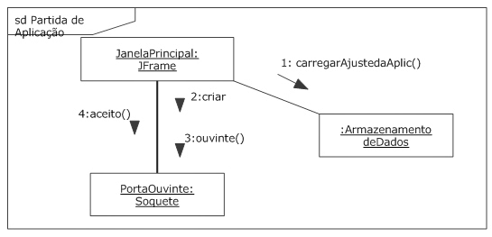

# Diagramas de Comunicação

## Diagramas de Comunicação

Os diagramas de comunicação permitem concentrar-se sobre os elementos envolvidos nas interações, ao invés de sobre o sequenciamento detalhado e controle de fluxo, permitidos nos diagramas de sequência. A maioria das ferramentas UML converte automaticamente um diagrama de sequência em diagrama de comunicação. No entanto, como os diagramas de comunicação não são tão expressivos, algumas informações podem ser perdidas.

Ao se modelar com diagramas de comunicação, os objetos são representados por um retângulo, e as conexões entre os objetos são mostradas com uma linha contínua. Cada mensagem tem certo número de sequência e uma pequena seta indicando a direção da mensagem ao longo de determinada conexão. Os diagramas de comunicação não podem mostrar mensagens sobrepostas ou fragmentos de interação.

As imagens seguintes mostram um diagrama de sequência simples e um diagrama de comunicação equivalente. Confira:

A sintaxe para o nome da mensagem é:

**numero_de_sequencia: nome [recurrence_or_guard]**

Onde:

**numero_de_sequencia**

É o número-índice da mensagem, com 1, sendo o índice da primeira mensagem no diagrama. As chamadas de mensagens são mostradas aninhadas, anexando um número decimal à mensagem original e, em seguida, iniciando nova sequência.

Podem ser mostradas mensagens simultâneas, utilizando-se letras no sequenciamento. Por exemplo, 1a e 1b.

**nome**

É o nome da mensagem que está sendo enviada (em chamada de método).

**recurrence_or_guard**

É parte opcional da sintaxe. Permite especificar uma condição booleana, que deve ser verdadeira para a mensagem ocorrer, ou um intervalo de valores inteiros para looping. As condições de proteção são representadas como expressões booleanas normais, por exemplo, [password.Valid == true]. UML não fornece sintaxe para especificar restrições de looping, que devem começar com asterisco *. Por exemplo, para representar um loop que executa de 0 a 10, escreva * [i = 0 .. 10].

Receba nossa Newsletter no Messenger?
Mandamos uma mensagem semanalmente com as atualizações de novos artigos. Para receber, basta clicar no botão abaixo: ↴

---

## Criando um diagrama de comunicação

---

## Exercícios