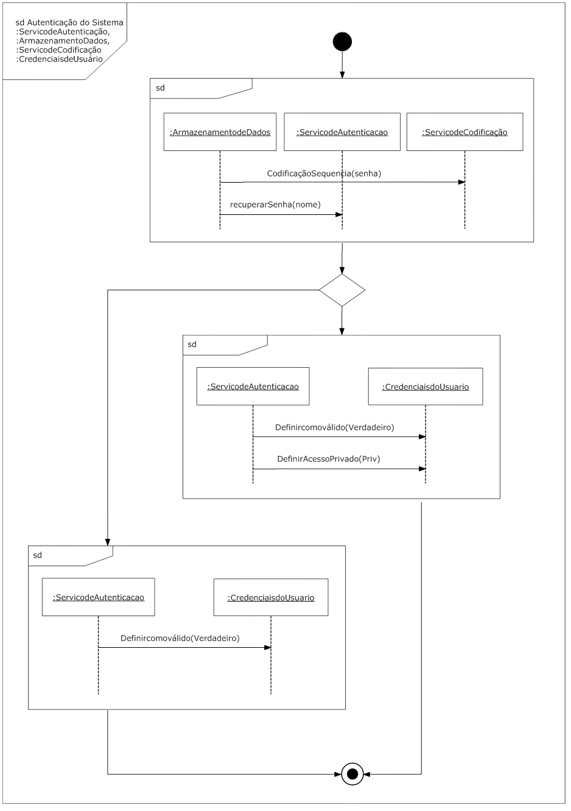

# Diagramas de Interação Resumidos

## Diagramas de Interação Resumidos

Os diagramas de Interação resumidos representam as interações usando a simplificação da notação de diagrama de atividade. Os diagramas de interação resumidos podem ajudar a visualizar o fluxo total de controle por meio de um diagrama. No entanto, eles não mostram as informações detalhadas das mensagens.

As interações ou ocorrências de interação podem ser inseridas em um diagrama de interação resumido, caso isso seja útil, para ver os detalhes das mensagens para um subconjunto da interação global.

Vários conceitos de diagrama de sequência são suportados em diagramas de interação resumidos:

- Mostra fragmentos combinados utilizando nó de decisão e nó de mixagem;
- Mostra interações paralelas usando um nó de bifurcação e nó de agrupamento;
- Mostra loops como ciclos no diagrama de atividade;
- Mostra nomes das linhas de vida envolvidas na interação usando a palavra-chave “linha de vida” após o nome do diagrama de interação resumido, seguido de lista com o nome de cada linha de vida, separada por vírgulas (incluindo quaisquer separadores de dois pontos que podem ou não ser parte do nome).

A imagem a seguir é um diagrama de interação resumido. Confira:

--- 

## Criando um diagrama de interação resumidos

---

## Exercícios
