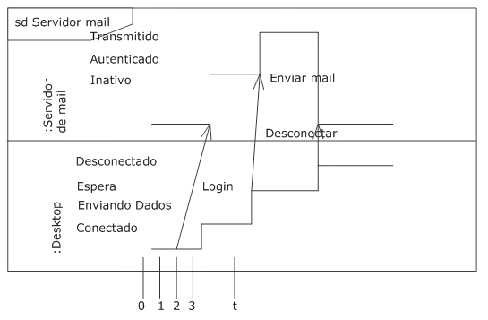

# Diagramas de Tempo

## Diagramas de Tempo

Os diagramas de tempo são representações especiais das interações que têm seu foco nos tempos específicos das mensagens enviadas entre objetos. Os diagramas de tempo podem ser usados para mostrar detalhadamente as restrições de tempo nas mensagens, ou para mostrar quando as mudanças ocorrem em linhas de vida no que diz respeito ao tempo. Os diagramas de tempo são mais frequentemente utilizados em sistemas de tempo real ou embarcados.

Ao contrário dos diagramas de sequência, diagramas de tempo são lidos da esquerda para a direita, ao invés de cima para baixo. O nome de uma linha de vida é mostrado ao longo da borda esquerda do diagrama. Os vários estados da linha de vida são listados, seguidos de representação gráfica das transições entre esses estados. A imagem abaixo mostra um exemplo de um diagrama de tempo no qual o objeto ServidordeMail progride através de vários estados.

Observe que o ServidordeMail começa no estado inativo até que o evento Login ocorra. O evento Login provoca a transição do ServidordeMail para autenticado. Quando o evento Enviar Mail ocorre, ServidordeMail sofre transição para Transmitindo e lá permanece até que seja desconectado. Veja:

Ao ler o diagrama da esquerda para a direita, o comprimento da linha de vida pode ser usado para indicar quanto tempo um objeto permanece em determinado estado. Para associar medidas de tempo, basta mostrar marcações na parte inferior do diagrama, como mostrado nesta imagem:

No exemplo acima, o evento Login é recebido três vezes depois de a sequência ser iniciada. Para mostrar os tempos relativos, marca-se uma instância específica no tempo usando um nome de variável. No exemplo acima, o tempo em que o evento Enviar Mail é recebido é marcado como o tempo t. As marcas relativas de tempo podem ser usadas em restrições para indicar que a mensagem deve ser recebida dentro de um período de tempo específico. A imagem a seguir mostra que a mensagem Desconectar deve ser recebida dentro do prazo de 10 unidades de tempo do evento Enviar Mail. Veja:

Os vários objetos envolvidos podem ser mostrados em um diagrama de tempo, empilhando as linhas de vida. As mensagens entre os objetos são mostradas usando-se uma seta, de uma linha de vida para outra. O início e o final da seta correspondem ao momento em que a mensagem é enviada e recebida. Esta notação mostra os gatilhos que fazem com que uma transição ocorra. No entanto, ela se torna rapidamente ilegível se grande quantidade de mensagens for trocada. Veja:

UML oferece uma variação da notação da linha de vida que simplifica a notação de diagramas, mostrando os nomes de estado entre duas linhas horizontais que se cruzam quando o estado muda. Esta notação facilita mostrar vários objetos ao longo de única linha de vida, mas ele não mostra as mensagens que acionam as transições. Confira o exemplo:

---

## Criando um diagramas de Tempo

---

## Exercícios

