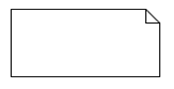

# Estrutura do UML

## Entendendo a UML
Um modelo UML proporciona uma visão do sistema, frequentemente uma das muitas visões necessárias para montar ou documentar o sistema completo. Os usuários novatos em UML podem cair na armadilha de tentar modelar tudo no sistema usando um único diagrama e acabar perdendo informações críticas. Ou, na extremidade oposta, podem tentar incorporar todos os diagramas UML possíveis no modelo, criando complicações e dificultando a manutenção.

Para que você se torne proficiente em UML, deverá entender o que cada diagrama tem para oferecer e saber quando aplicá-lo. Muitas vezes, você viverá a situação em que determinado conceito pode ser expresso por certo número de diagramas; escolha aquele que melhor expressará a informação para os usuários.

Algumas vezes, você poderá precisar de mais de um diagrama para documentar todos os detalhes relevantes para uma única parte do sistema. Por exemplo, você poderá precisar de um diagrama de gráfico de estado para mostrar como um controlador embutido processa uma entrada vinda de um usuário, e de um diagrama de tempo para mostrar como o controlador interage com o restante do sistema como resultado daquela entrada.

Você deve considerar também, quem utilizará os modelos quando for criá-los. Por exemplo, um engenheiro de testes pode não se preocupar com a implementação de um componente de nível baixo (diagrama de sequência), mas somente com as interfaces externas que ele oferece (diagrama de componente). Certifique-se de levar em consideração quem irá utilizar cada diagrama que você produz e faça-o ser inteligível para esse público-alvo.

---

## Perfis UML
Além da variedade de tipos de diagrama, UML é projetada para ser estendida. Você poderá estender UML informalmente pela adição de estereótipos de restrição, valores rotulados e notas aos modelos; ou poderá utilizar a extensão formal de UML e definir um completo perfil. Um perfil UML é uma coleção de estereótipos e restrições sobre elementos que mapeiam a UML genérica para um problema específico de domínio ou implementação. Por exemplo, existem perfis para CORBA, Enterprise Application Integration (EAI), tolerância a falhas, modelagem de bancos de dados e testes.

---

## Modelagem UML
O foco de UML é modelagem. Entretanto, o que isso significa exatamente pode se tornar uma questão interminável. A modelagem é um meio de documentar ideias, relacionamentos, decisões e requisitos numa notação bem definida que pode ser aplicada a muitos domínios diferentes. Modelagem não significa unicamente coisas diferentes para diferentes pessoas, mas também poder usar diferentes partes de UML dependendo do que se está tentando transportar.

Em geral, um modelo UML é feito de um ou mais diagramas. Um diagrama representa, graficamente, coisas e as relações entre elas. Essas coisas podem ser representações de objetos do mundo real, construções de software ou uma descrição do comportamento de algum outro objeto. É comum uma coisa isolada aparecer em múltiplos diagramas, sendo que cada diagrama representa um interesse ou visão em particular da coisa que está sendo modelada.

---

## Diagramas UML
A UML divide os diagramas em duas categorias: estruturais e comportamentais. Os diagramas estruturais podem ser utilizados para documentar a organização física das coisas do sistema; isto é: como um objeto se relaciona com outro. Existem vários diagramas estruturais na UML 2.5:

- **Diagramas de classe:** utilizam classes e interfaces para documentar detalhes sobre as entidades que formam o sistema e as relações estáticas entre elas. Os diagramas de classe estão entre os mais utilizados e podem variar em detalhes que podem ser depurados e aptos para gerar código-fonte, a esboços rápidos em quadros brancos e guardanapos.
- **Diagramas de componentes:** mostram a organização e as dependências envolvidas na implementação do sistema. Eles podem agrupar elementos menores, como classes, em partes maiores, desdobráveis. A quantidade de detalhes que são utilizados em diagramas de componentes varia, dependendo do que se está tentando mostrar. Algumas pessoas simplesmente exibem a versão final, desdobrável de um sistema; outras exibem a funcionalidade proporcionada por determinado componente e como ele a executa internamente.
- **Diagramas de estruturas compostas:** conceitualmente, os diagramas de estruturas compostas ligam os diagramas de classe e os diagramas de componentes. Eles não enfatizam os detalhes de projeto, que os diagramas de classe fazem, ou os detalhes de implementação que os componentes fazem. Ao invés disso, as estruturas compostas mostram como os elementos do sistema se combinam para formar padrões complexos.
- **Diagramas de desdobramento:** mostram como o sistema é realmente executado e atribuído às várias partes de hardware. Você utilizará os diagramas de desdobramento normalmente para mostrar como os componentes funcionam durante a execução.
- **Diagramas de pacote:** são realmente tipos especiais de diagramas de classe. Eles utilizam a mesma notação, mas o foco está em como as classes e interfaces são agrupadas.
- **Diagramas de objeto:** utilizam a mesma sintaxe que os diagramas de classes e mostram como as etapas reais de classe são relacionadas num instante específico. Você pode usar os diagramas de objeto para mostrar as relações dentro do sistema em momento específico.

Os diagramas comportamentais têm foco no comportamento dos elementos de um sistema. Por exemplo, você pode utilizar diagramas comportamentais para documentar requisitos, operações e alterações internas de estado para elementos. Os diagramas comportamentais são:

- **Diagramas de atividade:** documentam o fluxo de um comportamento ou atividade para o próximo fluxo. Eles são similares, em conceito, ao fluxograma clássico, mas mais detalhados.
- **Diagramas de comunicação:** tipo de diagrama de interação que tem o foco sobre os elementos envolvidos num comportamento em particular e nas mensagens que eles passam adiante e para trás. Os diagramas de comunicação enfatizam mais os objetos envolvidos do que a ordem e natureza das mensagens trocadas.
- **Diagramas de interação resumidos:** versões simplificadas de diagramas de atividade. Ao invés de enfatizar a atividade de cada passo, os diagramas de interação resumidos enfatizam qual(is) elemento(s) está(ão) envolvido(s) no desempenho daquela atividade. As especificações UML descrevem diagramas de interação ao enfatizar quem têm o foco de controle durante a execução de um sistema.
- **Diagramas de sequência:** tipo de diagrama de interação que enfatiza o tipo e a ordem das mensagens passadas entre os elementos durante a execução. Os diagramas de sequência são o tipo mais comum de diagramas de interação, além de ser muito intuitivos para os novos usuários de UML.
- **Diagramas de máquina de estado:** documentam as transições de estado internas de um elemento. O elemento pode ser tão pequeno quanto uma classe simples ou tão grande quanto o sistema completo. Os diagramas de máquina de estado são normalmente utilizados para modelar sistema embutidos e especificações, ou implementações de protocolo.
- **Diagramas de tempo:** tipo de diagrama de interação que enfatiza as especificações do detalhamento de tempo para mensagens. São frequentemente utilizados para modelar sistemas de tempo real, tais como comunicações por satélite ou entre partes de hardware. Eles têm notação específica para indicar quanto tempo o sistema tem para processar ou responder a mensagens, e como interrupções externas são tratadas na execução.
- **Diagramas de caso de uso:** documentam os requisitos funcionais para um sistema. Eles fornecem uma visão independente de implementação e do papel que o sistema deve fazer, permitindo ao modelador manter o foco nas necessidades do usuário, ao invés de tê-los nos detalhes de realização.
---

## Visões
Embora não seja estritamente parte de UML em si, o conceito de visões de um sistema auxilia o modelador a encontrar diagramas que ajudam no transporte de informação correta, dependendo dos objetivos. No geral, os modelos são frequentemente divididos entre o que se chama **visões 4+1 do sistema**. A notação 4+1 representa quatro visões distintas de um sistema e um resumo de como tudo se acopla. As quatro visões são:

- **Visão de projeto:** documenta as classes, interfaces e padrão que descrevem a representação do domínio de um problema e como o software será montado para resolvê-lo. A visão do projeto quase sempre utiliza diagramas de classes, diagramas de objeto, diagramas de atividade, diagramas de estrutura compostas e diagramas de sequência para carregar o projeto de um sistema. A visão de projeto normalmente não encaminha a implementação ou execução do sistema.
- **Visão de desdobramento:** documenta os meios com que o sistema está configurado, instalado e executado. Ela geralmente consiste de diagramas de componentes, diagramas de desdobramento e diagramas de interação. A visão de desdobramento documenta o meio com o qual o layout físico do hardware se comunica para executar o sistema e pode ser utilizada para exibir lista de falhas, redundâncias e topologia de rede.
Visão de implementação: enfatiza os componentes, arquivos e recursos usados por um sistema. Tipicamente a visão da implementação tem o foco nas gerências de configuração de um sistema, quais componentes dependem de quais, quais arquivos-fonte implementam quais classes, etc. As visões de implementação quase sempre usam um ou mais diagramas de componente e podem incluir diagramas de interação, diagramas gráficos de estado e diagramas de estrutura composta.
- **Visão do processo:** de um sistema tem a finalidade de documentar informações sobre cooperação, desempenho e escalabilidade. As visões do processo normalmente utilizam alguma forma de diagrama de interação e diagramas de atividade para mostrar como um sistema realmente se comporta em operação.

As quatro visões distintas de um sistema são tomadas juntas pela visão final:

- **Visão de caso de uso:** documenta a funcionalidade requerida pelos usuários finais. O conceito de usuário final é deliberadamente amplo na visão de caso de uso: inclui os usuários básicos, o administrador do sistema, os testadores e, potencialmente, os próprios desenvolvedores. A visão de caso de uso é normalmente dividida em colaborações que ligam um caso de uso a uma ou mais das quatro visões básicas. A visão de caso de uso inclui diagramas de caso de uso e, geralmente, usa vários diagramas de interação para mostrar detalhes do caso de uso.

---

## Notas
UML fornece um elemento de notas para adicionar informações ao diagrama. O símbolo de nota é um retângulo com orelha dobrada no canto superior direito com uma linha pontilhada opcional para ligá-lo a algum elemento.

Em geral, você pode usar notas para documentar quase qualquer coisa em seu diagrama. As notas são comumente usadas para expressar informações adicionais que têm, ou não, a sua própria notação – ou que poderiam atravancar um diagrama, se fossem anexadas diretamente ao elemento. Algumas ferramentas permitem a inclusão de links de URL nas notas, proporcionando uma maneira fácil para navegar de um diagrama ao próximo ou para documentos em HTML e etc.

---

## Regras UML
Por fornecer uma linguagem comum para a documentação de informações sobre funcionalidade e projeto, a UML é deliberadamente aberta para permitir a flexibilidade necessária para modelar diferentes domínios. Existem várias regras, que devem ser mantidas em mente, ao usar UML:

- **Quase tudo em UML é opcional.** UML fornece uma linguagem para documentar informações que variam muito, dependendo do domínio do problema. Ao fazer isso, existem sempre partes de UML que: ou não se aplicam ao problema particular ou podem não acrescentar nada à visão em particular que você está tentando apresentar. É importante entender que você não precisa usar todas as partes de UML no modelo criado. Você não precisa usar todos os símbolos disponíveis a cada diagrama que você usar. Use somente aquilo que realmente ajuda a esclarecer a mensagem que está tentando apresentar e deixe de lado o que não for preciso. Às vezes, existe mais de uma maneira de apresentar a mesma informação: use a que for mais familiar ao seu público-alvo.
- **Os modelos UML raramente são completos.** Como tudo o que é opcional, é comum a um modelo UML faltar alguns detalhes sobre o sistema. O truque é não deixar faltar detalhes-chave que poderiam impactar o projeto do seu sistema. Saber o que é um detalhe-chave, ao contrário de informações descartáveis, se consegue com a experiência. Entretanto, usar um processo interativo e revisar o modelo auxilia na preservação do que é necessário. Como UML se move próxima da automação das ferramentas, práticas como MDA e Fábricas de Software normalmente tornam os modelos mais e mais detalhados e, assim, completos. A diferença é o suporte de ferramentas que auxilia em alterar o nível de abstração, dependendo das necessidades.
- **UML é projetada para ser aberta a interpretações.** A especificação de UML faz um bom serviço ao executar o trabalho duro de linguagem de modelagem. É importante que, dentro de uma organização ou grupo de usuários, possa ser estabelecido como e quando se deve usar um dispositivo da linguagem. Por exemplo, algumas organizações usam uma relação de agregação para indicar um ponteiro em C++ e uma relação de composição para indicar uma referência C++. Nada há de errado com essa distinção, mas ela não é imediatamente óbvia para alguém que não esteja familiarizado com a técnica de modelagem. Criar um documento deve ajudar os usuários novatos a se familiarizarem rapidamente, além de auxiliar os experientes a pensarem como representar alguma coisa e a considerarem uma notação potencialmente melhor.
- **UML tem a finalidade de se expandir.** UML inclui uma série de mecanismos que permitem a personalização e o refinamento da linguagem. Tais mecanismos como adornos, restrições e estereótipos proporcionam meios de documentação de detalhes específicos que não são facilmente expressos usando-se classificadores e relações. Geralmente eles são agrupados nos chamados perfis de UML. Por exemplo, você pode agregar um perfil Java Enterprise Edition (JEE) que inclui estereótipos para SessionBean ou JavaDataObject. Se você estiver modelando um domínio complexo, considere a possibilidade de agregar um perfil UML que permite identificar facilmente elementos e conceitos do seu domínio.

---

## Exercícios

Questão 1 de 3
Dentre as opções abaixo, qual não é um diagrama nativo do UML?

Diagrama de desdobramento.

✔ Diagrama de rede.

Diagrama de casos de uso.

Diagrama de classe.

Diagrama de pacote.

Questão 2 de 3
Complete corretamente a afirmação abaixo:
Um modelo UML proporciona uma visão do sistema, frequentemente uma das muitas visões necessárias para montar ou documentar o sistema completo .

Questão 3 de 3
Complete corretamente a afirmação abaixo:
No UML um diagrama representa, graficamente, coisas e as relações entre elas.