# Diagrama de Classe

## Diagrama de Classe

Os diagramas de classe são uns dos mais fundamentais tipos de diagramas em UML. Eles são utilizados para capturar as relações estáticas do software; em outras palavras, como as coisas são postas juntas.

Ao escrever software você está constantemente tomando decisões de projeto: quais classes suportam referências com outras classes, quais classes “possuem” alguma outra classe, e assim por diante. Os diagramas de classe proporcionam uma maneira de capturar a estrutura “física” do sistema.

---

## Classes
Uma classe representa um grupo de coisas que têm estado e comportamento comuns. Você pode pensar em uma classe como uma cópia de um objeto num sistema orientado a objeto. Falando-se em UML, uma classe é um tipo de classificador. Por exemplo, Volkswagen, Toyota e Ford são todos carros, então você pode representá-los usando uma classe chamada Carro. Cada modelo específico de carro é um exemplo daquela classe, ou um objeto. Uma classe pode representar um conceito tangível e concreto, tal como uma fatura; ela pode ser abstrata, tal como um documento ou veículo (em oposição à fatura ou a uma motocicleta); ou pode representar um conceito intangível, tal como uma estratégia de investimento de alto risco.

Você deve representar uma classe com uma caixa retangular dividida em compartimentos. Um compartimento é simplesmente uma área de retângulo onde se escrevem as informações. O primeiro compartilhamento contém o nome da classe; o segundo contém os atributos; e o terceiro contém os métodos ou operações da classe. Você pode ocultar qualquer compartimento da classe, caso isso aumente a legibilidade do diagrama. Ao ler um diagrama, você não poderá assumir nada sobre o compartimento faltante, isso não significa que ele esteja vazio. Você poderá adicionar compartimentos a uma classe para mostrar mais informações, tais como exceções ou eventos, embora isso esteja fora da notação típica.

UML sugere que o nome da classe siga as seguintes recomendações:

- Comece com letra maiúscula;
- Fique centrado no compartimento superior;
- Seja escrito em negrito;
- Seja em itálico, se for uma classe abstrata (explicada a frente).

Veja o exemplo de classe abaixo:

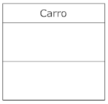

---

## Objetos
Um objeto é a instância de uma classe. Ou seja: a implementação das informações da classe. Por exemplo, você pode ter várias instâncias da classe Carro, como: um carro vermelho de duas portas, um carro azul de quatro portas e um carro verde modelo cupê. Cada instância de Carro é um objeto e pode receber um nome próprio, embora o mais comum é que sejam objetos ou diagramas de objeto sem nome, ou anônimos. O padrão é mostrar o nome do objeto seguido por dois pontos seguido do tipo – isso é: a Classe. Indica-se que isso é um exemplo de classe sublinhando o nome e o tipo.

A imagem abaixo é um exemplo de objeto da classe Carro, chamado Toyota. Observe que, nesta figura, os compartimentos vazios foram ocultados.


---

## Atributos
Os detalhes de uma classe (cor do carro, número da placa etc.) são representados como atributos. Os atributos podem ser tipos primitivos simples (inteiros, números de ponto decimal flutuante etc.) ou relações com outros objetos complexos.

Um atributo pode ser mostrado usando-se duas diferentes notações: alinhadas ou por relações entre classes. Além disso, a notação está disponível para mostrar coisas como multiplicidade, singularidade e ordenamento.

---

## Atributos Alinhados
Os atributos de uma classe podem ser listados direto na notação do retângulo. Tais notações são chamadas de atributos alinhados. Não há diferença semântica entre atributos alinhados e atributos por relação. Isso é simplesmente um problema de quantos detalhes você deseja apresentar (ou, no caso de primitivos como inteiros, quantos detalhes você pode apresentar).

Para representar um atributo dentro do corpo de uma classe, coloque o atributo no segundo compartimento de classe. UML se refere aos atributos alinhados como notação de atributos. Os atributos alinhados usam a seguinte notação:

```
visibilidade / nome: tipo multiplicidade = padrão{sequências e restrições de propriedade}visibilidade ::= {+|-|#|~}multiplicidade ::= [inferior..superior]
```

Onde:

**visibilidade**

Indica a visibilidade do atributo. Utilize os símbolos +, -, #, ou ~ para, respectivamente, público, privado, protegido ou pacote.

/

Indica que o atributo é derivado. Um atributo derivado pode ser computado de outros atributos da classe.

**nome**

É um substantivo ou frase curta, nomeando o atributo. Normalmente a primeira letra é minúscula e a primeira letra de cada palavra subsequente é maiúscula. (CamelCase)

**tipo**

É o tipo de atributo como outro classificador; geralmente é uma classe, interface ou um tipo de dados, como: int.

**multiplicidade**

Especifica quantos exemplos de tipos de atributos são referenciados por esse atributo. Pode ser ausente (significando multiplicidade 1), um simples inteiro ou uma faixa de valores especificada entre colchetes separados por .. . Utilize um * para representar o limite superior ou * por ele mesmo para significar zero ou mais.

**padrão**

É o valor padrão do atributo.

**sequências de propriedade**

É uma coleção de propriedades ou rótulos, que podem ser anexadas aos atributos. Elas são tipicamente específicas do contexto e denotam coisas como ordenamento ou singularidade. Elas são limitadas por {} e separadas por vírgulas.

**restrições**

Há uma ou mais restrições colocadas num atributo. Elas podem ser de linguagem natural ou usar uma gramática formal tal como a OCL.

---

## Atributos por Relação
Você pode também representar atributos usando a notação de relação. Ela resulta num diagrama de classe maior, mas pode fornecer mais detalhes para os tipos de atributos complexos. A notação de relação também mostra exatamente como o atributo está contido dentro de uma classe. Por exemplo, se você está modelando um Carro, pode mostrar que um carro contém um Motor muito mais claramente usando as relações do que se você tentasse fazê-lo listando um atributo dentro do retângulo Carro. Entretanto, mostrar o nome do Carro por relação é provavelmente um desperdício, pois é possível que seja somente um texto.

Para representar um atributo usando relações, você deve usar uma das relações de associação entre a classe que contém o atributo e a classe que representa o atributo, como pode ser visto na imagem abaixo. Ela mostra que as relações entre o carro e seu motor têm a multiplicidade de 1:, um carro tem um motor:


A notação de relação segue a mesma sintaxe da notação alinhada, embora o layout seja ligeiramente diferente. A visibilidade e o nome do atributo são colocados próximos à linha de relação. Não utilize colchetes para a multiplicidade, mas coloque a especificação da multiplicidade próxima ao classificador do atributo.

Assim como na multiplicidade, você pode colocar restrições nos atributos. Na notação de relação, escreva as restrições próximas ao classificador de atributo ao longo da linha de relação. UML permite que a notação de relação expresse também as restrições entre atributos, como mostra esta imagem:

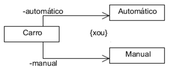

Na imagem anterior, a restrição UML padrão “xou”, mostra que somente um automático ou manual podem ser instaladas em dado momento (ou exclusivo). Você precisa expressar essa restrição numa nota, se a notação de atributo alinhado foi utilizada.

---

## Atributos estáticos
Os atributos estáticos são atributos da classe que possuem o mesmo valor para todas as instâncias da classe. Os atributos estáticos são representados sublinhando-se a sua especificação, conforme mostrado na imagem abaixo:


---

## Conhecendo od diagramas de classes

Novo diagrama de classe


Nome em negrito e no singular

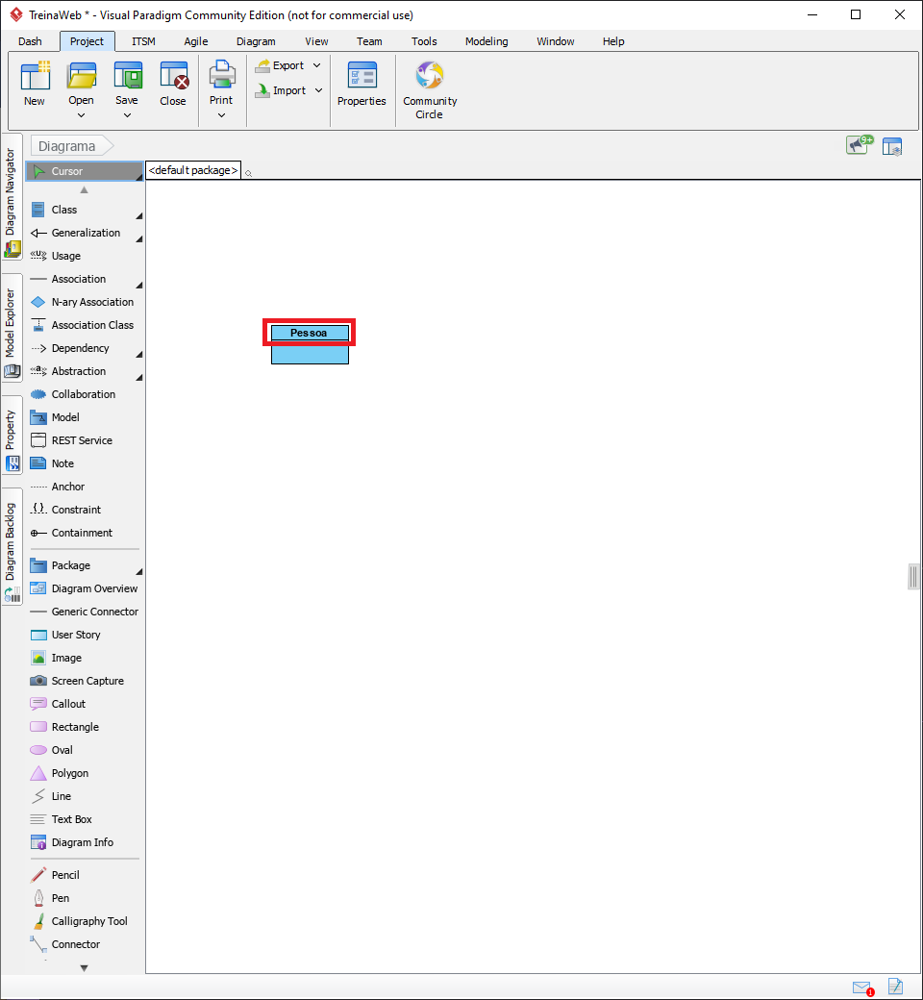

Clicar no icone para adicionar atributos...

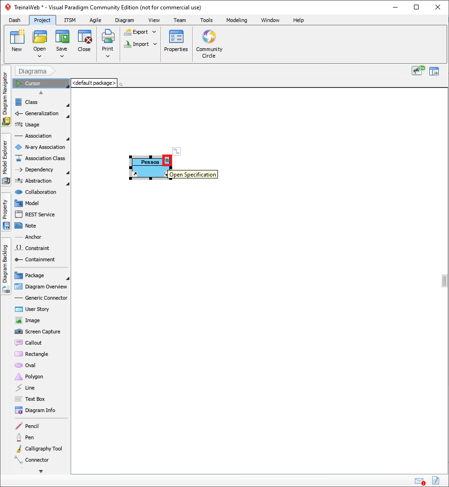

Vá na aba Attribute para adicionar

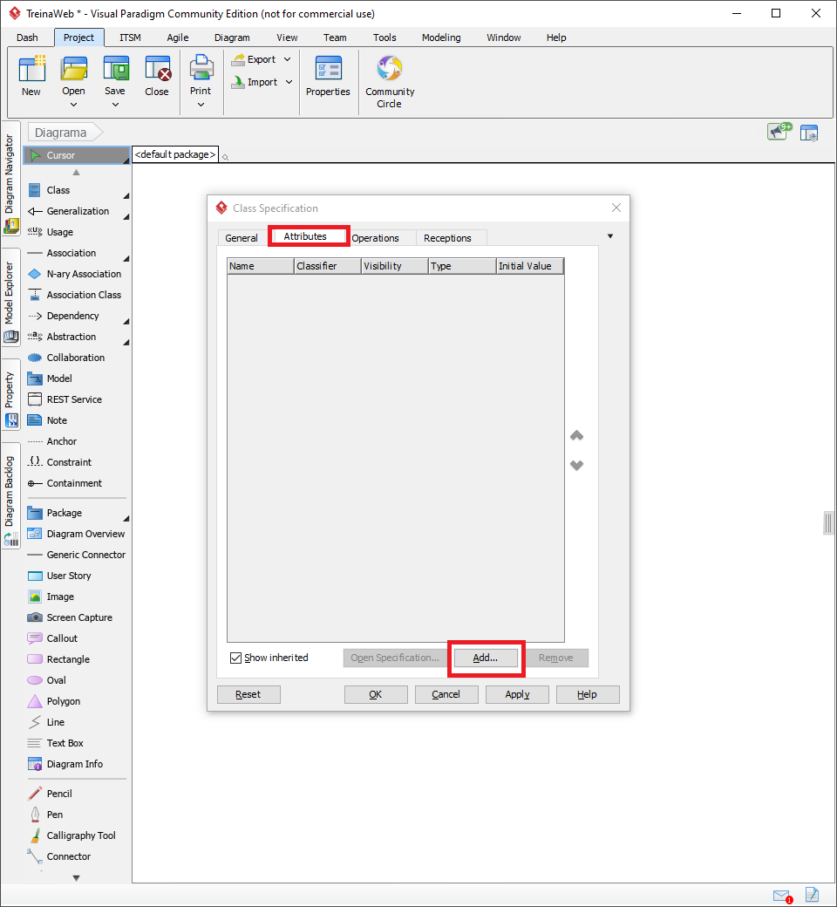

Configuração dos atributos

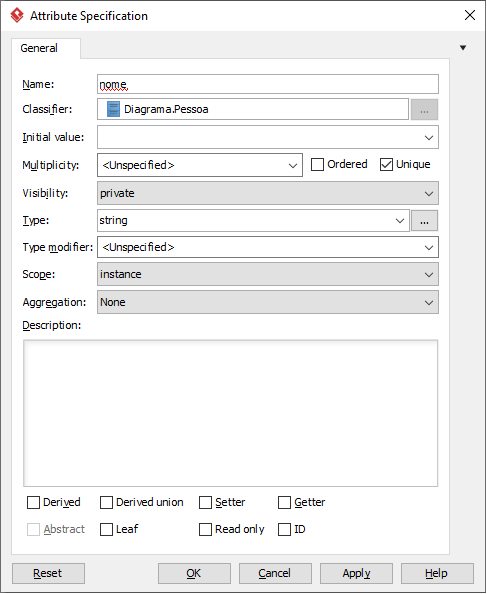

Listas dos atributos

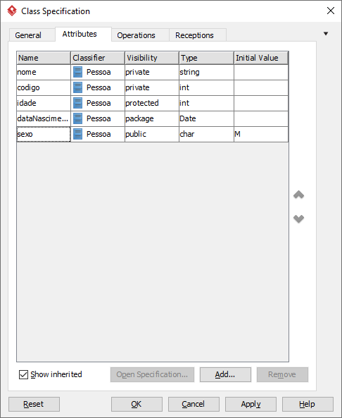

Adicionar uma relação entre Classes


Associação simples de `Pessoa` para `Pedido`


Atributo da associação de `Pessoa` para `Pedido`


---

## Operações

Operações são as características das classes que especificam como chamar um comportamento particular, ou seja, são as ações que as classes executam. Por exemplo, uma classe pode oferecer a operação de desenhar um retângulo na tela ou na contagem do número de itens selecionados em uma lista.

As operações devem ser colocadas em compartimento separado, com a seguinte sintaxe:

```
visibilidade nome (parâmetros) : tipo-retorno {propriedades}
```

Onde os parâmetros são escritos como:

```
nome_parâmetro direção : tipo [multiplicidade] = valor_padrão {propriedades}
```

Confira a imagem abaixo:

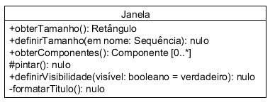

Os elementos da sintaxe são:

visibilidade

Indica a visibilidade da operação. Use os símbolos +, -, # ou ~, respectivamente, para público, privado, protegido ou pacote.

nome

É uma frase curta sem espaço para nomear a operação. As operações são geralmente expressões verbais que representam as ações que o classificador deve realizar em nome do chamador. A especificação UML recomenda que a primeira letra de uma operação seja minúscula, com todas as palavras seguintes começando com letra Maiúscula e sendo emendadas.

tipo-retorno

É o tipo de informação que a operação retorna, se houver retorno. Se nenhuma informação é retornada da operação (chamado de sub-rotina, em algumas linguagens), o tipo de retorno deve ser nulo (void). Se a operação retorna um valor (chamado de função, em algumas linguagens), você deve mostrar o tipo do valor retornado – como outro classificador, um tipo primitivo ou uma coleção. A especificação do tipo de retorno é opcional. Se não for especificado, não se pode assumir nada sobre o valor de retorno da operação.

propriedades

Especifica as restrições e as propriedades associadas à operação. Elas são opcionais.

Os parâmetros dos elementos da sintaxe são:

direção

Uma parte opcional da sintaxe que indica como um parâmetro é usado por uma operação: in (entrada), inout (entrada e saída), out (saída) ou return (retorno).

nome_parâmetro

É um substantivo nomeando o parâmetro. Normalmente, o nome do parâmetro começa com letra minúscula, com todas as palavras subsequentes começando com letra Maiúscula.

tipo

É o tipo de parâmetro. Ele pode ser: outra classe, interface, coleção ou tipo primitivo.

multiplicidade

Especifica quantas instâncias de tipo do parâmetro estão presentes. Pode estar ausente (o que significa multiplicidade de 1), um único número inteiro, uma lista de inteiros separados por vírgulas ou uma sequência de valores inteiros indicados entre parênteses ( ) e separados por dois pontos ... Um limite infinito superior pode ser representado por um asterisco *.

valor_padrão

Especifica o valor-padrão do parâmetro. Ele é opcional e, se não estiver presente, não mostre o sinal de igual.

propriedades

Qualquer propriedade relacionada aos parâmetros deve ser especificada entre chaves { }. As propriedades são definidas no contexto de um modelo específico, com algumas exceções: ordenados, somente leitura e único. Propriedades são opcionais para os parâmetros e, se não forem usadas, não mostre as chaves.

---

## Conhecendo as operações

Operações


Configuração da operação

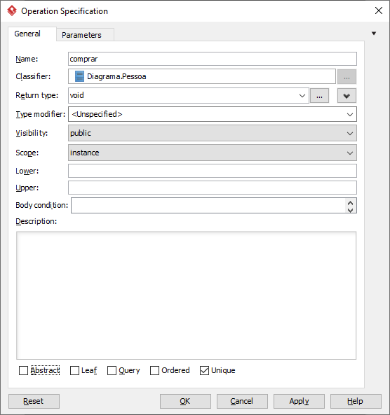

Configuração dos parâmetros da operação

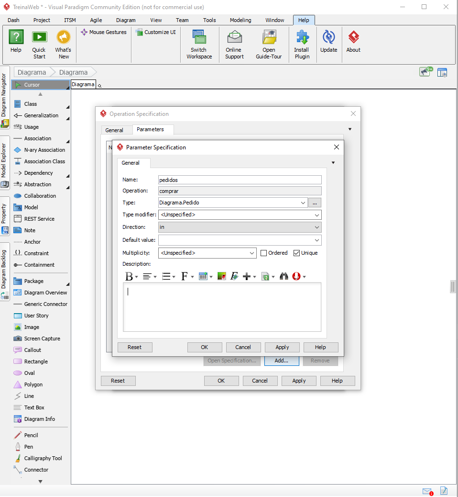

Overload - sobrecarga

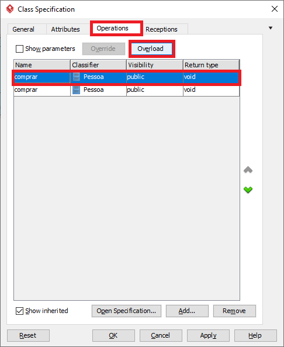

Adicionando uma generalização da classe `PessoaFisica` para `Pessoa`


---

## Classes Abstratas

Classe abstrata é uma classe que normalmente oferece uma assinatura de operação, mas nenhuma implementação. No entanto, você pode ter uma classe abstrata que não possui operações. Uma classe abstrata é útil para identificar funcionalidades comuns em vários tipos de objetos. Por exemplo, uma classe abstrata chamada móvel: o objeto móvel tem uma posição atual e tem a capacidade de mudar para outro lugar, utilizando a operação denominada mover(). Pode haver várias especializações desta classe abstrata - um Carro e uma pessoa -, sendo que cada uma delas fornece uma implementação diferente de mover(). Como a classe Móvel não tem implementação para mover(), ela é uma classe abstrata.

Indica-se que uma classe é abstrata, escrevendo seu nome, assim como o de cada operação, em itálico. Confira o exemplo abaixo:


A classe abstrata não pode ser instanciada, ou seja: sempre será superclasse. Já as subclasses terão que implementar todas as operações da classe abstrata e podem ser instanciadas.


---

## Conhecendo as classes abstratas

---

## Relações

As Classes, isoladamente, não fornecem informações de como um sistema é projetado. A UML oferece várias maneiras de representar as relações entre as classes. Cada tipo de relação UML representa um tipo diferente de relação entre classes, possuindo sutilezas que não são totalmente captadas na especificação UML. Ao modelar com base no mundo real, você deve ter certeza que o público-alvo entenderá que você está lidando com várias relações. As explicações a seguir são a interpretação da equipe TreinaWeb sobre as especificações UML.

Dependência

A mais fraca relação entre classes é uma relação de dependência. A dependência entre classes significa que determinada classe usa ou tem conhecimento de outra classe. É tipicamente uma relação transiente, ou seja: a classe dependente interage brevemente com a classe alvo, mas normalmente não mantém relacionamento com ela durante todo o tempo.

As dependências são normalmente lidas como **"... usa um..."**. Por exemplo, suponha que você tem a classe chamada Janela, que chama a classe chamada EventoFechaJanela quando ela está prestes a ser fechada, você pensaria "Janela usa um EventoFechaJanela ".

A dependência entre as classes é mostrada através de uma linha tracejada com uma seta apontando da classe dependente para a classe usada, conforme mostra a imagem a seguir:


Associação

As associações são mais fortes do que as dependências e geralmente indicam que a classe mantém relacionamento com outra classe durante um período de tempo prolongado. O tempo de vida dos objetos não está ligado (ou seja, um pode ser destruído sem necessariamente destruir o outro).

As associações são normalmente lidas como **"... tem um..."**. Por exemplo, suponha que você tem a classe chamada Janela, que é uma referência para o cursor do mouse; você diria "Janela tem um Cursor". Observe que há uma linha tênue entre "... tem um..." e "... possui um...". Neste caso, a Janela não possui o Cursor, ele é compartilhado entre todas as aplicações do sistema. No entanto, Janela tem uma referência a ele, de forma que ela pode escondê-lo, mudar sua forma, etc. Você mostra a associação com uma linha sólida entre as classes participantes do relacionamento, conforme mostra a imagem abaixo:


Navegabilidade

Associações têm notação explícita para expressar navegabilidade. Se for possível navegar de uma classe a outra, mostre uma seta na direção da classe a qual se pode navegar. Se for possível navegar em ambos os sentidos, é prática comum não mostrar qualquer seta. Mas a especificação UML define que, se você suprimir todas as setas, não conseguirá distinguir a associação não navegável da associação de dois sentidos. Como é extremamente raro usar a associação não navegável no mundo real, então é improvável que isso seja um problema.

É possível proibir a navegação de uma classe à outra. Para isso, coloque um **X**, na linha de associação, do lado que não se poderá navegar. A imagem abaixo mostra uma associação entre a classe chamada **Janela** e a classe chamada **Cursor**. Como não é possível navegar da instância de Cursor para a instância de Janela, mostra-se explicitamente a seta de navegabilidade com o **X** no local adequado.


Denominando uma Associação

Associações podem ser enfeitadas com vários símbolos para acrescentar informações ao modelo. O mais simples é uma seta sólida mostrando a direção em que o usuário deve ler a associação. É comum incluir uma frase curta, juntamente com a seta, para fornecer algum contexto para a associação. A frase usada com a associação normalmente não é gerada durante a codificação, servindo apenas para fins de modelagem. Veja este exemplo:


Multiplicidade

Como normalmente as associações representam relacionamentos duradouros, são muitas vezes usadas para indicar os atributos de uma classe. Como explicado anteriormente em “Atributos por Relação”, você pode expressar quantas instâncias de classe estão envolvidas em determinado relacionamento. Se você não especificar um valor, será assumida a multiplicidade de 1. Para mostrar um valor diferente, basta especificar a multiplicidade da classe. Note que, quando se utiliza a multiplicidade em uma associação, podem ser utilizados colchetes em torno dos valores, conforme mostra a imagem abaixo:


As propriedades relativas a multiplicidade também podem ser aplicadas às associações.

Agregação

A agregação é uma versão mais forte da associação. Ao contrário da associação, na agregação normalmente as classes têm o mesmo tempo de vida, ou seja: serão criadas e destruídas juntas. As agregações são geralmente lidas como **"... possui um..."**. Por exemplo, suponha que você tivesse a classe Janela, que armazena o nome, tamanho e posição na classe Retângulo. Você diria que "Janela possui um Retângulo". A classe Retângulo pode ser compartilhada com outras classes, mas Janela tem um relacionamento íntimo com ela.

A agregação é mostrada com um losango próximo à classe proprietária e uma linha sólida apontando para a classe possuída, conforme mostra a imagem abaixo:


Tal como acontece com a relação de associação, a navegabilidade e a multiplicidade podem ser mostradas numa linha de agregação.

Composição

Composição representa a relação muito forte entre as classes, a ponto de contenção. Composição é usada para capturar um relacionamento todo-parte. A peça "parte” da relação pode ser envolvida em apenas uma relação de composição num dado momento. O tempo de vida das instâncias envolvidas no relacionamento de composição é quase sempre o mesmo. Se a instância maior, possuidora, for destruída, quase sempre destrói a peça parte. UML permite que a parte seja associada a um novo proprietário antes da destruição, preservando assim a sua existência. Porém, esta é normalmente uma exceção e não a regra.

A relação de composição geralmente é lida como **"... faz parte de ..."**, o que significa que se deve ler a composição da parte com o todo. Por exemplo, para dizer que uma Janela em seu sistema deve ter uma barra de título, você pode representar isso com a classe chamada Barra de Títulos que "... é parte de ..." uma classe chamada Janela.

Esse relacionamento de composição deve ser mostrado com um losango preenchido junto à classe dominante e uma linha sólida apontando para a classe pertence, conforme mostra a imagem abaixo:


Tal como acontece com a relação de associação, a navegabilidade e multiplicidade podem ser mostradas numa linha de composição.

Generalização

Um relacionamento de generalização transmite que o objetivo da relação é uma versão geral, ou menos específica, da classe-origem ou interface. As relações de generalização são frequentemente usadas para estabelecer afinidades entre diferentes classificadores. Por exemplo, suponha que você tivesse a classe chamada Gato e a classe chamada Cachorro: a generalização para ambas seria a classe chamada Animal (a discussão completa de como e quando usar a generalização, especialmente confrontando com execução de interface, é conteúdo de análise orientada a objeto e não será abordado neste curso).

Generalizações são geralmente lidas como **"... é um..."**, a partir da classe mais específica e indo para a classe geral. Voltando ao exemplo do gato e do cão, você diria "um Gato... é um...Animal".

O relacionamento de generalização deve ser mostrado por uma linha sólida com uma seta fechada, apontando a partir da classe específica para a classe geral, conforme mostra a imagem abaixo:


Ao contrário das associações, relacionamentos de generalização normalmente não são nomeados e não têm qualquer tipo de multiplicidade. UML permite herança múltipla, ou seja, uma classe pode ter mais de uma generalização com cada um, representando um aspecto da classe ascendente. No entanto, algumas línguas modernas (por exemplo, Java e C #) não suportam herança múltipla, usando interfaces ao invés disso.

Associação de Classes

Muitas vezes a relação entre dois elementos não é uma simples conexão estrutural. Por exemplo, um jogador de futebol pode ser associado à determinada liga de futebol por estar em certa equipe. Se a associação entre dois elementos for complexa, essa conexão pode ser representada usando-se uma classe de associação. A classe de associação possui nome e atributos, como uma classe normal. Uma associação de classe deve ser mostrada como uma classe normal, com uma linha tracejada ligando-a a associação que representa, conforme demonstrado nesta imagem:

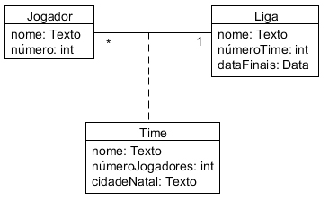

Quando traduzido em código, a relação com classes de associação muitas vezes resulta em três classes: uma para cada extremidade da associação e uma para a própria classe de associação. Pode haver ou não uma ligação direta entre os dois lados da associação, e a implementação pode requerer que se atravesse a classe de associação para chegar ao lado oposto da ligação. Em outras palavras, o jogador de futebol não pode ter uma referência direta com a Liga, mas ao invés disso pode ter uma referência para Time. Time teria, então, uma referência à Liga. Como as relações serão construídas é uma questão de escolha de implementação. No entanto, o conceito fundamental de classe de associação mantém-se inalterado.

---

## Conhecendo as relações

---

## Interfaces

Uma interface é um classificador que tem declarações de propriedades e métodos, mas não implementações. As interfaces podem ser usadas para agrupar os elementos comuns entre classificadores e fornecer o contrato que o classificador deve obedecer quando a interface for implementada. Por exemplo, para criar a interface chamada Ordenável, que tem a operação denominada vemAntes (...), qualquer classe que execute a interface Ordenável deve fornecer uma implementação de vemAntes (...).

Algumas linguagens, como C++, por exemplo, não suportam o conceito de interfaces. Interfaces UML são tipicamente representadas como classes abstratas puras. Outras linguagens, como Java, aceitam interfaces, mas não permitem que tenham propriedades. Por isso, você deve estar ciente da forma como o modelo será aplicado na modelagem do seu sistema.

A representação de uma interface quase como que de uma classe, só que com o estereótipo de "interface":


Você não pode instanciar diretamente uma interface. Ao invés disso, uma classe deve implementar uma interface e esta fornece uma implementação para as operações e propriedades dela. Essa associação deve ser mostrada com uma linha tracejada a partir da classe, levando a interface com uma ponta de flecha fechada no final. As classes que são dependentes da interface são apresentadas por uma linha tracejada com uma seta aberta (dependência), conforme mostra esta imagem:

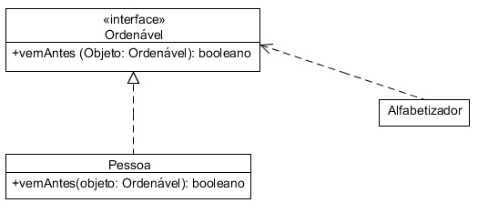

---

## Conhecendo as interfaces e classes parametrizadas

---

## Exercícios

Questão 1 de 3
A imagem abaixo:


Representa qual tipo de relação?

Dependência.

Composição.

Agregação.

✔ Generalização.

Associação.

Questão 2 de 3
Selecione abaixo as visibilidades válidas de um atributo de uma classe.

Escolha 4 respostas.
✔ Pacote.

✔ Público.

✔ Protegido.

Sistema.

✔ Privado.

Questão 3 de 3
Complete corretamente a afirmação abaixo:
Você pode pensar em uma classe como uma cópia de um objeto num sistema orientado a objeto . Falando-se em UML , uma classe é um `tipo de classificador`.