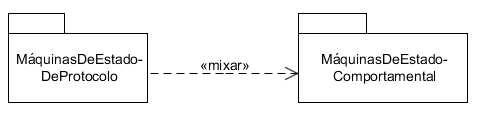

# Diagrama de Pacote

## Diagrama de Pacote

Os pacotes oferecem uma maneira de agrupar elementos UML relacionados e de fazer o escopo de seus nomes, como, por exemplo, colocar todos os elementos que têm a ver com a renderização em 3D em um pacote chamado 3DGraphics. Diagramas de pacote fornecem uma ótima maneira de visualizar as dependências entre as partes de seu sistema e são usadas frequentemente para procurar problemas ou determinar a ordem de compilação.

Quase todos os elementos UML podem ser agrupados em pacotes, que incluem pacotes próprios. Cada pacote tem um nome que faz o escopo de todos os seus elementos. Por exemplo, suponha que você tivesse uma classe chamada Temporizador em um pacote chamado Utilidades; o nome qualificado para a classe seria Utilidades::Temporizador. Elementos do mesmo pacote podem se referir entre si, sem usar qualificador em seus nomes.

---

## Representação

Para mostrar um pacote use um retângulo com uma aba anexada ao canto superior esquerdo, como na imagem:

Os elementos contidos dentro de um pacote podem ser exibidos de duas maneiras diferentes: 1) Podem ser colocados dentro do retângulo grande – ao usar tal representação, escreva o nome do pacote no topo, como mostra esta imagem:

2) Use uma linha sólida, a partir do pacote, apontando para cada elemento contido. Coloque um círculo com um sinal de mais **+** no final da linha, próximo ao pacote, para indicar confinamento. Ao usar esta representação, deverá mostrar o nome do pacote no retângulo grande, ao invés de na aba. Esta notação permite-lhe mostrar mais detalhes dos elementos do pacote, conforme indica a imagem:

Você não precisa mostrar todos os elementos contidos em um pacote; se não houver elementos apresentados, não podem ser feitas suposições sobre o que contém no pacote.

---

## Visibilidade

Um pacote pode especificar as informações de visibilidade para os elementos contidos e importados, porém os elementos podem ter apenas um dos dois níveis de visibilidade: público ou privado. Visibilidade pública significa que o elemento pode ser utilizado fora do pacote. Visibilidade privada significa que o elemento só pode ser usado por outros elementos do mesmo pacote. Visibilidade privada é útil para marcar classes que representam um subsistema ou componente que não se deseja expor ao resto do sistema.

A visibilidade pública é mostrada colocando-se um sinal de adição + antes do nome do elemento. A visibilidade privada é mostrada utilizando-se um sinal de menos -. Confira o exemplo:

---

## Diagrama de pacote

---

## Importando e Acessando Pacotes

Para acessar elementos em um pacote, de outro pacote diferente, deve-se qualificar o nome do elemento que se está acessando. Por exemplo, se Carro é uma classe no pacote Transporte e você está tentando acessar a partir de outro pacote chamado PlanejandoRota, será preciso qualificar Carro como Transporte:: Carro.

Para simplificar o acesso a elementos de pacotes diferentes, UML permite que um pacote importe outro. Os elementos do pacote importado ficam disponíveis, sem qualificação, no pacote importador. Assim, se o pacote PlanejandoRota importou o pacote Transporte, você pode se referir a Carro sem qualquer qualificação dentro do pacote PlanejandoRota.

Para mostrar um pacote de importação, deve-se desenhar uma linha tracejada com uma seta aberta a partir do pacote de importação para o pacote importado. Rotule essa linha com a palavra-chave «importar», como mostra a imagem:

Por padrão, elementos importados recebem visibilidade pública no pacote importador. UML permite especificar se os elementos importados devem receber visibilidade privada, o que significa que não podem ser usados fora do pacote importador (incluindo todos os pacotes que podem importar este pacote). Para especificar a visibilidade privada, deve ser usada a palavra-chave «acessar», ao invés da palavra-chave «importar». Veja a imagem:

A importação e o acesso dos pacotes variam drasticamente no momento da implementação, dependendo da linguagem-alvo. Por exemplo, C# e Java têm um conceito explícito de pacotes e dos elementos de importação. Já C++ tem um conceito um pouco mais sutil de pacotes, chamado namespaces. Como os pacotes mapeiam a implementação, tudo dependerá do implementador.

---

## Mixagem de Pacotes
UML contém um conceito um tanto complexo de mixagem de pacotes. Mixagem de pacotes varia de importação de pacotes, no fato de mixar, por definição, cria relações entre classes de mesmo nome. A motivação por trás da mixagem de pacotes vem diretamente da evolução da UML 1.x para a 2.0. A UML 2.0 define o conceito básico de elementos e permite que tipos de diagramas específicos possam estender um conceito básico sem a necessidade de fornecer um novo nome para ele. Por exemplo, UML estende vários conceitos de Máquina do Estado Comportamental em conceitos Máquinas de Estado de Protocolo, mantendo seus nomes originais.

Quando um pacote é mixado com outro, qualquer classe do mesmo tipo e nome automaticamente estende (ou tem uma relação de generalização) a classe original. Por exemplo, a UML pode definir o conceito de incluir relação em nível genérico e, em seguida, especializá-lo para a inclusão casos de uso e mantendo o nome incluir. Esse tipo de extensão simplificou os modelos internos UML, mas raramente faz uma analogia com o mundo real.

A mixagem de pacotes é mostrada pela linha tracejada com a seta aberta, a partir do pacote mixador para o pacote resultante da mixagem. Rotule a linha com a palavra-chave «mixar». Veja a imagem:

As regras para a mixagem de pacotes são:

- Membros privados de um pacote não são mixados;
- As classes dos pacotes que executam a mixagem, e tenham o mesmo nome e tipo de classes, obtêm uma relação de generalização com a(s) classe(s) mixada(s). Note que isso pode resultar em herança - múltipla, e a UML permite isso;
- É possível fazer referência a qualquer classe do pacote original, explicitando o escopo da classe e usando o nome do pacote original;
- As classes que só existem no pacote mixado, ou no pacote mixador, permanecem inalteradas e são adicionados ao pacote mixador;
- Subpacotes dentro do pacote mixado são adicionados ao pacote mixador, caso não existam;
- Se um subpacote com o mesmo nome já existir no pacote mixador, outra mixagem é feita entre os dois subpacotes;
- Qualquer importação de pacotes, a partir do pacote mixado, se torna importação do pacote mixador. Elementos que são importados não são mixados (ou seja, não recebem relações de generalização).

---

## Acessando pacotes

---

## Exercícios
Questão 1 de 3
De acordo com a imagem abaixo:

Selecione as afirmações corretas:

Escolha 2 respostas.
O pacote Banco de dados recebe visibilidade pública dentro de Controle.

O pacote Domínio recebe visibilidade pública dentro de Controle.

O pacote Domínio recebe visibilidade privada dentro de Controle.

O pacote Banco de dados recebe visibilidade privada dentro de Controle.

Ambos os pacotes recebem visibilidade privada dentro de Controle.

Questão 2 de 3
Selecione abaixo as afirmações corretas em relação a mixagem de pacotes:

Escolha 3 respostas.
Membros privados não são mixados.

Subpacotes com o mesmo em ambos os pacotes, são ignorados.

Subpacotes com o mesmo em ambos os pacotes, são "remixados".

Classes que só existem em um dos pacotes, não são mixadas.

Classes que só existem em um dos pacotes, permanecem inalteradas.

Questão 3 de 3
Complete corretamente a afirmação abaixo:
Os pacotes oferecem uma maneira de `agrupar` 
 elementos UML relacionados e de fazer o `agrupamento`
 de seus nomes .