# Diagrama de Componentes

## Diagrama de Componentes

Ao se modelar sistemas grandes é comum dividir o sistema em subsistemas gerenciáveis. UML fornece o classificador de componentes exatamente para esse fim. Um componente é uma parte substituível e executável de um sistema maior, cujos detalhes de implementação são ocultados. A funcionalidade de um componente é especificada por um conjunto de interfaces fornecidas que o componente executa. Além de fornecer interfaces, um componente pode necessitar de interfaces para funcionar, que são chamadas de interfaces requeridas.

A funcionalidade das interfaces fornecidas por um componente, é implementada com um ou mais classificadores internos, que são tipicamente classes (mas podem ser outros componentes). Componentes devem ser projetados para serem reutilizados, com dependências em interfaces externas, encapsulamento e alta coesão.

---

## Componentes

Na UML 2.0, um componente é representado por um retângulo classificador estereotipado como <<componente>>. Assim como nos demais classificadores, se os detalhes do componente não forem mostrados, coloque o nome do componente no centro do retângulo. Opcionalmente, o ícone do componente pode ser mostrado (um retângulo com dois retângulos menores do lado esquerdo) no canto superior direito, como no exemplo abaixo de um componente simples:

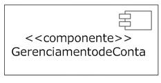

Observe que, nas versões anteriores, a representação do componente era diferente:

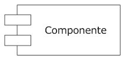

Essa notação ainda é reconhecida devido à compatibilidade com as versões anteriores, mas sua utilização não é recomendada.

---

## Dependências de Componentes

Os componentes podem necessitar de outros componentes para implementar sua funcionalidade. As dependências dos componentes podem ser mostradas usando-se a relação de dependência entre os dois componentes (uma linha tracejada com a seta aberta). Confira o seguinte exemplo:

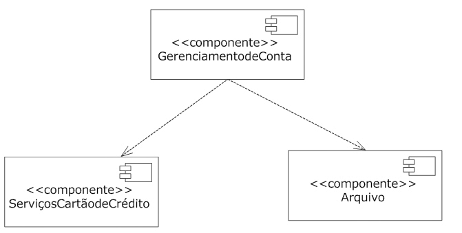

Representar a dependência entre os componentes dessa forma indica uma visão de nível relativamente alta do sistema, pois refina o diagrama ao mostrar as relações entre os componentes, como dependências nas interfaces fornecidas por outros componentes dependentes.

---

## Visões dos Componentes

A UML usa duas visões de componentes: a caixa-preta e a caixa-branca. A visão caixa-preta mostra o componente a partir de perspectiva externa; já a visão caixa-branca mostra como o componente realiza a funcionalidade especificada por suas interfaces fornecidas.

---

## Visão Caixa-Preta

A visão caixa-preta de um componente mostra as interfaces que ele fornece e que ele requer, além de outros detalhes necessários para explicar o comportamento do componente. Mas, não especifica coisa alguma sobre a implementação interna do componente. Essa é a distinção central para o conceito de componentes substituíveis.

---

## Conectores de montagem

Quando se modela a visão caixa-preta de um componente, as interfaces fornecidas e requeridas são representadas usando-se conectores de montagem. Os conectores são ilustrados por ícones bola e soquete. Para mostrar uma interface requerida, use o ícone soquete e escreva o nome da interface junto ao símbolo do conector, como mostrado no exemplo:

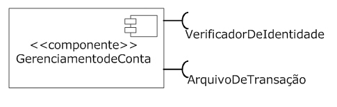

Para mostrar uma interface fornecida, utilize uma bola de um conector de montagem, novamente com o nome da interface junto ao símbolo, como mostra a imagem a seguir:

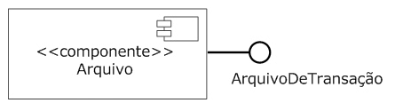

Para conectar componentes, basta ligar o acoplamento de interfaces fornecidas e requeridas. As dependências de componente, usando conectores de montagem, fornecem mais detalhes sobre as relações entre componentes do que as relações de dependência simples. Veja o exemplo abaixo:

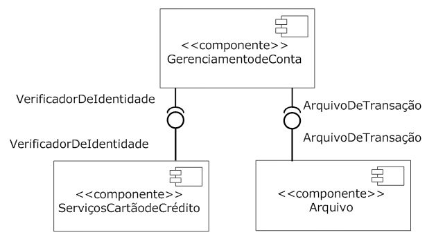

---

## Dependências de interfaces

Os conectores de montagem fornecem mais detalhes do que as simples dependências de componente. Porém, não fornecem informações detalhadas sobre a interface que está sendo executada. UML fornece uma terceira representação caixa-preta de componentes, usando execução e relações de dependência com as interfaces. Se um componente fornece uma interface, use uma seta de execução do componente para a interface. Se o componente requer uma interface, use uma seta de dependência do componente para a interface requerida, como pode ser visto na seguinte imagem:

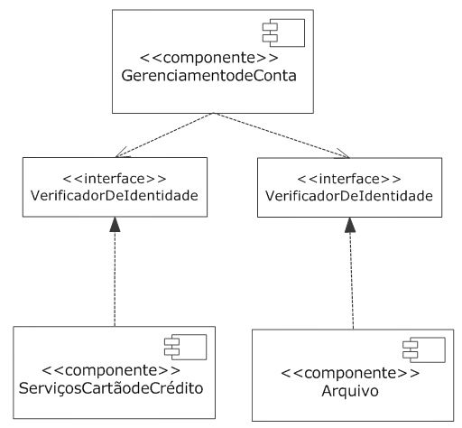

Uma vantagem do estilo de modelagem por dependência é que se pode anexar outros elementos de modelagem, tais como, uma máquina de estado ou caso de uso, para uma interface. Isso é particularmente útil quando um componente implementa um protocolo, pois permite ligar a interface fornecida ao protocolo de máquina de estado para esclarecer o uso do componente.

---

## Compartilhamento dos Componentes

UML também fornece uma visão caixa-preta de componentes usando compartimentos. É possível adicionar um compartimento para mostrar interfaces fornecidas e requeridas. Rotule as interfaces com o estereótipo «interfaces fornecidas» e as interfaces requeridas com o estereótipo «interfaces requeridas», como mostra o exemplo a seguir:

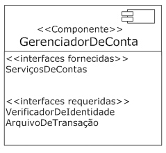

UML sugere um compartimento adicional, estereotipado «artefatos», que pode mostrar quais artefatos realmente implementam um componente (normalmente um ou mais JARs, DLLs e etc.), como no exemplo:

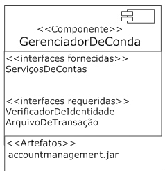

---

## Criando um diagrama de componentes

---

## Visão Caixa-Branca

A fim de fornecer detalhes sobre a implementação de um componente, UML define uma visão caixa-branca, que mostra exatamente como determinado componente executa as interfaces que fornece. Isso geralmente é feito usando classes, e ilustrado com um diagrama de classe. Entretanto, um componente pode delegar parte, ou a totalidade do seu comportamento, a outros componentes.

---

## Compartimento de execução

A mais simples visão caixa-branca de um componente é obtida acrescentando um compartimento ao componente e listando os classificadores que o executam. O compartimento deve ser rotulado com o estereótipo «execuções». Embora isso forneça mais detalhes do que uma visão caixa-preta é de uso limitado para os desenvolvedores de componentes. A imagem a seguir mostra um componente com o compartimento execuções, confira:

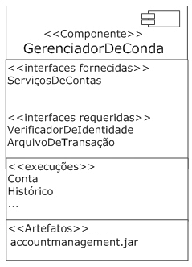

---

## Dependência de classificador

Para mostrar a parte interna de um componente, mostre cada classificador que o executa com uma dependência do próprio componente. Observe que a relação entre os classificadores e os componentes é de dependência (linha tracejada, seta aberta), e não uma relação de execução. Essa notação é útil para identificar os classificadores que constituem um componente, mas o foco do esquema ainda é o componente como um todo. A imagem abaixo representa a visão caixa-branca de um componente e seus classificadores constitutivos:

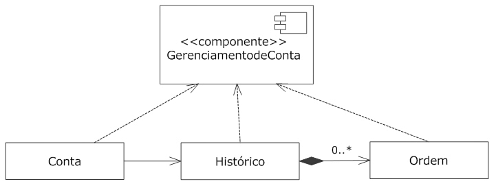

Para mudar o foco para a estrutura dos classificadores, basta mostrá-los dentro do retângulo do componente. Isso tem o efeito de enfatizar as relações dos classificadores que compõem o componente, além de incentivar o encapsulamento de componentes. Veja na imagem:

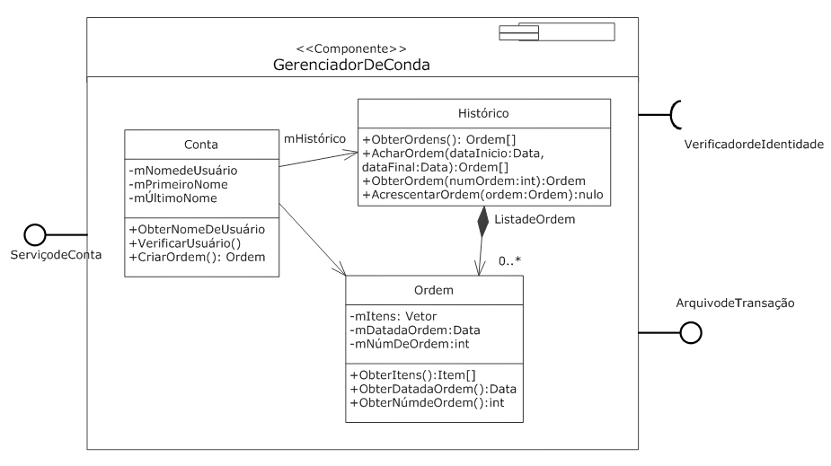

Se a parte interna de um componente é complexa, é comum usar um diagrama de classes separado para modelar os detalhes. O novo diagrama de classe pode ser ligado aos seus componentes usando uma nota.

---

## Estereótipos de Componentes

UML define vários estereótipos que se aplicam especificamente aos elementos:

Entidade

É um componente que representa um conceito de negócio. O componente entidade basicamente transmite informações dentro e fora de interfaces, e muitas vezes é usado como um todo. As entidades normalmente não têm qualquer funcionalidade ou aptidão para serviços associados a elas, e geralmente existem apenas para armazenar e recuperar dados.

Processo

É um componente que pode preencher requisitos funcionais (em oposição ao componente entidade). O componente processo é baseado em transação e, normalmente, tem algum tipo de estado associado a ele (ao contrário de componentes de serviço sem estado).

Execução

É um componente que não tem especificação própria. Ao contrário, é a execução de um componente especificação, como mostrado na imagem a seguir:

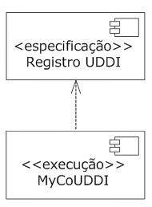

Serviço

É um componente sem estado, que pode preencher requisitos funcionais. Os componentes de serviço são raramente usados, pois não possuem qualquer estado.

Especificação

É um componente que tem interfaces fornecidas e requeridas, mas não implementação (classificadores executantes). O componente especificação, mostrado na imagem acima, deve formar par com um componente execução ou componente implementar.

Subsistema

Este componente faz parte de um sistema maior. A UML não fornece a definição real de um subsistema, no entanto, geralmente um subsistema significa um conjunto autocontido de funcionalidade, maior do que um simples componente.

---

## Criando um diagrama de componentes

---

## Estruturas compostas
À medida que um sistema se torna mais complexo, muitas vezes é útil decompô-lo em termos de funcionalidade. Para executar uma parte da funcionalidade, os diferentes elementos de um sistema muitas vezes trabalham em conjunto e trocam informações. UML formaliza o conceito de relações complexas entre os elementos dentro da ideia de estruturas compostas.

A estrutura é um conjunto de elementos interligados que existe em operação para fornecer coletivamente algum tipo de funcionalidade. Por exemplo, você pode usar uma estrutura para representar a composição interna de um classificador, como um subsistema (os objetos que estão relacionados uns com os outros, quem está se comunicando com quem, etc.). A UML chama essas estruturas de estruturas internas. Ela define vários símbolos para documentar as relações e comunicações entre elementos de uma estrutura interna.

Portas

Uma porta é a forma de oferecer a funcionalidade de uma estrutura composta sem expor os detalhes internos de como a funcionalidade é realizada. Por exemplo, suponha que você queira um subsistema que execute a verificação de pagamentos de cartão de crédito. A implementação efetiva dessa funcionalidade pode ser dividida em várias classes trabalhando em conjunto. A organização dessas classes pode ser representada como uma estrutura interna, no âmbito do subsistema, e a funcionalidade geral, ou de verificação do cartão de crédito, pode ser exposta usando uma porta. Expor a funcionalidade através de uma porta permite que o subsistema possa ser usado por qualquer outro classificador que esteja em conformidade com as especificações da porta.

A porta é mostrada por um pequeno quadrado. Normalmente se coloca o nome e a multiplicidade da porta perto do quadrado, embora ambos possam estar ocultos. Se a porta for desenhada no lado do classificador, será pública e estará disponível para o ambiente. Se desenhada dentro do classificador, a porta será protegida e estará disponível apenas para a estrutura composta, conforme mostra a imagem:

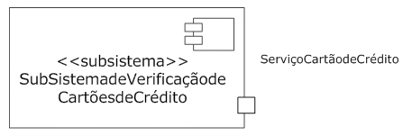

---

## Executando implementações de portas

Portas estão ligadas a uma aplicação interna utilizando conectores. Se o classificador que possui a porta prevê a implementação da funcionalidade em si, ela será considerada uma porta comportamental. Neste caso, o conector se liga a um estado dentro do classificador. Esse estado é usado para explicar o comportamento do classificador quando a porta for usada. Isso é tipicamente usado para classificadores simples (não de estruturas complexas) que implementam a funcionalidade em si mesmo, como é possível ver na imagem:

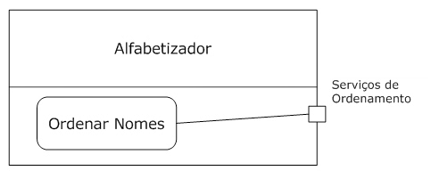

Por outro lado, se a funcionalidade for realizada por elementos internos, o conector deve ser ligado aos classificadores internos que proporcionam a implementação. Isso normalmente é usado para estruturas compostas, tais como componentes e subsistemas. Veja a imagem a seguir:

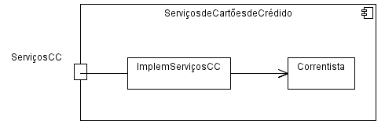

---

## Conectores múltiplos
UML permite que se tenham vários conectores, ligando uma porta a diferentes elementos internos. No entanto, não especifica o que acontece quando a comunicação é recebida na porta, deixando isso para o modelador. Uma solução possível é passar a comunicação a todos os conectores, com base na prioridade ou na rotatividade; ou simplesmente escolher aleatoriamente um conector. Independentemente do que você escolher certifique-se de documentar em seu modelo, provavelmente usando uma nota anexa à porta. Confira a imagem:

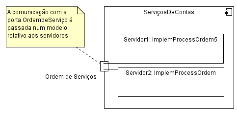

---

## Multiplicidade das portas

Um classificador pode especificar a multiplicidade de uma porta como qualquer outro elemento. Basta colocar o número desejado de instâncias da porta, entre parênteses, após o nome da porta e o tipo (se houver). Quando o classificador for instanciado, as portas associadas serão instanciadas também. Isto se chama pontos de interação e pode ser identificado exclusivamente pelo classificador. Por exemplo, se o classificador tem duas portas, ambas com interfaces fornecidas – uma oferece acesso anônimo a dados e a outra oferece acesso autenticado aos dados – o classificador pode distinguir qual porta foi usada pelo sistema externo. A imagem seguinte mostra um sistema de verificação de cartão de crédito que oferece duas instâncias da porta de verificação de cartão de crédito:

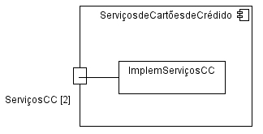

---

## Tipificação de portas

Na prática, quando uma porta é instanciada é representada por um classificador, que executa as interfaces fornecidas. Qualquer comunicação com o ponto de interação passa as informações para classificadores internos que realizam o comportamento. A UML permite especificar o tipo de porta usando classes para fornecer o comportamento mais sofisticado, como, por exemplo, especificar que a porta é tipificada usando uma classe que filtra as comunicações que recebe, ou que prioriza a entrega. Quando a porta for instanciada, a classe correspondente terá a chance de manipular a comunicação que recebe antes de passá-la para os classificadores executantes. Para mostrar que uma porta pode ser representada usando um classificador específico, basta colocar dois pontos : e o nome do classificador após o nome da porta. Veja na imagem:

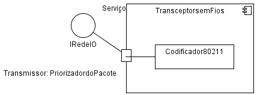

---

## Trabalhando com portas

---

## Exercícios
