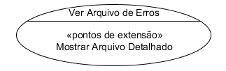

# Diagramas de Casos de Uso

## Diagramas de Casos de Uso

Os casos de uso são uma forma de capturar a funcionalidade do sistema e de todos os requisitos de UML. Diagramas de casos de uso consistem em peças nomeadas de funcionalidade (casos de uso), das pessoas ou coisas que invoca a funcionalidade (atores) e possivelmente dos elementos responsáveis pela execução dos casos de uso (sujeitos).

---

## Casos de Uso

Os casos de uso representam partes distintas da funcionalidade de um sistema, de um componente, ou mesmo de uma classe. Cada caso de uso deve ter um nome, normalmente uma palavra que descreve a funcionalidade, como Exibir Arquivo de erros. UML oferece duas maneiras de chamar um caso de uso: a primeira é uma figura oval (elipse) com o nome do caso de uso no centro. Veja o exemplo abaixo:

A elipse de um caso de uso pode ser dividida em compartimentos para fornecer mais detalhes sobre o caso de uso, tais como pontos de extensão, casos de uso incluídos ou a modelagem de restrições específicas. Veja o exemplo:

No entanto, a representação oval (elíptica) de casos de uso não acomoda bem os compartimentos detalhados. UML recomenda utilizar a notação de classificador para fornecer detalhes sobre um caso de uso. O caso de uso é mostrado com um retângulo, com a elipse de caso de uso no canto superior direito. O nome do caso de uso é colocado no topo, em negrito. O classificador pode ser dividido em compartimentos, quando necessário. Confira a imagem abaixo:

UML faz clara distinção de que o termo **caso de uso** se aplica estritamente ao elemento UML e seu nome. Toda a documentação de um caso de uso é considerada instanciação do caso de uso. Essa é uma distinção sutil, mas que permite documentar um caso de uso da maneira que melhor capta a funcionalidade do caso de uso. É possível documentar um caso de uso em documento de texto, máquina de estado, diagrama de interação, diagrama de atividade, ou qualquer coisa que transmita os detalhes das funcionalidades de forma significativa para o usuário.

---

## Atores

Um caso de uso deve ser iniciado por alguém, ou alguma coisa, fora do âmbito do caso de uso. Essa parte é chamada de ator. Um ator não precisa ser um usuário humano; qualquer sistema externo ou elemento fora do caso de uso, que pode disparar o caso de uso, pode e deve ser modelado como um ator. Por exemplo, é muito comum modelar o relógio do sistema como um ator que chama um caso de uso em determinado momento.

Um ator pode ter representações diferentes em UML. A primeira como um boneco, com o nome do ator escrito perto do ícone, como mostra o exemplo abaixo.

Alternativamente, um ator pode ser mostrado usando a notação de classificador: o ator é representado com um retângulo, com a palavra-chave <<ator>> na parte superior e o nome do ator em negrito logo abaixo. Como os atores tipicamente não têm compartimentos, essa representação não é usada com muita frequência. Veja o exemplo:

Se for útil, podem ser usados ícones personalizados para distinguir claramente os diferentes tipos de atores. Por exemplo, para mostrar um sistema de banco de dados externo podem ser usados dois ícones: um para o banco de dados; e o outro (boneco) para representar o administrador do sistema. Veja o exemplo:

---

## Associações Ator/Caso de Uso

Um ator é normalmente associado a um ou mais casos uso. A relação entre ator e caso de uso indica que o ator inicia o caso de uso ou que o caso de uso fornece resultado ao ator, ou ambos. A associação entre ator e caso de uso é mostrada por uma linha contínua. Convencionalmente, a leitura dos diagramas de caso de uso é feita da esquerda para a direita, com atores que iniciam os casos de uso no lado esquerdo e atores que recebem os resultados no lado direito. No entanto, dependendo do modelo ou nível de complexidade, pode fazer sentido agrupar os atores de forma diferente. A imagem abaixo mostra um ator se comunicando com um caso de uso.

Embora não pertença à especificação oficial UML, é comum ver setas direcionais de associação nas linhas, indicando quem inicia a comunicação com quem. Note que as setas não restringem a direção do fluxo de informações, servindo simplesmente de iniciador para o destinatário da comunicação:

O que acontece depois que um caso de uso inicia a execução é especificado em outros lugares.

---

## Limites do Sistema

Por definição, os casos de uso capturam a funcionalidade de determinado sujeito. Qualquer coisa que não seja executada pelo sujeito é considerada fora dos limites do sistema e deve ser modelado como um ator. Essa técnica é bastante útil para determinar o alcance e a atribuição de responsabilidades quando se projeta um sistema, subsistema ou componente. Por exemplo, ao modelar um sistema de ATM (caixa de banco) as discussões de projeto se desviam para os detalhes do terminal do sistema bancário, um modelo de caso de uso com os limites do sistema claramente definidos, que identificam o sistema bancário como um ator e, assim, expõe o escopo do problema.

Os limites do sistema são representados em sentido genérico, usando um simples retângulo com o nome do sistema no topo:

---

## Usando Atores para Identificar Funcionalidade

Os atores não precisam ter o mapeamento um-para-um para as entidades físicas. Na verdade, eles não precisam ser entidades físicas. UML permite que os atores representem papéis de usuários potenciais de um sistema. Por exemplo, o administrador pode ser o único usuário físico do sistema e, ainda assim, ter muitas especialidades. Pode ser útil ver o sistema a partir da perspectiva do administrador de banco de dados, do administrador de backup, do administrador de implantação e assim por diante:

---

## Criando um diagrama de casos de uso

---

## Modelagem Avançada de Casos de Uso

A UML fornece mecanismos para reutilizar e acrescentar casos de uso e atores. É possível expandir a capacidade de um ator ou substituir os casos de uso, usando generalização. Para expandir elementos comuns de casos de uso, utilize os casos de uso incluídos ou adicione a base de casos de uso usando a extensão.

Generalização de Ator e Caso de Uso

Embora não seja oficialmente mencionado na especificação, os atores e casos de uso podem ser generalizados assim como muitos outros classificadores. A generalização do ator é normalmente usada para extrair os requisitos comuns de vários atores diferentes para simplificar a modelagem. Por exemplo, a imagem abaixo mostra vários administradores e os casos de uso que eles precisam chamar. É possível ter um administrador de banco de dados, um administrador de backup e um administrador de implantação, todos com uma ligeira diferença de necessidades. No entanto, a maioria das necessidades dos atores individuais pode ser sobreposta. Um ator Administrador de Sistema genérico pode ser destacado para extrair as funcionalidades comuns e, em seguida, especializá-lo para identificar as necessidades específicas de cada ator.

A generalização do ator é representada como a de qualquer outro classificador: é traçada uma linha contínua com uma seta fechada, que aponta do ator especializado para o ator base. Confira a imagem:

Os casos de uso podem ser generalizados também. Normalmente, a generalização de caso de uso é usada para expressar alguma necessidade de alto nível funcional de um sistema sem entrar em detalhes. Especializações de um caso de uso geral introduzem uma funcionalidade específica. Por exemplo, um caso de uso genérico pode ser: Verificar a Identidade dos Passageiros; e as especializações desse caso de uso podem ser: Verificar impressões digitais dos Passageiros e Verificar rótulo RIF dos Passageiros. É importante saber que mesmo com a generalização de casos de uso, a funcionalidade (e não a implementação) ainda deve ser discutida. Não se deve ter especializações de um caso de uso para diferentes formas de implementar a mesma funcionalidade, mas usá-las apenas para representar uma funcionalidade diferente.

A generalização de casos de uso é representada da mesma forma que a generalização do ator: uma linha contínua com uma seta fechada, apontando para o caso de uso base, a partir do caso de uso especializado. Veja na imagem a seguir:

Se o caso de uso representa uma funcionalidade abstrata (ou seja, é um conceito funcional, mas na verdade não explica como o usuário pode fazer alguma coisa), seu nome deve ser grafado em itálico.

Inclusão de Casos de Uso

As funcionalidades comuns a vários casos de uso podem ser destacadas pela criação de um caso de uso incluído, compartilhado. Ao contrário da extensão de caso de uso (explicado a seguir), o caso de uso que inclui outro caso de uso é tipicamente incompleto. A funcionalidade incluída não é considerada opcional, sendo destacada apenas para permitir a reutilização em outros casos de uso.

A inclusão de casos de uso é mostrada por uma linha tracejada com uma seta aberta (dependência) apontando para o caso de uso incluído, a partir do caso de uso base. Rotule a linha com a palavra-chave «incluir», como mostra a imagem:

Extensão de Casos de Uso

UML oferece a capacidade de conectar funcionalidade adicional ao caso de uso, se as condições especificadas forem satisfeitas. Por exemplo, ao modelar uma aplicação bancária pode-se ter o caso de uso Abrir Conta, que especifica como o usuário pode criar nova conta no banco. Pode ser oferecida uma conta conjunta, que permite ao usuário adicionar outras pessoas à sua conta. A funcionalidade de conta conjunta pode ser capturada como caso de uso diferente, chamado Adicionar usuário à conta. Neste caso, a condição especificada para a ampliação é mais do que um membro sobre a aplicação bancária.

UML especifica claramente que um caso de uso deve ser um caso de uso completo por si só. A extensão de casos de uso é geralmente de menor porte e representa uma funcionalidade adicional. Por isso, não pode ser útil fora do contexto do caso de uso.

Qualquer caso de uso que se deseje estender deve ter os pontos de extensão claramente definidos. Um ponto de extensão é a especificação de algum ponto no caso de uso, em que um caso de uso de extensão pode ligar e adicionar funcionalidade. UML não tem sintaxe particular para pontos de extensão, que são tipicamente de forma livre de texto ou números, se a funcionalidade do caso de uso for representada como lista numerada.

A extensão do caso de uso pode ser representada mostrando-se uma linha tracejada com uma seta aberta (dependência) apontando, a partir do caso de uso de extensão, para o outro caso de uso. Rotule a linha com a palavra-chave «estender», como mostra o exemplo:

Para fornecer mais detalhes, pode ser especificado onde a nova funcionalidade se conecta ao caso de uso, especificando o ponto de extensão e a nota anexa à linha de dependência, como no exemplo, que ainda especifica uma condição:

Quando o sistema encontra um ponto de extensão em um caso de uso, quaisquer condições associadas à extensão são avaliadas. Se uma condição for atendida, a funcionalidade de extensão correspondente é executada. Uma vez que todas as extensões de casos de uso tenham sido executadas, o caso de uso básico continua com o próximo passo do fluxo original.

Escopo de Caso de Uso

Para ajudar a definir o escopo do Caso de Uso, a UML define diversos requisitos:

O caso de uso deve ser iniciado por um ator. Quando o caso de uso é considerado completo não há mais entradas ou saídas, a funcionalidade desejada foi executada ou um erro ocorreu. Depois do caso de uso ter sido completado, o sistema estará em estado em que o caso de uso pode ser iniciado novamente ou estará em estado de erro.

Uma regra popular é perguntar se o usuário “pode ir almoçar" após a conclusão do caso de uso, o que significa que uma meta razoável foi atingida pelo usuário. Por exemplo, o principal objetivo do usuário provavelmente não seja “Adicionar item ao carrinho”, mas sim “Comprar Item”.

Acima de tudo, casos de uso são destinados a transmitir a funcionalidade desejada. Desse modo, o escopo do caso de uso deve variar, dependendo do público-alvo e da finalidade da modelagem.

---

## Definindo inclusão e extensão no diagrama de casos de uso

---

## Exercícios

Questão 1 de 3
Complete corretamente a afirmação abaixo:
Diagramas de casos de uso consistem em peças nomeadas de funcionalidade ( 
`casos de uso` ) e elementos que invocam a funcionalidade ( 
`atores` ) .

Questão 2 de 3
De acordo com a imagem abaixo:

Selecione as afirmações corretas:

Escolha 2 respostas.

Pode existir apenas uma instância do autor consumidor no sistema.

✔Existem 4 casos de uso na imagem.

Não existe limite de instâncias de atores no sistema modelado.

✔Existem 4 atores na imagem.

Existem 3 atores na imagem.

Questão 3 de 3
Nos casos de uso, o que é um ator?

Os usuários humanos do sistema.

Um sistema externo que inicia um caso de uso.

✔Elemento que inicia um caso de uso.

Um caso de uso especial, que se inicia sozinho.

Nenhuma das alternativas.