# Diagramas de máquina de Estado

## Diagramas de máquina de Estado

Diagramas de máquina de estado capturam o comportamento de um sistema de software. As máquinas de estado podem ser usadas para modelar o comportamento de uma classe, de um subsistema ou de uma aplicação inteira. Também oferecem excelentes formas de modelar a comunicação que ocorre com entidades externas através de protocolo ou sistema baseado em eventos.

UML tem dois tipos de máquinas de estado:

**Máquinas de estado Comportamental:** Mostra o comportamento dos elementos de modelagem, tais como objetos. Uma máquina de estado comportamental representa a implementação específica de um elemento.

**Máquinas de estado Protocolo:** Mostra o comportamento de um protocolo. Máquinas de estado Protocolo mostram como os participantes podem provocar mudanças no estado de um protocolo e as alterações correspondentes no sistema (ou seja, o novo estado do protocolo). Máquinas de estado protocolo normalmente não são vinculadas a uma aplicação particular e mostram o comportamento do protocolo requerido.

Máquinas de estado comportamental e de protocolo têm elementos comuns, no entanto, as máquinas de estado protocolo não estão vinculadas a uma aplicação e têm restrições sobre suas transições.

---

## Máquinas de Estado Comportamental

As máquinas de estado representam o comportamento de certa peça de um sistema, utilizando a notação gráfica. A máquina de estado é mostrada usando-se a notação básica de retângulo, com o nome da máquina no compartimento superior. O retângulo exterior é frequentemente omitido em diagramas de máquina de estado que mostram apenas uma simples máquina de estado.

A máquina de estado é muitas vezes associada a um classificador, no maior modelo UML, por exemplo, uma classe ou subsistema. No entanto, a UML não define notação específica para mostrar essa relação. Uma notação possível é utilizar uma nota, rotulando com o nome da máquina de Estado, e ligá-la ao classificador. Veja o exemplo:

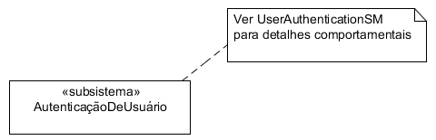

O comportamento do classificador pode ser modelado usando-se estados, pseudoestados, atividades e transições. Se a máquina de estado for usada para modelar o comportamento de uma operação, deverá ter parâmetros que correspondam aos parâmetros da operação. Eles poderão ser usados em qualquer estado ou de transição, conforme as necessidades.

Transições entre estados ocorrem quando os eventos são despachados. À medida que a máquina de estado executa, as atividades ocorrerão com base na transição, na entrada em certo estado, e assim por diante.

Cada máquina tem um conjunto de pontos de conexão que define a interface externa da máquina de estado. Esses pontos de conexão devem ser os pseudoestados de entrada ou saída.

---

## Estados

Estados modelam um momento específico no comportamento do classificador. Esse momento é definido por uma condição que seja verdadeira, no classificador.

Estados modelam uma situação no comportamento do classificador quando uma condição estável for verdadeira. Em termos mais simples, um estado é a "condição de ser" para a máquina de estado e, por associação, o classificador que está sendo modelado. Por exemplo, uma máquina de café poderia estar no estado "Moendo Grãos", "Coando", "Aquecendo Café", "Liberando", etc. O estado pode representar uma situação estática, como "Aguardando nome do Usuário", ou uma situação dinâmica na qual esteja ativamente processando dados, como "Codificando Mensagem".

Um estado é mostrado por um retângulo com cantos arredondados. O nome do estado é escrito dentro do retângulo, como na imagem:

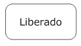

Um nome de estado pode ser colocado fora do retângulo numa notação de extensão, quando se mostram estados compostos ou de submáquina. A notação de extensão pode ser usada, ou simplesmente inserindo o nome no interior do estado. Porém, não utilize os dois.

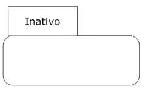

Dentro do retângulo, um estado pode ser dividido em compartimentos, conforme necessário. UML define os seguintes compartimentos:

**Nome**

Mostra o nome do estado. Isso não deve ser usado se o nome for colocado em extensão.

**Atividades internas**

Mostra a lista de atividades internas que são executadas enquanto estiverem no estado.

**Transições internas**

Mostra a lista de transições internas e os eventos que as iniciam. Escrever uma transição interna como:

Evento (listaDeAtributos) [condição de proteção] / transição

A lista de atributos, opcional, mapeia os parâmetros do evento para os atributos dados do classificador. A condição de proteção também é opcional, mas, se houver, deve ser delimitada por colchetes.

O mesmo evento pode ser listado várias vezes, desde que cada entrada tenha única condição de proteção para a transição.

A imagem seguinte mostra um estado com compartimentos:

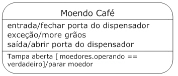

Um estado pode ser ativo ou inativo. Ele é considerado ativo assim que se inicia, devido a alguma transição. Da mesma forma, um estado é considerado inativo imediatamente depois de deixar o estado.

UML define três tipos de estados:

- **Estados Simples:** Mais simples de todos, não têm subestados. Todos os exemplos de estado utilizados até agora são estados simples.
- **Estados Compostos:** Têm uma ou mais regiões de subestados. Um estado composto com duas ou mais regiões é chamado ortogonal.
- **Estados Submáquina:** Semanticamente equivalentes aos estados compostos, os estados de submáquina têm subestados contidos em estado de submáquina. Ao contrário de estados compostos, os estados submáquina têm a finalidade de agrupar estados, de forma que seja possível reutilizá-los. Estados compostos normalmente são específicos da máquina de estado atual.

---

## Estados Compostos
Um estado composto possui uma ou mais regiões. A região é simplesmente um recipiente para subestados. Um estado composto com duas ou mais regiões é chamado ortogonal.

O estado composto pode ter um compartimento adicional chamado compartimento de decomposição. O compartimento de decomposição é uma visão detalhada do estado composto, onde podem ser mostradas as regiões, os subestados e transições. A imagem seguinte mostra um estado composto por única região:

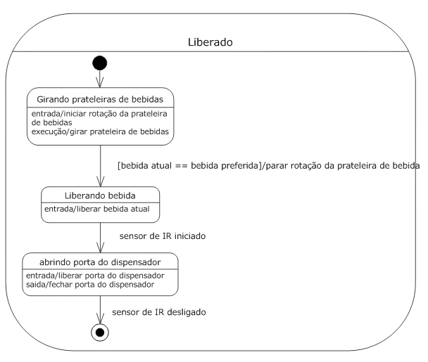

O compartimento de decomposição pode ser ocultado para aumentar a clareza do diagrama. Ao ocultar o compartimento, o ícone composto pode ser usado para indicar que a decomposição do Estado não está sendo mostrada no diagrama, como indica a imagem abaixo:

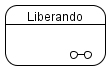

Estados podem ser colocados dentro da região de um estado composto para representar subestados internos. O subestado que não está contido em outro estado é chamado **subestado direto**; o subestado contido em outros subestados é chamado **subestado indireto**.

O estado composto é considerado ativo quando a máquina de estado está em qualquer um dos subestados. Quando um estado composto está ativo, a árvore de estados ativos, começando com o próprio estado composto e seguindo até o subestado atual, é chamado de configuração de estados.

---

## Regiões

Uma região é mostrada por uma linha pontilhada, dividindo o compartimento de decomposição. Cada região pode ser nomeada, escrevendo seu nome dentro da área da região, como mostra o exemplo a seguir:

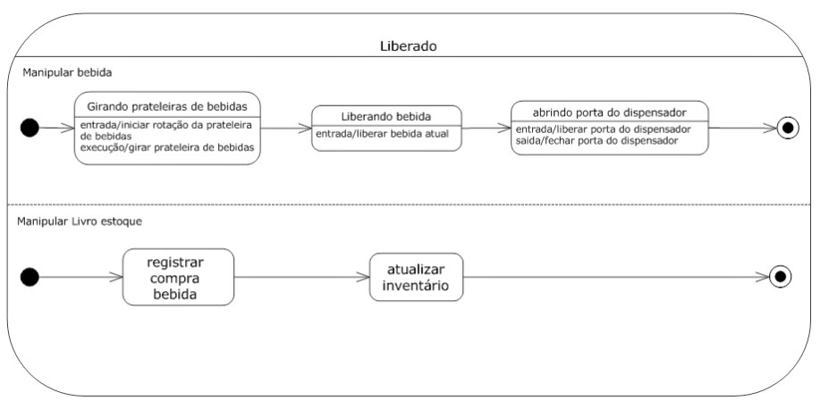

Cada região tem o próprio pseudoestado inicial e o estado final. A transição para o estado composto é uma transição para o pseudoestado inicial de cada região. Cada região de um estado composto é executada em paralelo, sendo perfeitamente aceitável que uma região termine antes de outra. A transição para o estado final de uma região indica que a atividade para essa região foi completada. Depois de ter completado todas as regiões, o estado composto dispara um evento de conclusão e uma transição de conclusão (se houver) é disparada.

---

## Estados de Submáquina

Estados de submáquina são semanticamente equivalentes aos estados compostos à medida que são feitos de subestados internos e transições. UML define o estado de submáquina como forma de encapsular estados e transições para que possam ser reutilizados. Um estado submáquina significa simplesmente que outra máquina é de estado: um estado de submáquina é contido pelo Estado.

O estado submáquina também é mostrado no retângulo arredondado, como qualquer outro estado. Exceto o nome do estado, que é mostrado seguido por dois pontos (:), seguido do nome da submáquina referenciada. Veja exemplo na imagem a seguir:

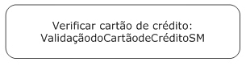

Normalmente, quando se mostra um estado de submáquina, os pontos de entrada e saída da referida submáquina são mostrados, como na imagem:

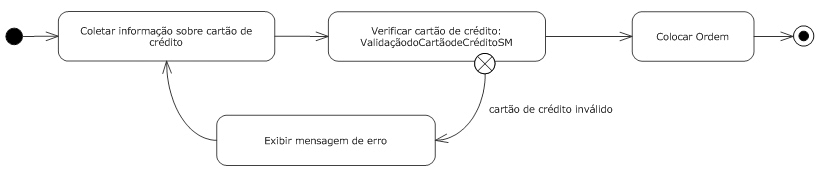

Se o estado de submáquina é introduzido através do pseudoestado padrão inicial, ou retirado por causa da conclusão da submáquina, os pontos de entrada/saída não precisam ser mostrados de forma explícita.

Para maior clareza o mesmo ícone composto deve ser usado para mostrar que a submáquina referenciada é definida em outras partes do modelo.

---

## Criando um diagrama de gráfico de estado

---

## Transições

A transição mostra o relacionamento, ou o caminho entre dois estados ou pseudoestados. Ela representa a real mudança na configuração de uma máquina de estado, enquanto um estado vai para outro. Cada transição pode ter a condição de proteção, que indica se a transição pode ser considerada (habilitada) – um gatilho que provoca a transição para a execução ser habilitada, e qualquer efeito que a transição pode ter quando ela ocorre.

Transições são mostradas por uma linha entre dois Estados, com uma seta apontando para o estado de destino. Os detalhes da transição podem ser especificados usando-se a seguinte sintaxe:

**gatilho [proteção ]/ efeito**

Onde:

**gatilho**

Indica a condição que pode fazer com que a transição ocorra. O gatilho é normalmente o nome de um evento, embora possa ser mais complexo.

**proteção**

Restrição avaliada quando um evento é acionado pela máquina de estado para determinar se a transição está habilitada. Proteção não deve ter efeitos colaterais e deve ser avaliada como um booleano, antes da transição ser disparada.

**efeito**

Especifica a atividade executada quando a transição acontece. Essa atividade pode ser escrita através de operações, atributos e links do classificador proprietário, bem como pelos parâmetros do evento que está sendo iniciado.

A imagem seguinte mostra várias transições entre estados:

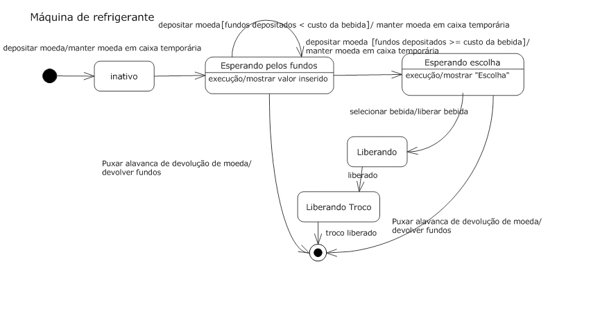

---

## Tipos de Transição

UML define vários tipos específicos de transições, descritos na lista a seguir. Não há símbolos especiais associados aos tipos de transição, que são definidos apenas para maior clareza:

Transições compostas

Representação da mudança de configuração de uma máquina de estado completa para outra. Transições compostas são um conjunto de transições, escolhas, bifurcações e agrupamento, levando a um conjunto de estados-alvo.

Transição de alto nível

Transição de um estado composto. Se o destino da transição está fora do estado composto, ela sairá também dos subestados e suas atividades de saída são executadas, seguidas pela atividade de saída do estado composto. Se a transição terminar num alvo dentro do estado composto, a atividade de saída do estado composto não será executada.

Transição interna

Transição entre estados, dentro do mesmo estado composto. O estado que a contém não é encerrado ou reiniciado durante a transição. A transição direta entre uma região do estado composto para outra região no mesmo estado composto não é permitida.

Transição de conclusão

Transição de um estado que não tem gatilho explícito. Quando um estado concluir as suas atividades, um evento de conclusão será gerado. Esse evento é colocado no conjunto de eventos e enviado, antes de qualquer outro evento. Se as condições de proteção da transição de conclusão forem cumpridas, a transição será disparada. É possível ter várias transições de conclusão, no entanto, elas devem ter condições de proteção exclusivas e compartilhadas.

---

## Atividades

Uma atividade representa uma funcionalidade executada pelo sistema. Um estado pode ter atividades que são desencadeadas por transições do e para o estado, ou por eventos gerados enquanto estiverem no estado. As atividades de um estado são executadas somente se o estado estiver ativo.

Cada atividade tem um rótulo que mostra quando é executada, e uma expressão opcional de atividade.

Uma atividade é escrita como:

**rótulo / expressão da atividade**

Uma expressão de atividade pode ser escrita usando-se o pseudocódigo:

**list.append (keystroke); print("*")**

Ou, em linguagem natural:

**gravar digitação e mostrar caractere da senha**

A barra pode ser omitida quando a expressão da atividade não for mostrada. Expressões de atividade podem usar atributos e operações disponíveis para o classificador que possui a máquina de estado.

UML reserva três rótulos de atividades:

**Entrada**

Dispara quando entra em um estado. A atividade de entrada é executada antes de qualquer outra coisa que aconteça no estado.

**Saída**

Dispara ao sair de um estado. A atividade de saída executa assim que a última coisa do estado for executada.

**Execução**

Executa enquanto um estado está ativo. A atividade executa após a atividade de entrada e pode executar até a atividade de saída.

Cada estado pode ter atividades complementares associadas a ele, e etiquetas específicas para cada atividade.

Se a atividade de execução se completa, isso gera um evento de conclusão que pode disparar uma transição. Se não houver transição de conclusão (uma transição sem outra condição de evento), a atividade de saída será executada e ocorrerá a transição. Se algum outro evento fizer com que o estado entre em transição antes que a atividade de execução se complete, ela será interrompida, a atividade de saída será executada e ocorrerá a transição.

---

## Definindo transições e atividades

---

## Símbolos de sinais

Transições podem ser mostradas em mais detalhes usando-se ícones explícitos para mostrar o envio de sinal, recepção de sinal, e atividades de efeito. Esses ícones não são necessários e são usados simplesmente para fornecer a visão orientada para a transição de uma máquina de estado.

Você pode mostrar uma transição que recebe um sinal, mostrando uma transição sem rótulo do estado-fonte para um retângulo com um entalhe triangular no lado esquerdo. A assinatura do sinal é mostrada dentro do retângulo. O diagrama completo mostra uma transição sem rótulo apontando, a partir do retângulo, para o estado-alvo:

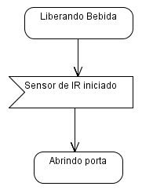

Você pode mostrar uma transição que envia um sinal, como parte do efeito da transição, mostrando uma transição sem rótulo apontando, a partir do estado-fonte, para um retângulo com uma ponta triangular saliente do lado direito. A assinatura do sinal (incluindo os parâmetros) é mostrada dentro do retângulo. Outra transição não rotulada liga o retângulo ao estado-alvo:

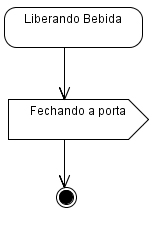

Os efeitos que ocorrem, como resultado de uma transição, podem ser mostrados usando-se um retângulo simples. A descrição da atividade é escrita dentro do retângulo:

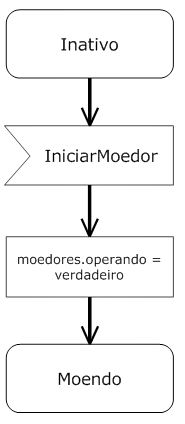

---

## Máquinas de Estado Protocolo
A máquina de estado Protocolo captura o comportamento de um protocolo, como HTTP. Ele não está vinculado a uma aplicação de protocolo específico, mas sim que especifica as mudanças de estado e os eventos associados com uma comunicação baseada em protocolo.

Ao contrário das máquinas de estado comportamental, as de protocolo representam situações estáveis, onde o classificador não está processando qualquer operação e o usuário conhece sua configuração.

Máquinas de estado Protocolo diferem das máquinas de estados comportamental pelos seguintes motivos:

- Atividades de entrada, saída e execução não podem ser usadas.
- Os estados podem ter constantes. As constantes devem ser colocadas entre colchetes, abaixo do nome do estado.
- A palavra-chave protocolo é colocada entre chaves, após o nome da máquina de estado, para indicar que é uma máquina de estado protocolo.
- Transições em máquinas de estado protocolo têm uma pré-condição, o gatilho, e uma pós-condição. A notação para a transição de protocolo é a seguinte: **[pré-condição] evento/[ pós-condição]**.
- Cada transição é associada a zero, ou a uma operação no classificador proprietário. A transição garante que a pré-condição será verdadeira antes de a operação ser invocada, e que a pós-condição será verdadeira antes de entrarem no estado-alvo.
- A atividade efeito nunca é especificada para uma transição de protocolo.

A imagem a seguir traz um exemplo de máquina de estado protocolo:

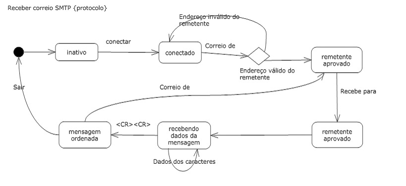

--- 

## Pseudoestados

Pseudoestados são tipos especiais de Estados que representam o comportamento específico durante as transições entre os estados normais. Combinado com transições básicas, os pseudoestados podem representar mudanças de estados complexos dentro de uma máquina de estado.

A tabela a seguir mostra os tipos de pseudoestados e seus símbolos:

|Nome do Pseudo-estado   |Símbolo                            |Descrição    |
|------------------------|-----------------------------------|-------------|
|Pseudoestado inicial    ||O ponto de partida de uma máquina de estado. |
|Escolha                 |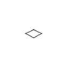|Permite a execução de uma máquina de estado para escolher entre vários estados diferentes com base em condições de proteção nas transições. |
|História profunda       ||Utilizado dentro de uma região do estado, uma transição para este pseudoestado de fora da região indica que a máquina de estado deve reassumir o último subestado em que estava dentro da dada região, não importa o quão "profundo" o subestado esteja dentro da região. |
|Ponto de entrada        ||Representa um possível alvo para uma transição num estado composto. Um ponto de entrada pode transitar depois para um subestado interno que pode ser diferente da transição padrão. Você deve rotular os pontos de entrada escrevendo seu nome ao lado do símbolo. |
|Ponto de saída          |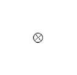|Representa uma fonte possível para uma transição de um estado composto. Como pontos de entrada, pontos de saída são identificados com seus nomes. |
|Bifurcação e agrupamento|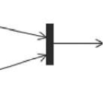|Representa uma divisão na execução da máquina do Estado em regiões ortogonais. |
|Junção                  |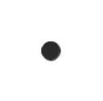|Traz várias transições possíveis para formar um pseudoestado. Uma ou mais transições podem, então, deixar a junção de outros estados. |
|História rasa           ||Utilizada dentro de uma região do Estado, uma transição para este pseudoestado de fora da região, indica que a máquina de estado deve reassumir o último subestado em que estava dento da dada região, porém o subestado deve estar no mesmo nível que o pseudoestado da história. |
|Nó terminal             |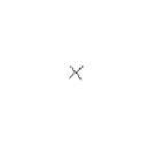|Faz com que o estado da máquina seja finalizado. |

---

## Conhecendo os pseudoestados

---

## Exercícios

