# Diagramas de Atividade

## Diagramas de Atividade

A modelagem de atividade centra-se na execução e fluxo do comportamento de um sistema, ao invés de como é montado. Possivelmente mais do que qualquer outro diagrama UML, os diagramas de atividades se aplicam a mais coisas do que a modelagem de software apenas. Eles são aplicáveis a praticamente qualquer tipo de modelagem comportamental, como, por exemplo, processos de negócios, processos de software ou fluxos de trabalho. Os diagramas de atividades capturam atividades que são formadas por ações menores.

Quando usadas para a modelagem de software, as atividades representam tipicamente um comportamento invocado como resultado de uma chamada de método. Quando usadas para a modelagem de negócios, as atividades podem ser desencadeadas por eventos externos, como uma ordem a ser colocada, ou eventos internos, como um temporizador para disparar o processo de folha de pagamento nas tardes de sexta-feira. Os diagramas de atividades sofreram alterações significativas com UML 2.0, sendo promovidos a elementos de primeira classe e não mais elementos emprestados de diagramas de estado.

---

## Atividades e Ações

Uma atividade é o comportamento detalhado em uma ou mais ações. A ação representa um passo dentro da atividade, onde a manipulação de dados ou de processamento ocorre em um sistema modelado. "Passo simples" significa que a ação não é quebrada em pedaços menores no esquema, mas isso não quer dizer necessariamente que a ação é simples ou atômica. Por exemplo, as ações podem ser:

- Funções matemáticas;
- As chamadas para outros comportamentos;
- Processadores de dados (atributos do objeto, variáveis locais etc.).

Traduzindo em exemplos reais, as ações podem ser usadas para representar:

- Cálculo do imposto de vendas;
- Envio de informações para um parceiro distribuidor;
- Gerar lista de itens que precisam ser reajustados devido a baixas no inventário.

Quando se usa um diagrama de atividades para modelar o comportamento de um classificador, é dito que o classificador é contexto da atividade. A atividade pode acessar os atributos e operações do classificador, quaisquer objetos ligados a ele, e todos os parâmetros, se a atividade for associada a um comportamento. Quando usado para modelar processos de negócios, esta informação é normalmente chamada de dados relevantes do processo. As atividades são destinadas a ser reutilizadas dentro de um aplicativo, e as ações são normalmente específicas e só são utilizadas dentro de determinada atividade.

Uma atividade é mostrada com um retângulo com cantos arredondados. O nome da atividade é especificado no canto superior esquerdo. Os parâmetros envolvidos podem ser exibidos na atividade, abaixo do nome. Veja o exemplo:

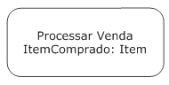

Os detalhes da atividade podem ser mostrados dentro do retângulo; ou, para simplificar um diagrama, deixe completamente fora do retângulo. As ações são mostradas usando-se o mesmo símbolo da atividade: um retângulo com cantos arredondados, colocando o nome da ação no retângulo. Confira o exemplo a seguir:

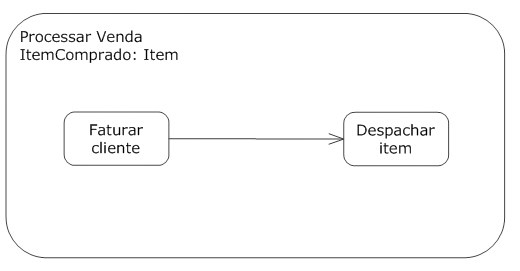

Para fazer diagramas de atividade mais expressivos, escreva o pseudocódigo, ou linguagem dependente da aplicação, dentro da ação. Veja:

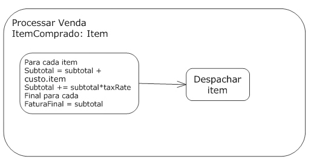

Tipicamente, cada atividade começa com um nó inicial e termina com um nó final. Quando uma atividade chega ao nó final ela é encerrada. O nó inicial é representado por um círculo sólido preto e o nó final de atividade é representado por um círculo sólido preto com um anel em torno dele. Veja:

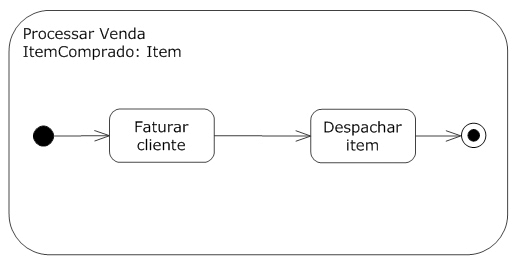

As atividades devem ter pré e pós-condições que se aplicam a atividade completa. A pré-condição é mostrada colocando-se a palavra-chave «precondition» na parte superior da atividade, escrevendo a restrição depois dela. A pós-condição é mostrada usando a palavra-chave «poscondition»:

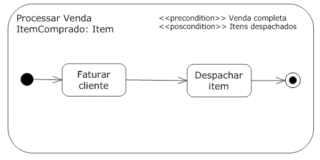

---

## Bordas de Atividades

Para mostrar o fluxo em uma atividade, as ações são ligadas utilizando-se as bordas de atividade. As bordas (arestas) especificam como o controle e os dados fluem de uma ação para a próxima. Ações que não estão ordenados por bordas podem executar simultaneamente. A especificação UML deixa para a implementação específica de um diagrama de atividade dizer se as ações realmente executam em paralelo ou se são tratadas sequencialmente.

A borda de atividade é mostrada por uma linha com uma seta apontando para a próxima ação. As bordas podem ser nomeadas, colocando-se o nome perto da seta, embora a maioria das bordas seja anônima. Veja o exemplo:

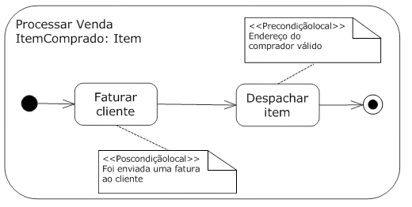

---

## Fluxo de controle

A UML oferece uma borda de atividade exclusiva para elementos de controle, chamada fluxo de controle. O fluxo de controle modela explicitamente o controle passando de uma ação para a próxima. Na prática, porém, poucas pessoas fazem a distinção entre uma borda de atividade genérica e um controle de fluxo, pois ambos usam a mesma notação.

---

## Fluxo de objetos

UML oferece uma borda exclusiva de dados, chamada de fluxo de objeto. Os fluxos de objetos adicionam suporte à distribuição de dados, seleção de indicação e na transformação de indicações. A notação para os fluxos de objeto é a mesma da borda de atividade genérica.

O fluxo de objeto pode ser usado para escolher algumas indicações para ir de uma atividade a outra, acrescentando um comportamento de seleção. Um comportamento de seleção é indicado anexando-se uma nota para o fluxo de objeto com a palavra-chave «seleção» e o comportamento especificado. Veja:

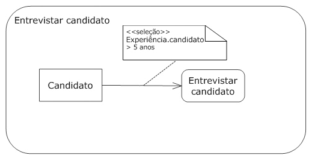

Você pode atribuir comportamentos para fluxos de objetos que transformam os dados passados ao longo de uma borda. No entanto, o comportamento não pode ter quaisquer efeitos colaterais sobre os dados originais. A transformação de comportamentos pode ser mostrada através de nota anexada ao fluxo de objeto, nomeada com a palavra-chave «transformação» e com o comportamento escrito sob a palavra-chave. Confira o exemplo:

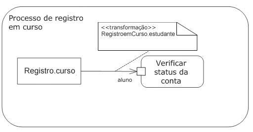

Os fluxos de objetos permitem especificar o envio de dados para várias instâncias de um receptor, utilizando a distribuição. Por exemplo, ao modelar um processo de licitação, você pode mostrar uma coleta de proposta a ser enviada para vários fornecedores e receber as respostas pela atividade. Você mostra o envio de dados para múltiplos receptores no rótulo de um fluxo de objeto com a palavra-chave «distribuição» e mostra os dados que estão sendo recebidos de vários remetentes, rotulando um fluxo de objeto com a palavra-chave «multicoleta»:

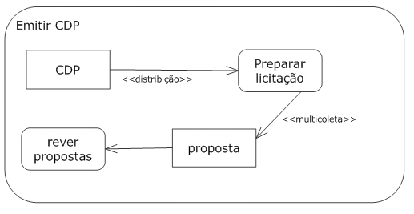

Há momentos em que determinada ação poderá aceitar mais de um tipo válido de entrada para iniciar a execução. Por exemplo, uma ação de recursos humanos chamada Ajuste Salário, pode exigir um objeto Empregado e um Documento para Nova contratação ou um Documento de Revisão de Avaliação Anual, mas não ambos. Você pode mostrar os grupos e as alternativas para os pinos de entrada usando os conjuntos de parâmetros. O conjunto de parâmetros agrupa um ou mais pinos e indica que eles são tudo o que se necessita para iniciar ou terminar a ação. Uma ação pode usar pinos de entrada somente de um conjunto de parâmetros estabelecido para qualquer execução dada, da mesma forma para os pinos de saída.

O conjunto de parâmetros é mostrado desenhando-se um retângulo ao redor dos pinos incluídos no conjunto. Confira o exemplo:

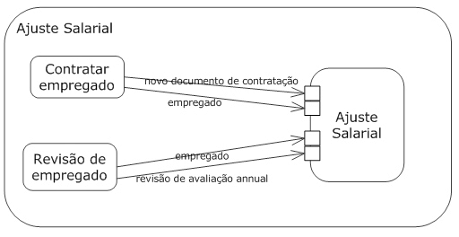

---

## Conectores
Para simplificar os diagramas de grandes atividades, as bordas podem ser dividias usando-se conectores. A cada conector é dado um nome, que é puramente uma ferramenta de notação. Coloca-se o nome do conector em um círculo e, em seguida, mostra-se a primeira metade de uma borda que aponta para o conector e a segunda metade saindo do conector. Confira o exemplo:

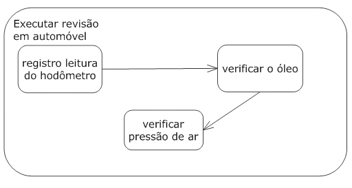

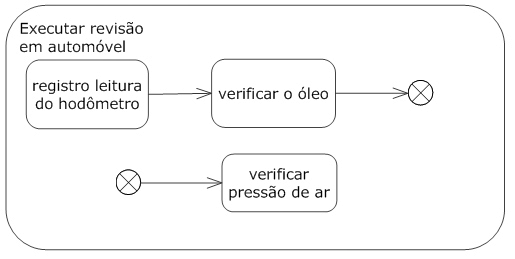

---

## Indicações

Conceitualmente, UML modela informações movendo-se ao longo de uma borda com uma indicação. A indicação pode representar dados reais, um objeto ou o foco de controle. A ação normalmente tem um conjunto de entradas necessárias e não inicia sua execução até que as entradas sejam cumpridas. Da mesma forma, normalmente quando a ação se completa gera saídas que podem desencadear outras ações. As entradas e saídas de uma ação são representadas como indicações.

Cada borda pode ter um peso associado que sinaliza quantas indicações devem estar disponíveis antes de serem apresentadas à ação alvo. O peso é mostrado colocando-se, entre chaves **{}**, a palavra-chave peso acompanhada do número desejado de indicações. Um peso nulo sinaliza que todas as indicações devem ser disponibilizadas para a ação-alvo logo que chegarem. Confira o exemplo:

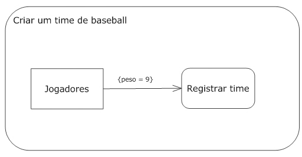

Além de pesos, cada borda pode ter uma condição de proteção que é testada em relação a todas as indicações. Se a condição de proteção falhar, a indicação será destruída. Se a condição for aprovada, a indicação ficará disponível para ser consumida pela próxima ação. Se o peso estiver associado à borda, as indicações não serão testadas contra a condição de proteção até que haja indicações suficientes para satisfazer o peso. Cada indicação é testada individualmente e se alguma falhar será removida do conjunto de indicações disponíveis. Se, com isso, o número de indicações disponíveis for reduzido para menos do que o peso da borda, todas as indicações serão retiradas até que haja suficientes disponíveis. A condição de proteção é mostrada colocando-se, entre colchetes **[]**, uma expressão booleana perto da borda da atividade. As condições de proteção são normalmente utilizadas com os nós de decisão para controlar o fluxo da atividade.

---

## Nós de Atividade

UML 2.0 define vários tipos de nós de atividade para modelar diferentes tipos de fluxo de informações. Há nós de parâmetro para representar dados que são passados para uma atividade, nós de objeto para representar dados complexos e nós de controle para direcionar o fluxo através de um diagrama de atividade.

Nós de Parâmetro

Os parâmetros para uma atividade, ou saída de uma atividade executada, podem ser representados como nós de parâmetro. O nó de parâmetro é mostrado com um retângulo na divisa de uma atividade, com o nome ou descrição do parâmetro dentro dele. Nós de parâmetro de entrada têm bordas dirigidas para a primeira ação, e nós de parâmetro de saída têm bordas provenientes da ação final. A imagem abaixo mostra o processo de fabricação de papel:

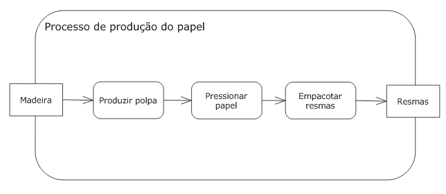

Nós de Objeto

Os nós de objeto podem ser utilizados para representar dados complexos, passando pelo diagrama de atividade. Um nó de objeto representa a instância de classificador específico em determinado estado. O nó de objeto é mostrado com um retângulo, com o nome do nó escrito dentro dele. Geralmente o nome do nó é o tipo de dado que ele representa. Veja:

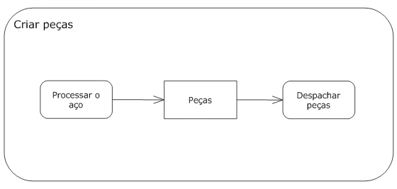

Obs.: Se o tipo de dado que o nó representa for um sinal, desenhe o nó com um pentágono côncavo.

---

## Nós de Controle

Além das ações, as atividades podem incluir outros nós para representar a tomada de decisões, a cooperação ou sincronização. Esses nós especializados são chamados de nós de controle.

Nós iniciais

Um nó inicial é o ponto de partida para uma atividade e não pode ter bordas de entrada. São permitidos vários nós iniciais para uma atividade simples, indicando que ela começa com múltiplos fluxos de execução. O nó inicial é mostrado com um ponto preto sólido.

Nós de decisão e de mixagem

Um nó de decisão é um nó de controle, que escolhe diferentes fluxos de saída com base em expressões booleanas. Cada nó de decisão tem uma borda de entrada e múltiplas bordas de saída. Quando os dados chegam ao nó de decisão, uma única borda saída é selecionada e os dados são enviados ao longo dessa borda. Um nó de decisão geralmente seleciona uma borda, avaliando cada uma das condições de proteção das bordas de saída.

O nó de decisão é mostrado com um diamante com os fluxos indo para dentro ou para fora dos lados. As condições de proteção são mostradas colocando-se uma expressão booleana entre colchetes **[]**, perto da borda de atividade. Confira o exemplo:

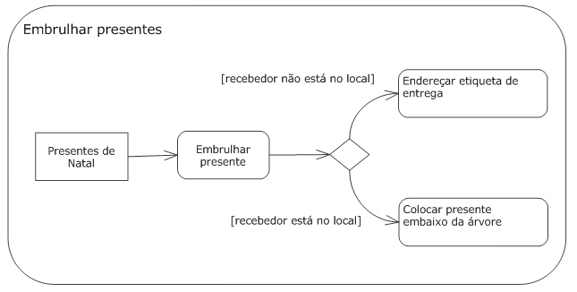

As condições de proteção não são garantidas de ser avaliadas em ordem em particular, e o nó de decisão permite que apenas uma borda de saída seja selecionada. Preste atenção ao projetar seus modelos, de forma que somente uma condição de proteção seja avaliada como verdadeira para determinado conjunto de dados, para evitar condições de concorrência.

A funcionalidade executada sempre que os dados chegarem ao nó de decisão pode ser especificada. Chamada comportamento de entrada de decisão, essa funcionalidade é permitida para avaliar os dados que chegam ao nó e oferecer uma saída para as condições de proteção. O comportamento não tem permissão para ter quaisquer efeitos colaterais durante a execução, uma vez que pode ser executado várias vezes para a mesma entrada de dados (uma vez por cada borda que precisa ser testada). O comportamento de decisão de entrada é mostrado em nota rotulada com a palavra-chave «entradadeDecisão»:

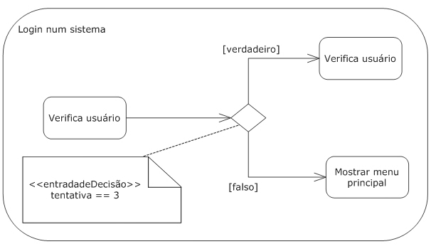

O nó de mixagem é efetivamente o oposto do nó de decisão, pois traz fluxos alternativos em um único fluxo de saída. Ele não sincroniza múltiplos fluxos concorrentes. Um nó de mixagem tem várias arestas de entrada e uma única aresta de saída.

O nó de mixagem é mostrado com o mesmo diamante usado no nó de decisão, exceto pelas múltiplas arestas de entrada e uma única aresta de saída. Confira o exemplo:

Nós de bifurcação e de agrupamento

O nó de bifurcação divide o fluxo atual através de uma atividade, em vários fluxos paralelos. Ele tem uma extremidade de entrada e várias de saída. Quando os dados chegam ao nó de bifurcação são copiados para cada aresta de saída. Por exemplo, o nó de bifurcação pode ser usado para indicar que, quando uma nova pessoa for contratada, serão iniciadas ações pelos Recursos Humanos, pelo Departamento de TI e pela Gerência de Instalações. Todas essas ações serão executadas simultaneamente e terminarão de forma independente.

O nó de bifurcação pode ser mostrado com uma linha vertical com uma aresta de entrada e várias de saída. Veja:

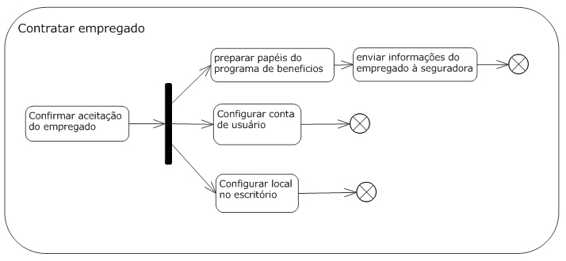

O nó de agrupamento é efetivamente o oposto do nó de bifurcação, pois sincroniza múltiplos fluxos de uma atividade de volta para um único fluxo de execução. O nó de agrupamento tem várias arestas de entrada e uma aresta de saída. Uma vez que todas as arestas de entrada tiverem indicações, serão enviadas pela aresta de saída.

O nó de agrupamento é mostrado por linha vertical, com múltiplas arestas de entrada e uma de saída. Confira o exemplo:

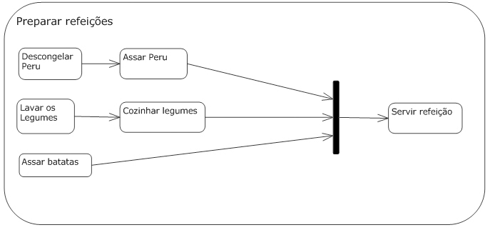

Uma condição booleana pode ser especificada para indicar sob quais condições o nó de agrupamento irá emitir uma indicação, permitindo que o fluxo continue para a única aresta de saída. Essa expressão é chamada especificação de agrupamento e pode usar os nomes de arestas de entrada e as condições das indicações que chegam sobre as arestas. A especificação de agrupamento é escrita, entre chaves **{}**, perto do nó de agrupamento. Veja o exemplo:

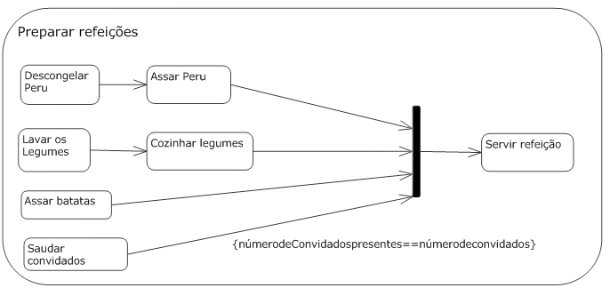

Nós finais

Dois tipos de nós finais são usados em diagramas de atividade: final de atividade e final de fluxo. Os nós de final de atividade finalizam a atividade completa. Quaisquer indicações que chegam ao nó final de atividade são destruídas, e qualquer execução em qualquer outro nó é finalizada sem resultados. É possível ter vários nós de final em um diagrama de atividade, mas quando a indicação chegar a qualquer um deles finalizará toda a atividade. O nó de final de atividade é representado com uma bola preta sólida com um círculo em volta, como mostrado nas duas últimas imagens no início do tópico de Diagramas de Atividades.

Os nós de final de fluxo encerram o caminho através de um diagrama de atividade, mas não toda a atividade. Eles são utilizados quando o fluxo da atividade se bifurca e um ramo da bifurcação deve ser interrompido, mas os outros podem continuar. O nó de final de fluxo é representado com um círculo vazado com um X dentro, como pode ser visto na imagem “Contratar empregado”, acima.

---

## Criando um diagrama de atividade

---

## Exercícios